# Friendship Management Process

## Friendship Flow Diagram

```mermaid
sequenceDiagram
    actor User1 as User (Requester)
    participant Frontend1 as Frontend<br/>(React)
    participant Backend as Backend<br/>(Django)
    participant DB as Database<br/>(PostgreSQL)
    participant WS as WebSocket<br/>(Django Channels)
    participant Frontend2 as Friend's Frontend<br/>(React)
    actor User2 as Friend (Addressee)

    Note over User1,User2: Send Friend Request
    
    User1->>Frontend1: Search for user & click "Add Friend"
    Frontend1->>Backend: POST /api/friends/request<br/>{addressee_id}<br/>(JWT from HttpOnly cookie)
    
    Backend->>Backend: Extract & verify JWT<br/>Get requester_id
    Backend->>Backend: Validate addressee_id exists
    
    Backend->>DB: Check if friendship exists
    DB-->>Backend: Query result
    
    alt Friendship already exists
        Backend-->>Frontend1: 409 Conflict<br/>{error: "Request already exists"}
        Frontend1-->>User1: Show error message
    else Self-request
        Backend-->>Frontend1: 400 Bad Request<br/>{error: "Cannot add yourself"}
        Frontend1-->>User1: Show error message
    else Valid request
        Backend->>DB: INSERT INTO Friendship<br/>- id (UUID)<br/>- requester_id<br/>- addressee_id<br/>- status = 'pending'<br/>- created_at
        DB-->>Backend: Friendship created
        
        Backend->>WS: Notify addressee<br/>(friend_request event)
        WS->>Frontend2: Push notification<br/>{type: 'friend_request', from: user1}
        Frontend2->>Frontend2: Show notification badge<br/>Update friend requests list
        Frontend2-->>User2: Show "New friend request"
        
        Backend-->>Frontend1: 201 Created<br/>{friendship}
        Frontend1-->>User1: Show "Request sent"
    end

    Note over User1,User2: Accept Friend Request
    
    User2->>Frontend2: View friend requests
    Frontend2->>Backend: GET /api/friends/requests<br/>(JWT from HttpOnly cookie)
    Backend->>Backend: Extract & verify JWT<br/>Get user_id
    
    Backend->>DB: SELECT Friendship WHERE<br/>addressee_id = user_id<br/>AND status = 'pending'
    DB-->>Backend: Pending requests list
    
    Backend->>DB: SELECT User info for requesters
    DB-->>Backend: Requester profiles
    
    Backend-->>Frontend2: 200 OK<br/>{pending_requests}
    Frontend2-->>User2: Display friend requests
    
    User2->>Frontend2: Click "Accept" on request
    Frontend2->>Backend: PATCH /api/friends/{friendship_id}/accept<br/>(JWT from HttpOnly cookie)
    
    Backend->>Backend: Extract & verify JWT<br/>Get user_id
    
    Backend->>DB: SELECT Friendship<br/>WHERE id = friendship_id<br/>AND addressee_id = user_id
    DB-->>Backend: Friendship record
    
    alt Not found or unauthorized
        Backend-->>Frontend2: 404 Not Found
        Frontend2-->>User2: Show error
    else Found and authorized
        Backend->>DB: UPDATE Friendship SET<br/>status = 'accepted',<br/>updated_at = CURRENT_TIMESTAMP<br/>WHERE id = friendship_id
        DB-->>Backend: Updated
        
        Backend->>WS: Notify requester<br/>(friend_accepted event)
        WS->>Frontend1: Push notification<br/>{type: 'friend_accepted', user: user2}
        Frontend1->>Frontend1: Update friends list<br/>Show notification
        Frontend1-->>User1: Show "Friend request accepted"
        
        Backend-->>Frontend2: 200 OK<br/>{friendship}
        Frontend2->>Frontend2: Move to friends list
        Frontend2-->>User2: Show success message
    end

    Note over User1,User2: Decline Friend Request
    
    User2->>Frontend2: Click "Decline" on request
    Frontend2->>Backend: DELETE /api/friends/{friendship_id}<br/>(JWT from HttpOnly cookie)
    
    Backend->>Backend: Extract & verify JWT<br/>Get user_id
    
    Backend->>DB: SELECT Friendship<br/>WHERE id = friendship_id<br/>AND addressee_id = user_id<br/>AND status = 'pending'
    DB-->>Backend: Friendship record
    
    alt Not found or unauthorized
        Backend-->>Frontend2: 404 Not Found
        Frontend2-->>User2: Show error
    else Found and authorized
        Backend->>DB: DELETE FROM Friendship<br/>WHERE id = friendship_id
        DB-->>Backend: Deleted
        
        Backend-->>Frontend2: 204 No Content
        Frontend2->>Frontend2: Remove from requests list
        Frontend2-->>User2: Request declined (silent)
    end

    Note over User1,User2: Block User
    
    User1->>Frontend1: Click "Block User" on profile
    Frontend1->>Backend: POST /api/friends/block<br/>{blocked_user_id}<br/>(JWT from HttpOnly cookie)
    
    Backend->>Backend: Extract & verify JWT<br/>Get blocker_id
    
    Backend->>DB: Check if friendship exists
    DB-->>Backend: Friendship record or NULL
    
    alt Friendship exists
        Backend->>DB: UPDATE Friendship SET<br/>status = 'blocked',<br/>updated_at = CURRENT_TIMESTAMP
        DB-->>Backend: Updated
    else No friendship
        Backend->>DB: INSERT INTO Friendship<br/>- requester_id = blocker_id<br/>- addressee_id = blocked_user_id<br/>- status = 'blocked'<br/>- created_at
        DB-->>Backend: Created
    end
    
    Backend->>WS: Disconnect any active game/chat<br/>between users
    WS->>Frontend2: Notify disconnection
    Frontend2-->>User2: Connection lost (no block info)
    
    Backend-->>Frontend1: 200 OK
    Frontend1->>Frontend1: Remove from all lists<br/>Hide user in search
    Frontend1-->>User1: Show "User blocked"

    Note over User1,User2: Unblock User
    
    User1->>Frontend1: View blocked users list
    Frontend1->>Backend: GET /api/friends/blocked<br/>(JWT from HttpOnly cookie)
    Backend->>Backend: Extract & verify JWT
    
    Backend->>DB: SELECT Friendship WHERE<br/>(requester_id = user_id OR addressee_id = user_id)<br/>AND status = 'blocked'
    DB-->>Backend: Blocked users list
    
    Backend-->>Frontend1: 200 OK<br/>{blocked_users}
    Frontend1-->>User1: Display blocked list
    
    User1->>Frontend1: Click "Unblock" on user
    Frontend1->>Backend: DELETE /api/friends/{friendship_id}<br/>(JWT from HttpOnly cookie)
    
    Backend->>Backend: Extract & verify JWT
    
    Backend->>DB: DELETE FROM Friendship<br/>WHERE id = friendship_id<br/>AND (requester_id = user_id OR addressee_id = user_id)<br/>AND status = 'blocked'
    DB-->>Backend: Deleted
    
    Backend-->>Frontend1: 204 No Content
    Frontend1->>Frontend1: Remove from blocked list
    Frontend1-->>User1: Show "User unblocked"

    Note over User1,User2: Remove Friend
    
    User1->>Frontend1: Click "Remove Friend"
    Frontend1->>Frontend1: Show confirmation dialog
    User1->>Frontend1: Confirm removal
    
    Frontend1->>Backend: DELETE /api/friends/{friendship_id}<br/>(JWT from HttpOnly cookie)
    
    Backend->>Backend: Extract & verify JWT<br/>Get user_id
    
    Backend->>DB: DELETE FROM Friendship<br/>WHERE id = friendship_id<br/>AND (requester_id = user_id OR addressee_id = user_id)<br/>AND status = 'accepted'
    DB-->>Backend: Deleted
    
    Backend->>WS: Notify friend (optional)<br/>(friend_removed event)
    WS->>Frontend2: Push notification
    Frontend2->>Frontend2: Remove from friends list
    Frontend2-->>User2: Update friends list (silent)
    
    Backend-->>Frontend1: 204 No Content
    Frontend1->>Frontend1: Remove from friends list
    Frontend1-->>User1: Show "Friend removed"
```



## Process Breakdown

### Frontend Responsibilities

1. **Friend Search & Discovery**
   - Search users by username
   - Display user profiles with friendship status
   - Show "Add Friend" / "Pending" / "Friends" / "Blocked" status
   - Hide blocked users from search results

2. **Friend Request Management**
   - Display notification badge for pending requests
   - Show list of incoming friend requests
   - Provide Accept/Decline buttons
   - Show list of outgoing pending requests

3. **Friends List Display**
   - Show accepted friends list
   - Display online/offline status (from WebSocket)
   - Provide "Remove Friend" and "Block User" options
   - Show blocked users in separate section

4. **Real-Time Updates**
   - Listen for WebSocket events (friend_request, friend_accepted, friend_removed)
   - Update UI immediately on notifications
   - Show notification badges and toasts

### Backend Responsibilities

1. **Request Validation**
   - Verify JWT token for all operations
   - Prevent self-friending
   - Check for duplicate requests
   - Ensure user can only manage their own friendships

2. **Business Logic**
   - Handle bidirectional friendship relationships
   - Manage friendship status transitions (pending → accepted/blocked)
   - Prevent interactions between blocked users
   - Clean up related data (active games, chat) when blocking

3. **WebSocket Notifications**
   - Send real-time notifications to both parties
   - Update online friends list
   - Notify on status changes (accepted, removed)
   - Don't notify blocked users of block status

4. **Authorization**
   - Requester can cancel pending requests
   - Addressee can accept/decline requests
   - Either party can remove friendship or block
   - Only show blocked status to blocker

### Database Operations

#### Send Friend Request
```sql
-- Check for existing relationship
SELECT * FROM Friendship 
WHERE (requester_id = user1_id AND addressee_id = user2_id)
   OR (requester_id = user2_id AND addressee_id = user1_id);

-- Create new request
INSERT INTO Friendship (id, requester_id, addressee_id, status, created_at)
VALUES (gen_uuid(), user1_id, user2_id, 'pending', CURRENT_TIMESTAMP);
```

#### Accept Request
```sql
UPDATE Friendship 
SET status = 'accepted', 
    updated_at = CURRENT_TIMESTAMP
WHERE id = friendship_id 
  AND addressee_id = current_user_id
  AND status = 'pending';
```

#### Decline Request / Remove Friend
```sql
DELETE FROM Friendship 
WHERE id = friendship_id 
  AND (requester_id = current_user_id OR addressee_id = current_user_id);
```

#### Block User
```sql
-- Update existing friendship
UPDATE Friendship 
SET status = 'blocked', 
    updated_at = CURRENT_TIMESTAMP
WHERE (requester_id = blocker_id AND addressee_id = blocked_id)
   OR (requester_id = blocked_id AND addressee_id = blocker_id);

-- Or create new block entry if no relationship exists
INSERT INTO Friendship (id, requester_id, addressee_id, status, created_at)
VALUES (gen_uuid(), blocker_id, blocked_id, 'blocked', CURRENT_TIMESTAMP);
```

#### Get Friends List
```sql
-- Get accepted friends
SELECT u.id, u.username, u.display_name, u.avatar_url
FROM Friendship f
JOIN User u ON (
  CASE 
    WHEN f.requester_id = current_user_id THEN u.id = f.addressee_id
    WHEN f.addressee_id = current_user_id THEN u.id = f.requester_id
  END
)
WHERE (f.requester_id = current_user_id OR f.addressee_id = current_user_id)
  AND f.status = 'accepted';
```

#### Get Pending Requests
```sql
-- Incoming requests
SELECT f.id, f.created_at, u.id, u.username, u.display_name, u.avatar_url
FROM Friendship f
JOIN User u ON u.id = f.requester_id
WHERE f.addressee_id = current_user_id
  AND f.status = 'pending';

-- Outgoing requests
SELECT f.id, f.created_at, u.id, u.username, u.display_name, u.avatar_url
FROM Friendship f
JOIN User u ON u.id = f.addressee_id
WHERE f.requester_id = current_user_id
  AND f.status = 'pending';
```

## WebSocket Events

### Event Types

```javascript
// Sent when user receives friend request
{
  type: 'friend_request',
  friendship_id: 'uuid',
  from: {
    id: 'uuid',
    username: 'string',
    display_name: 'string',
    avatar_url: 'string'
  },
  timestamp: 'ISO 8601'
}

// Sent when friend request is accepted
{
  type: 'friend_accepted',
  friendship_id: 'uuid',
  user: {
    id: 'uuid',
    username: 'string',
    display_name: 'string',
    avatar_url: 'string'
  },
  timestamp: 'ISO 8601'
}

// Sent when friend removes friendship (optional)
{
  type: 'friend_removed',
  user_id: 'uuid',
  timestamp: 'ISO 8601'
}

// Sent when friend comes online
{
  type: 'friend_online',
  user_id: 'uuid',
  timestamp: 'ISO 8601'
}

// Sent when friend goes offline
{
  type: 'friend_offline',
  user_id: 'uuid',
  timestamp: 'ISO 8601'
}
```

## Security Considerations

1. **JWT Cookie Authentication**: All requests authenticated via HttpOnly cookies
2. **Authorization Checks**: 
   - Only addressee can accept/decline requests
   - Only requester can cancel pending requests
   - Either party can remove friendship or block
3. **Privacy Protection**:
   - Blocked users don't know they're blocked
   - Declining requests is silent (no notification)
   - Don't reveal blocked status in API responses to blocked user
4. **Rate Limiting**: 
   - Max 10 friend requests per hour per user
   - Max 50 friendship operations per day
5. **Input Validation**: Validate all UUIDs and prevent SQL injection
6. **CSRF Protection**: Use CSRF tokens for all POST/PATCH/DELETE operations
7. **Block Enforcement**: Prevent all interactions (games, chat, profile views) between blocked users

## Error Handling

| Error Condition | HTTP Status | Frontend Action |
|----------------|-------------|-----------------|
| Token invalid/expired | 401 Unauthorized | Redirect to login |
| Self-friend attempt | 400 Bad Request | Show "Cannot add yourself as friend" |
| Duplicate request | 409 Conflict | Show "Request already exists" |
| User not found | 404 Not Found | Show "User not found" |
| Unauthorized action | 403 Forbidden | Show "You cannot perform this action" |
| Rate limit exceeded | 429 Too Many Requests | Show "Too many requests, try again later" |
| Server error | 500 Internal Server Error | Show "Operation failed, try again" |

## UI/UX Best Practices

1. **Clear Status Indicators**:
   - Gray button: Not friends
   - Yellow/Pending: Request sent
   - Green/Friends: Accepted
   - Red/Blocked: User blocked

2. **Confirmation Dialogs**:
   - Confirm before removing friend
   - Confirm before blocking user
   - Explain consequences of blocking

3. **Notification Management**:
   - Badge count for pending requests
   - Toast notifications for real-time events
   - Don't spam with too many notifications

4. **Privacy**:
   - Don't show "blocked" status to blocked user
   - Silent decline (no notification to requester)
   - Block is permanent until unblocked
