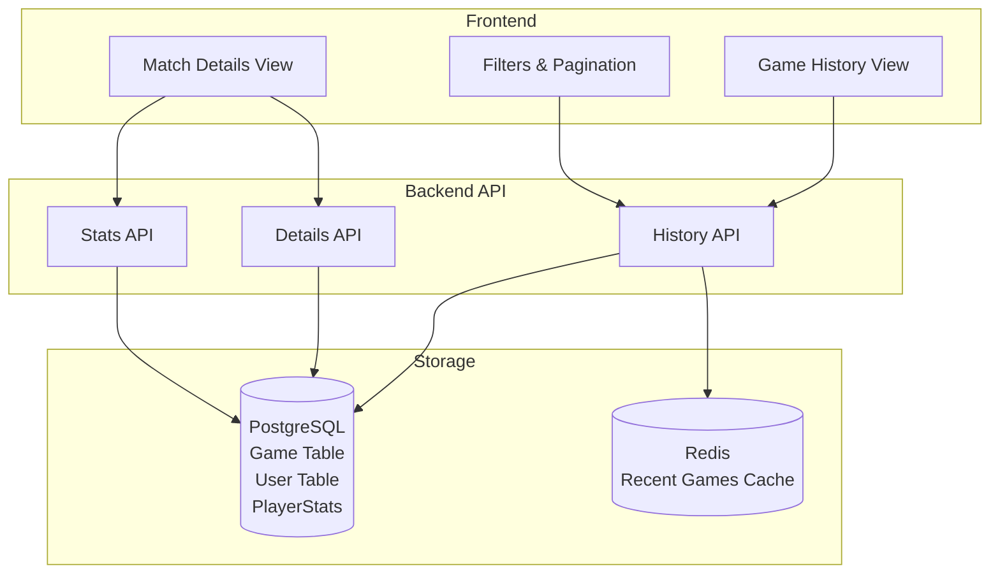

# Game History & Match Details Process

## Game History Architecture



## Game History Flow Diagram

```mermaid
sequenceDiagram
    actor User
    participant Frontend as Frontend<br/>(React)
    participant Backend as Backend<br/>(Django)
    participant Redis as Redis<br/>(Cache)
    participant DB as Database<br/>(PostgreSQL)

    Note over User,DB: View Personal Game History
    
    User->>Frontend: Navigate to "My Games"
    Frontend->>Backend: GET /api/games/history<br/>?page=1&limit=20<br/>(JWT from HttpOnly cookie)
    
    Backend->>Backend: Extract & verify JWT<br/>Get user_id
    
    Backend->>Redis: Check cache<br/>GET games:history:{user_id}:page:1
    Redis-->>Backend: Cache miss
    
    Backend->>DB: SELECT g.id, g.game_type,<br/>g.winner_id, g.duration_seconds,<br/>g.player_1_shots, g.player_1_hits,<br/>g.player_2_shots, g.player_2_hits,<br/>g.started_at, g.ended_at,<br/>p1.username as player_1_name,<br/>p1.avatar_url as player_1_avatar,<br/>p2.username as player_2_name,<br/>p2.avatar_url as player_2_avatar<br/>FROM Game g<br/>LEFT JOIN User p1 ON g.player_1_id = p1.id<br/>LEFT JOIN User p2 ON g.player_2_id = p2.id<br/>WHERE g.player_1_id = user_id<br/>OR g.player_2_id = user_id<br/>ORDER BY g.ended_at DESC<br/>LIMIT 20 OFFSET 0
    DB-->>Backend: Games list
    
    Backend->>Backend: Process results<br/>- Calculate win/loss for each<br/>- Calculate accuracy<br/>- Format timestamps
    
    Backend->>Redis: Cache results<br/>SETEX games:history:{user_id}:page:1<br/>300 (5 min TTL)
    Redis-->>Backend: Cached
    
    Backend-->>Frontend: 200 OK<br/>{games: [<br/>  {id, opponent, result,<br/>   accuracy, duration,<br/>   ended_at, game_type},<br/>  {...}<br/>],<br/>total: 145,<br/>page: 1,<br/>has_more: true}
    
    Frontend->>Frontend: Display games list
    Frontend-->>User: Show game history table

    Note over User,DB: Filter by Result (Wins Only)
    
    User->>Frontend: Select "Wins" filter
    Frontend->>Backend: GET /api/games/history<br/>?page=1&result=won
    
    Backend->>Backend: Extract user_id from JWT
    
    Backend->>DB: SELECT ... FROM Game g<br/>WHERE (g.player_1_id = user_id<br/>       OR g.player_2_id = user_id)<br/>AND g.winner_id = user_id<br/>ORDER BY g.ended_at DESC<br/>LIMIT 20
    DB-->>Backend: Won games list
    
    Backend-->>Frontend: 200 OK<br/>{games: [...]}
    Frontend-->>User: Show only victories

    Note over User,DB: Filter by Opponent Type
    
    User->>Frontend: Select "vs AI" filter
    Frontend->>Backend: GET /api/games/history<br/>?page=1&game_type=ai
    
    Backend->>DB: SELECT ... FROM Game g<br/>WHERE (g.player_1_id = user_id<br/>       OR g.player_2_id = user_id)<br/>AND g.game_type = 'ai'<br/>ORDER BY g.ended_at DESC
    DB-->>Backend: AI games list
    
    Backend-->>Frontend: 200 OK<br/>{games: [...]}
    Frontend-->>User: Show AI games only

    Note over User,DB: View Match Details
    
    User->>Frontend: Click on specific game
    Frontend->>Backend: GET /api/games/{game_id}/details<br/>(JWT from cookie)
    
    Backend->>Backend: Extract user_id from JWT
    
    Backend->>DB: SELECT g.*,<br/>p1.id as p1_id, p1.username as p1_name,<br/>p1.display_name as p1_display,<br/>p1.avatar_url as p1_avatar,<br/>p2.id as p2_id, p2.username as p2_name,<br/>p2.display_name as p2_display,<br/>p2.avatar_url as p2_avatar,<br/>winner.username as winner_name<br/>FROM Game g<br/>LEFT JOIN User p1 ON g.player_1_id = p1.id<br/>LEFT JOIN User p2 ON g.player_2_id = p2.id<br/>LEFT JOIN User winner ON g.winner_id = winner.id<br/>WHERE g.id = game_id
    DB-->>Backend: Game details
    
    Backend->>Backend: Verify access<br/>(user must be participant)
    
    alt User is participant
        Backend->>Backend: Calculate detailed statistics:<br/>- Player 1 accuracy<br/>- Player 2 accuracy<br/>- Shots per minute<br/>- Game duration formatted<br/>- Winner determination
        
        Backend-->>Frontend: 200 OK<br/>{<br/>  game_id,<br/>  game_type,<br/>  started_at,<br/>  ended_at,<br/>  duration_seconds,<br/>  duration_formatted,<br/>  winner: {id, username, avatar},<br/>  player_1: {<br/>    id, username, avatar,<br/>    shots, hits,<br/>    accuracy: 68.5,<br/>    is_current_user: true<br/>  },<br/>  player_2: {<br/>    id, username, avatar,<br/>    shots, hits,<br/>    accuracy: 71.2,<br/>    is_current_user: false<br/>  },<br/>  result_for_user: "won"<br/>}
        
        Frontend->>Frontend: Render match details UI:<br/>- Player cards with avatars<br/>- Stats comparison<br/>- Timeline<br/>- Result banner
        Frontend-->>User: Display detailed match view
    else User not participant
        Backend-->>Frontend: 403 Forbidden<br/>{error: "Access denied"}
        Frontend-->>User: Show "Cannot view this game"
    end

    Note over User,DB: View Head-to-Head Statistics
    
    User->>Frontend: Click "View H2H" on opponent
    Frontend->>Backend: GET /api/games/head-to-head/{opponent_id}<br/>(JWT from cookie)
    
    Backend->>Backend: Extract user_id from JWT
    
    Backend->>DB: SELECT<br/>  COUNT(*) as total_games,<br/>  COUNT(CASE WHEN winner_id = user_id<br/>             THEN 1 END) as user_wins,<br/>  COUNT(CASE WHEN winner_id = opponent_id<br/>             THEN 1 END) as opponent_wins,<br/>  AVG(duration_seconds) as avg_duration,<br/>  MAX(ended_at) as last_played<br/>FROM Game<br/>WHERE (player_1_id = user_id<br/>       AND player_2_id = opponent_id)<br/>   OR (player_1_id = opponent_id<br/>       AND player_2_id = user_id)
    DB-->>Backend: H2H statistics
    
    Backend->>DB: SELECT g.id, g.winner_id,<br/>g.ended_at, g.duration_seconds<br/>FROM Game g<br/>WHERE (player_1_id = user_id<br/>       AND player_2_id = opponent_id)<br/>   OR (player_1_id = opponent_id<br/>       AND player_2_id = user_id)<br/>ORDER BY g.ended_at DESC<br/>LIMIT 10
    DB-->>Backend: Recent H2H games
    
    Backend->>DB: Get opponent details<br/>SELECT username, display_name, avatar_url<br/>FROM User WHERE id = opponent_id
    DB-->>Backend: Opponent info
    
    Backend-->>Frontend: 200 OK<br/>{<br/>  opponent: {id, username, avatar},<br/>  total_games: 23,<br/>  user_wins: 12,<br/>  opponent_wins: 11,<br/>  win_rate: 52.2,<br/>  avg_duration: 487,<br/>  last_played: "2024-01-05T14:30:00Z",<br/>  recent_games: [...]<br/>}
    
    Frontend->>Frontend: Display H2H modal:<br/>- Win/loss record<br/>- Win rate chart<br/>- Recent matches<br/>- Last played date
    Frontend-->>User: Show head-to-head stats

    Note over User,DB: Search Game History
    
    User->>Frontend: Search for opponent "john"
    Frontend->>Backend: GET /api/games/history<br/>?search=john&page=1
    
    Backend->>Backend: Extract user_id from JWT
    
    Backend->>DB: SELECT g.*, p1.username, p2.username<br/>FROM Game g<br/>LEFT JOIN User p1 ON g.player_1_id = p1.id<br/>LEFT JOIN User p2 ON g.player_2_id = p2.id<br/>WHERE (g.player_1_id = user_id<br/>       OR g.player_2_id = user_id)<br/>AND (p1.username ILIKE '%john%'<br/>     OR p2.username ILIKE '%john%')<br/>ORDER BY g.ended_at DESC<br/>LIMIT 20
    DB-->>Backend: Matching games
    
    Backend-->>Frontend: 200 OK<br/>{games: [...]}
    Frontend-->>User: Show filtered results

    Note over User,DB: Export Game History
    
    User->>Frontend: Click "Export to CSV"
    Frontend->>Backend: GET /api/games/history/export<br/>?format=csv<br/>(JWT from cookie)
    
    Backend->>Backend: Extract user_id from JWT
    
    Backend->>DB: SELECT all games for user<br/>(no pagination)
    DB-->>Backend: Complete game history
    
    Backend->>Backend: Generate CSV:<br/>Date, Opponent, Result,<br/>Your Accuracy, Opp Accuracy,<br/>Duration, Game Type
    
    Backend-->>Frontend: 200 OK<br/>Content-Type: text/csv<br/>Content-Disposition: attachment<br/><br/>CSV data
    
    Frontend->>Frontend: Trigger download
    Frontend-->>User: Download "game_history.csv"

    Note over User,DB: View Game Statistics Summary
    
    User->>Frontend: Navigate to "Statistics"
    Frontend->>Backend: GET /api/games/statistics<br/>(JWT from cookie)
    
    Backend->>Backend: Extract user_id from JWT
    
    Backend->>DB: SELECT<br/>  COUNT(*) as total_games,<br/>  COUNT(CASE WHEN winner_id = user_id<br/>             THEN 1 END) as wins,<br/>  COUNT(CASE WHEN winner_id != user_id<br/>             THEN 1 END) as losses,<br/>  AVG(duration_seconds) as avg_duration,<br/>  AVG(CASE<br/>    WHEN player_1_id = user_id<br/>    THEN (player_1_hits::float / player_1_shots) * 100<br/>    ELSE (player_2_hits::float / player_2_shots) * 100<br/>  END) as avg_accuracy,<br/>  COUNT(CASE WHEN game_type = 'pvp'<br/>             THEN 1 END) as pvp_games,<br/>  COUNT(CASE WHEN game_type = 'ai'<br/>             THEN 1 END) as ai_games<br/>FROM Game<br/>WHERE player_1_id = user_id<br/>   OR player_2_id = user_id
    DB-->>Backend: Aggregate statistics
    
    Backend->>DB: Get recent performance trend<br/>SELECT DATE(ended_at) as date,<br/>COUNT(*) as games,<br/>COUNT(CASE WHEN winner_id = user_id<br/>           THEN 1 END) as wins<br/>FROM Game<br/>WHERE (player_1_id = user_id<br/>       OR player_2_id = user_id)<br/>AND ended_at >= NOW() - INTERVAL '30 days'<br/>GROUP BY DATE(ended_at)<br/>ORDER BY date
    DB-->>Backend: Daily performance data
    
    Backend->>DB: Get most played opponents<br/>SELECT<br/>  CASE WHEN player_1_id = user_id<br/>       THEN player_2_id ELSE player_1_id<br/>  END as opponent_id,<br/>  COUNT(*) as game_count<br/>FROM Game<br/>WHERE (player_1_id = user_id<br/>       OR player_2_id = user_id)<br/>AND game_type = 'pvp'<br/>GROUP BY opponent_id<br/>ORDER BY game_count DESC<br/>LIMIT 5
    DB-->>Backend: Top opponents
    
    Backend->>DB: Get opponent usernames<br/>SELECT id, username, avatar_url<br/>FROM User<br/>WHERE id IN (opponent_ids)
    DB-->>Backend: Opponent details
    
    Backend-->>Frontend: 200 OK<br/>{<br/>  total_games: 145,<br/>  wins: 78,<br/>  losses: 67,<br/>  win_rate: 53.8,<br/>  avg_accuracy: 69.2,<br/>  avg_duration: 412,<br/>  pvp_games: 98,<br/>  ai_games: 47,<br/>  performance_trend: [<br/>    {date, games, wins},<br/>    {...}<br/>  ],<br/>  top_opponents: [<br/>    {id, username, avatar, game_count},<br/>    {...}<br/>  ]<br/>}
    
    Frontend->>Frontend: Render statistics dashboard:<br/>- Win/loss pie chart<br/>- Accuracy gauge<br/>- Performance line chart<br/>- Top opponents list
    Frontend-->>User: Display comprehensive stats

    Note over User,DB: View Specific Opponent's Game History
    
    User->>Frontend: Click opponent profile<br/>from match details
    Frontend->>Backend: GET /api/games/history<br/>?opponent={opponent_id}&page=1
    
    Backend->>Backend: Extract user_id from JWT
    
    Backend->>DB: SELECT g.* FROM Game g<br/>WHERE ((player_1_id = user_id<br/>        AND player_2_id = opponent_id)<br/>    OR (player_1_id = opponent_id<br/>        AND player_2_id = user_id))<br/>ORDER BY ended_at DESC<br/>LIMIT 20
    DB-->>Backend: Games with specific opponent
    
    Backend-->>Frontend: 200 OK<br/>{games: [...]}
    Frontend-->>User: Show filtered game history

    Note over User,DB: Delete Game from History
    
    Note over Frontend: Feature not implemented<br/>Games are immutable records
    Note over Backend: Soft delete could be added<br/>with is_visible flag if needed
```



## Database Queries

### Personal Game History

```sql
-- Get paginated game history for user
SELECT 
    g.id,
    g.game_type,
    g.winner_id,
    g.duration_seconds,
    g.player_1_shots,
    g.player_1_hits,
    g.player_2_shots,
    g.player_2_hits,
    g.started_at,
    g.ended_at,
    p1.username as player_1_name,
    p1.display_name as player_1_display,
    p1.avatar_url as player_1_avatar,
    p2.username as player_2_name,
    p2.display_name as player_2_display,
    p2.avatar_url as player_2_avatar,
    CASE 
        WHEN g.winner_id = :user_id THEN 'won'
        WHEN g.winner_id IS NULL THEN 'draw'
        ELSE 'lost'
    END as result
FROM Game g
LEFT JOIN User p1 ON g.player_1_id = p1.id
LEFT JOIN User p2 ON g.player_2_id = p2.id
WHERE g.player_1_id = :user_id OR g.player_2_id = :user_id
ORDER BY g.ended_at DESC
LIMIT 20 OFFSET :offset;
```

### Game Details

```sql
-- Get complete details for specific game
SELECT 
    g.*,
    p1.id as p1_id,
    p1.username as p1_username,
    p1.display_name as p1_display,
    p1.avatar_url as p1_avatar,
    p2.id as p2_id,
    p2.username as p2_username,
    p2.display_name as p2_display,
    p2.avatar_url as p2_avatar,
    winner.username as winner_username
FROM Game g
LEFT JOIN User p1 ON g.player_1_id = p1.id
LEFT JOIN User p2 ON g.player_2_id = p2.id
LEFT JOIN User winner ON g.winner_id = winner.id
WHERE g.id = :game_id;
```

### Head-to-Head Statistics

```sql
-- Get H2H stats between two players
SELECT
    COUNT(*) as total_games,
    COUNT(CASE WHEN winner_id = :user_id THEN 1 END) as user_wins,
    COUNT(CASE WHEN winner_id = :opponent_id THEN 1 END) as opponent_wins,
    AVG(duration_seconds) as avg_duration,
    MAX(ended_at) as last_played,
    MIN(ended_at) as first_played
FROM Game
WHERE (player_1_id = :user_id AND player_2_id = :opponent_id)
   OR (player_1_id = :opponent_id AND player_2_id = :user_id);
```

### Recent Games (Last 10)

```sql
SELECT 
    g.id,
    g.winner_id,
    g.ended_at,
    g.duration_seconds,
    CASE WHEN g.winner_id = :user_id THEN 'won' ELSE 'lost' END as result
FROM Game g
WHERE (player_1_id = :user_id AND player_2_id = :opponent_id)
   OR (player_1_id = :opponent_id AND player_2_id = :user_id)
ORDER BY g.ended_at DESC
LIMIT 10;
```

### Performance Statistics

```sql
-- Get comprehensive user statistics
SELECT
    COUNT(*) as total_games,
    COUNT(CASE WHEN winner_id = :user_id THEN 1 END) as wins,
    COUNT(CASE WHEN winner_id != :user_id THEN 1 END) as losses,
    AVG(duration_seconds) as avg_duration,
    AVG(CASE
        WHEN player_1_id = :user_id THEN (player_1_hits::float / NULLIF(player_1_shots, 0)) * 100
        ELSE (player_2_hits::float / NULLIF(player_2_shots, 0)) * 100
    END) as avg_accuracy,
    COUNT(CASE WHEN game_type = 'pvp' THEN 1 END) as pvp_games,
    COUNT(CASE WHEN game_type = 'ai' THEN 1 END) as ai_games,
    MIN(ended_at) as first_game_date,
    MAX(ended_at) as last_game_date
FROM Game
WHERE player_1_id = :user_id OR player_2_id = :user_id;
```

### Daily Performance Trend (Last 30 Days)

```sql
SELECT 
    DATE(ended_at) as game_date,
    COUNT(*) as games_played,
    COUNT(CASE WHEN winner_id = :user_id THEN 1 END) as wins
FROM Game
WHERE (player_1_id = :user_id OR player_2_id = :user_id)
  AND ended_at >= NOW() - INTERVAL '30 days'
GROUP BY DATE(ended_at)
ORDER BY game_date;
```

### Top Opponents

```sql
SELECT
    CASE 
        WHEN player_1_id = :user_id THEN player_2_id 
        ELSE player_1_id 
    END as opponent_id,
    COUNT(*) as game_count,
    COUNT(CASE WHEN winner_id = :user_id THEN 1 END) as wins_against
FROM Game
WHERE (player_1_id = :user_id OR player_2_id = :user_id)
  AND game_type = 'pvp'
GROUP BY opponent_id
ORDER BY game_count DESC
LIMIT 5;
```

## Redis Caching Strategy

### Cache Keys

```
games:history:{user_id}:page:{page}        # TTL: 300s
games:history:{user_id}:filter:{filter}    # TTL: 300s
games:details:{game_id}                    # TTL: 3600s (1 hour)
games:h2h:{user_id}:{opponent_id}          # TTL: 600s
games:stats:{user_id}                      # TTL: 600s
```

### Invalidation

- **On Game Completion**: Invalidate user history caches for both players
- **Pattern**: `DEL games:history:{user_id}:*`
- **Background Job**: Refresh statistics caches every 10 minutes

## API Endpoints

### GET /api/games/history
**Purpose**: Get paginated game history
**Query Params**: 
- `page` (default: 1)
- `limit` (default: 20, max: 100)
- `result` (filter: won|lost)
- `game_type` (filter: pvp|ai)
- `opponent` (filter by opponent_id)
- `search` (search opponent username)

**Response**: 
```json
{
  "games": [
    {
      "id": "uuid",
      "opponent": {
        "id": "uuid",
        "username": "string",
        "avatar_url": "string"
      },
      "result": "won|lost",
      "your_accuracy": 68.5,
      "opponent_accuracy": 71.2,
      "duration_seconds": 487,
      "duration_formatted": "8m 7s",
      "ended_at": "2024-01-05T14:30:00Z",
      "game_type": "pvp"
    }
  ],
  "total": 145,
  "page": 1,
  "has_more": true
}
```

### GET /api/games/{game_id}/details
**Purpose**: Get detailed match information
**Response**:
```json
{
  "game_id": "uuid",
  "game_type": "pvp",
  "started_at": "2024-01-05T14:22:00Z",
  "ended_at": "2024-01-05T14:30:00Z",
  "duration_seconds": 487,
  "duration_formatted": "8m 7s",
  "winner": {
    "id": "uuid",
    "username": "string",
    "avatar_url": "string"
  },
  "player_1": {
    "id": "uuid",
    "username": "string",
    "avatar_url": "string",
    "shots": 73,
    "hits": 50,
    "accuracy": 68.5,
    "is_current_user": true
  },
  "player_2": {
    "id": "uuid",
    "username": "string",
    "avatar_url": "string",
    "shots": 66,
    "hits": 47,
    "accuracy": 71.2,
    "is_current_user": false
  },
  "result_for_user": "won"
}
```

### GET /api/games/head-to-head/{opponent_id}
**Purpose**: Get H2H statistics with specific opponent
**Response**:
```json
{
  "opponent": {
    "id": "uuid",
    "username": "string",
    "display_name": "string",
    "avatar_url": "string"
  },
  "total_games": 23,
  "user_wins": 12,
  "opponent_wins": 11,
  "win_rate": 52.2,
  "avg_duration": 487,
  "first_played": "2023-08-15T10:00:00Z",
  "last_played": "2024-01-05T14:30:00Z",
  "recent_games": [
    {
      "id": "uuid",
      "result": "won",
      "ended_at": "2024-01-05T14:30:00Z",
      "duration_seconds": 412
    }
  ]
}
```

### GET /api/games/statistics
**Purpose**: Get comprehensive user statistics
**Response**:
```json
{
  "total_games": 145,
  "wins": 78,
  "losses": 67,
  "win_rate": 53.8,
  "avg_accuracy": 69.2,
  "avg_duration": 412,
  "pvp_games": 98,
  "ai_games": 47,
  "first_game_date": "2023-06-10T12:00:00Z",
  "last_game_date": "2024-01-05T14:30:00Z",
  "performance_trend": [
    {
      "date": "2024-01-05",
      "games": 3,
      "wins": 2
    }
  ],
  "top_opponents": [
    {
      "id": "uuid",
      "username": "string",
      "avatar_url": "string",
      "game_count": 15,
      "wins_against": 8
    }
  ]
}
```

### GET /api/games/history/export
**Purpose**: Export game history to CSV
**Query Params**: `format=csv`
**Response**: CSV file download

## Frontend Design Considerations

### Game History View

**Layout Components**:
1. **Filter Bar**: Result, Game Type, Date Range, Opponent Search
2. **Game Cards/Table**: Compact view of each match
3. **Pagination**: Load more or page navigation
4. **Empty State**: "No games yet, start playing!"

**Per Game Display**:
- Opponent avatar and username
- Result badge (Won/Lost with color)
- Your accuracy vs opponent accuracy
- Game duration
- Date/time ago (e.g., "2 hours ago")
- Game type icon (PvP/AI)
- Click to view details

### Match Details View

**Sections**:
1. **Header**: Result banner, game type, date
2. **Player Comparison**: Side-by-side stats cards
3. **Statistics**: Shots, hits, accuracy, duration
4. **Actions**: View opponent profile, rematch button

### Statistics Dashboard

**Visualizations**:
1. **Win/Loss Pie Chart**
2. **Accuracy Gauge** (current vs average)
3. **Performance Line Chart** (last 30 days)
4. **Top Opponents List** with W/L records
5. **Key Metrics Cards**: Total games, win rate, avg duration

## Security Considerations

1. **Access Control**: Users can only view games they participated in
2. **Privacy**: Don't expose private games to non-participants
3. **Rate Limiting**: Limit history queries to prevent data scraping
4. **Pagination Limits**: Max 100 games per request
5. **Export Throttling**: Max 1 export per minute per user

## Performance Optimization

1. **Indexing**: Composite indexes on (player_1_id, ended_at), (player_2_id, ended_at)
2. **Caching**: Cache recent history pages in Redis (5 min TTL)
3. **Lazy Loading**: Load match details on demand
4. **Pagination**: Cursor-based pagination for large histories
5. **Denormalization**: Consider caching computed stats

## Error Handling

| Error Condition | HTTP Status | Frontend Action |
|----------------|-------------|-----------------|
| Game not found | 404 Not Found | Show "Game not found" |
| Access denied | 403 Forbidden | Show "Cannot view this game" |
| Invalid pagination | 400 Bad Request | Reset to page 1 |
| Rate limit exceeded | 429 Too Many Requests | Show "Please slow down" |
| Server error | 500 Internal Server Error | Show error, allow retry |

## Best Practices

1. **Immutable Records**: Games are historical records, never modified
2. **Audit Trail**: Keep complete game history for integrity
3. **User Control**: Allow filtering and searching for easy navigation
4. **Visual Clarity**: Clear win/loss indicators with color coding
5. **Performance Insights**: Show trends to help users improve
6. **Social Features**: Easy access to rematch and view opponent profiles
