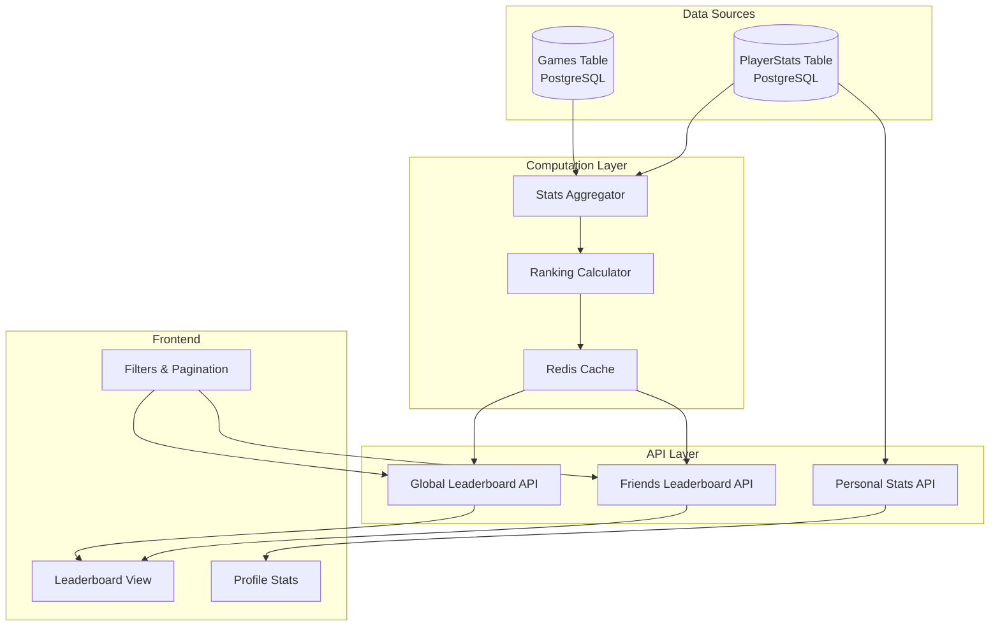

# Leaderboard and Rankings System

## Leaderboard Architecture



## Leaderboard Flow Diagram

```mermaid
sequenceDiagram
    actor User
    participant Frontend as Frontend<br/>(React)
    participant Backend as Backend<br/>(Django)
    participant Redis as Redis<br/>(Leaderboard Cache)
    participant DB as Database<br/>(PostgreSQL)

    Note over User,DB: View Global Leaderboard
    
    User->>Frontend: Navigate to Leaderboard
    Frontend->>Backend: GET /api/leaderboard/global<br/>?page=1&limit=50<br/>(JWT from HttpOnly cookie)
    
    Backend->>Backend: Extract & verify JWT<br/>(optional - public view)
    
    Backend->>Redis: Check cache<br/>GET leaderboard:global:page:1
    Redis-->>Backend: Cache hit or miss
    
    alt Cache hit
        Backend-->>Frontend: 200 OK<br/>{rankings: [...], cache: true}
        Frontend->>Frontend: Display leaderboard
        Frontend-->>User: Show top players
    else Cache miss
        Backend->>DB: SELECT u.id, u.username, u.avatar_url,<br/>ps.games_won, ps.games_played,<br/>ps.accuracy_percentage,<br/>ps.longest_win_streak<br/>FROM PlayerStats ps<br/>JOIN User u ON u.id = ps.user_id<br/>WHERE u.is_active = TRUE<br/>ORDER BY ps.games_won DESC,<br/>ps.accuracy_percentage DESC<br/>LIMIT 50 OFFSET 0
        DB-->>Backend: Rankings data
        
        Backend->>Backend: Calculate ranks<br/>Add additional metrics
        
        Backend->>Redis: Cache result<br/>SETEX leaderboard:global:page:1<br/>300 (5 min TTL)
        Redis-->>Backend: Cached
        
        Backend-->>Frontend: 200 OK<br/>{rankings: [...]}
        Frontend->>Frontend: Display leaderboard
        Frontend-->>User: Show top players
    end

    Note over User,DB: View Friends Leaderboard
    
    User->>Frontend: Click "Friends Only" tab
    Frontend->>Backend: GET /api/leaderboard/friends<br/>?page=1&limit=50<br/>(JWT from HttpOnly cookie)
    
    Backend->>Backend: Extract & verify JWT<br/>Get user_id
    
    Backend->>Redis: Check cache<br/>GET leaderboard:friends:{user_id}:page:1
    Redis-->>Backend: Cache miss
    
    Backend->>DB: Get friends list<br/>SELECT addressee_id, requester_id<br/>FROM Friendship<br/>WHERE (requester_id = user_id<br/>OR addressee_id = user_id)<br/>AND status = 'accepted'
    DB-->>Backend: Friend IDs list
    
    Backend->>DB: SELECT u.id, u.username, u.avatar_url,<br/>ps.games_won, ps.games_played,<br/>ps.accuracy_percentage<br/>FROM PlayerStats ps<br/>JOIN User u ON u.id = ps.user_id<br/>WHERE u.id IN (friend_ids)<br/>OR u.id = user_id<br/>ORDER BY ps.games_won DESC<br/>LIMIT 50
    DB-->>Backend: Friends rankings
    
    Backend->>Backend: Calculate ranks within friend group<br/>Highlight current user
    
    Backend->>Redis: Cache result<br/>SETEX leaderboard:friends:{user_id}:page:1<br/>300 (5 min TTL)
    Redis-->>Backend: Cached
    
    Backend-->>Frontend: 200 OK<br/>{rankings: [...],<br/>current_user_rank: 5}
    Frontend->>Frontend: Display friends leaderboard<br/>Highlight user's position
    Frontend-->>User: Show friends rankings

    Note over User,DB: Filter by Time Period
    
    User->>Frontend: Select "This Week" filter
    Frontend->>Backend: GET /api/leaderboard/global<br/>?period=week&page=1
    
    Backend->>Redis: Check cache<br/>GET leaderboard:global:week:page:1
    Redis-->>Backend: Cache miss
    
    Backend->>DB: SELECT u.id, u.username, u.avatar_url,<br/>COUNT(g.id) as wins_this_week<br/>FROM Game g<br/>JOIN User u ON u.id = g.winner_id<br/>WHERE g.ended_at >= NOW() - INTERVAL '7 days'<br/>GROUP BY u.id, u.username, u.avatar_url<br/>ORDER BY wins_this_week DESC<br/>LIMIT 50
    DB-->>Backend: Weekly rankings
    
    Backend->>Redis: Cache result<br/>SETEX leaderboard:global:week:page:1<br/>300
    Redis-->>Backend: Cached
    
    Backend-->>Frontend: 200 OK<br/>{rankings: [...]}
    Frontend-->>User: Show weekly leaderboard

    Note over User,DB: Search for User on Leaderboard
    
    User->>Frontend: Search for username
    Frontend->>Backend: GET /api/leaderboard/search<br/>?username=player123<br/>(JWT from HttpOnly cookie)
    
    Backend->>DB: SELECT u.id, u.username, u.avatar_url,<br/>ps.games_won, ps.accuracy_percentage,<br/>(SELECT COUNT(*) + 1<br/> FROM PlayerStats ps2<br/> WHERE ps2.games_won > ps.games_won) as rank<br/>FROM PlayerStats ps<br/>JOIN User u ON u.id = ps.user_id<br/>WHERE u.username ILIKE '%player123%'<br/>LIMIT 10
    DB-->>Backend: Search results with ranks
    
    Backend-->>Frontend: 200 OK<br/>{results: [...]}
    Frontend-->>User: Display search results

    Note over User,DB: View Personal Stats & Rank
    
    User->>Frontend: Click profile
    Frontend->>Backend: GET /api/stats/me<br/>(JWT from HttpOnly cookie)
    
    Backend->>Backend: Extract & verify JWT<br/>Get user_id
    
    Backend->>DB: SELECT ps.*,<br/>(SELECT COUNT(*) + 1<br/> FROM PlayerStats ps2<br/> WHERE ps2.games_won > ps.games_won<br/> OR (ps2.games_won = ps.games_won<br/>     AND ps2.accuracy_percentage > ps.accuracy_percentage))<br/>as global_rank,<br/>(SELECT COUNT(*) FROM PlayerStats) as total_players<br/>FROM PlayerStats ps<br/>WHERE ps.user_id = user_id
    DB-->>Backend: Stats with rank
    
    Backend->>Backend: Calculate percentile<br/>percentile = (1 - rank/total) * 100
    
    Backend-->>Frontend: 200 OK<br/>{stats: {...},<br/>global_rank: 342,<br/>total_players: 10000,<br/>percentile: 96.58}
    Frontend->>Frontend: Display stats dashboard
    Frontend-->>User: Show "You're in top 4%!"

    Note over User,DB: Game Completed - Update Rankings
    
    Note over Backend: Game ends, winner determined
    
    Backend->>DB: UPDATE PlayerStats<br/>for winner and loser<br/>(games_won, accuracy, etc.)
    DB-->>Backend: Updated
    
    Backend->>Redis: Invalidate leaderboard caches<br/>DEL leaderboard:global:*<br/>DEL leaderboard:friends:*
    Redis-->>Backend: Caches cleared
    
    Backend->>Backend: Trigger background task<br/>to update real-time rankings
    
    Note over Backend: Next leaderboard request<br/>will recalculate from DB

    Note over User,DB: Real-Time Rank Updates (WebSocket)
    
    Backend->>Backend: Detect significant rank change<br/>(e.g., user jumped 10+ positions)
    
    Backend->>Backend: Calculate new rank for user
    
    Backend->>Backend: Send WebSocket notification
    Backend-->>Frontend: WebSocket event<br/>{type: 'rank_update',<br/>new_rank: 325,<br/>old_rank: 342,<br/>change: +17}
    
    Frontend->>Frontend: Show notification toast
    Frontend-->>User: "🎉 You climbed to rank #325!"
```



## Database Queries

### Global Leaderboard (All-Time Wins)

```sql
SELECT 
    ROW_NUMBER() OVER (
        ORDER BY ps.games_won DESC, 
                 ps.accuracy_percentage DESC, 
                 ps.games_played ASC
    ) as rank,
    u.id,
    u.username,
    u.display_name,
    u.avatar_url,
    ps.games_played,
    ps.games_won,
    ps.games_lost,
    ps.accuracy_percentage,
    ps.longest_win_streak,
    ps.current_win_streak
FROM PlayerStats ps
JOIN User u ON u.id = ps.user_id
WHERE u.is_active = TRUE
  AND ps.games_played >= 5  -- Minimum games for ranking
ORDER BY rank
LIMIT 50 OFFSET 0;
```

### Friends Leaderboard

```sql
WITH friend_ids AS (
    SELECT 
        CASE 
            WHEN requester_id = :user_id THEN addressee_id
            ELSE requester_id 
        END as friend_id
    FROM Friendship
    WHERE (requester_id = :user_id OR addressee_id = :user_id)
      AND status = 'accepted'
    UNION
    SELECT :user_id  -- Include current user
)
SELECT 
    ROW_NUMBER() OVER (
        ORDER BY ps.games_won DESC, 
                 ps.accuracy_percentage DESC
    ) as rank,
    u.id,
    u.username,
    u.display_name,
    u.avatar_url,
    ps.games_played,
    ps.games_won,
    ps.accuracy_percentage,
    CASE WHEN u.id = :user_id THEN TRUE ELSE FALSE END as is_current_user
FROM PlayerStats ps
JOIN User u ON u.id = ps.user_id
WHERE u.id IN (SELECT friend_id FROM friend_ids)
  AND u.is_active = TRUE
ORDER BY rank;
```

### Time-Period Leaderboard (This Week)

```sql
SELECT 
    ROW_NUMBER() OVER (
        ORDER BY weekly_wins DESC, 
                 weekly_accuracy DESC
    ) as rank,
    u.id,
    u.username,
    u.display_name,
    u.avatar_url,
    COUNT(CASE WHEN g.winner_id = u.id THEN 1 END) as weekly_wins,
    COUNT(g.id) as weekly_games,
    CASE 
        WHEN SUM(CASE WHEN g.player_1_id = u.id THEN g.player_1_shots ELSE g.player_2_shots END) > 0
        THEN (SUM(CASE WHEN g.player_1_id = u.id THEN g.player_1_hits ELSE g.player_2_hits END)::FLOAT / 
              SUM(CASE WHEN g.player_1_id = u.id THEN g.player_1_shots ELSE g.player_2_shots END)) * 100
        ELSE 0
    END as weekly_accuracy
FROM User u
LEFT JOIN Game g ON (g.player_1_id = u.id OR g.player_2_id = u.id)
    AND g.ended_at >= NOW() - INTERVAL '7 days'
WHERE u.is_active = TRUE
GROUP BY u.id, u.username, u.display_name, u.avatar_url
HAVING COUNT(g.id) >= 3  -- Minimum games for weekly ranking
ORDER BY rank
LIMIT 50;
```

### Get User's Exact Rank

```sql
WITH ranked_players AS (
    SELECT 
        u.id,
        ps.games_won,
        ps.accuracy_percentage,
        ROW_NUMBER() OVER (
            ORDER BY ps.games_won DESC, 
                     ps.accuracy_percentage DESC
        ) as rank
    FROM PlayerStats ps
    JOIN User u ON u.id = ps.user_id
    WHERE u.is_active = TRUE
      AND ps.games_played >= 5
)
SELECT 
    rank,
    games_won,
    accuracy_percentage,
    (SELECT COUNT(*) FROM ranked_players) as total_players
FROM ranked_players
WHERE id = :user_id;
```

### Ranking Categories

```sql
-- Top 100 by Wins
-- Top 100 by Accuracy (min 20 games)
-- Top 100 by Win Streak
-- Top 100 by Best Game Time
SELECT 
    ROW_NUMBER() OVER (ORDER BY ps.accuracy_percentage DESC) as rank,
    u.id,
    u.username,
    u.avatar_url,
    ps.accuracy_percentage,
    ps.games_played
FROM PlayerStats ps
JOIN User u ON u.id = ps.user_id
WHERE u.is_active = TRUE
  AND ps.games_played >= 20  -- Minimum for accuracy leaderboard
ORDER BY rank
LIMIT 100;
```

## Redis Caching Strategy

### Cache Key Structure

```
leaderboard:global:page:{page_num}         # TTL: 300s (5 min)
leaderboard:global:{period}:page:{page}    # TTL: 300s
leaderboard:friends:{user_id}:page:{page}  # TTL: 300s
leaderboard:category:{category}:page:{page} # TTL: 300s
user:rank:{user_id}                        # TTL: 600s (10 min)
```

### Cache Operations

- **SET**: Store leaderboard page with 5-minute expiration
- **GET**: Retrieve cached leaderboard page
- **DEL**: Invalidate caches when game completes (pattern-based deletion)
- **Alternative**: Use Redis Sorted Sets (`ZADD`, `ZREVRANGE`, `ZREVRANK`) for real-time ranking calculations

### Invalidation Strategy

On game completion:
- Delete all global leaderboard caches
- Delete affected friends leaderboard caches
- Delete affected user rank caches
- Background job recalculates rankings asynchronously

## Frontend Design Considerations

### Key Features

1. **Tab Navigation**: Switch between Global and Friends leaderboards
2. **Time Period Filters**: All Time, This Week, This Month (global only)
3. **Pagination**: 50 players per page with infinite scroll or pagination buttons
4. **Search**: Find specific users by username
5. **Rank Highlighting**: Highlight current user's position in rankings
6. **Real-time Updates**: WebSocket notifications for rank changes
7. **Loading States**: Show skeleton loaders while fetching data
8. **Empty States**: Friendly messages when no data available

### Display Information Per Player

- Rank number (with badges for top 3)
- Avatar image
- Username / Display name
- Games won
- Total games played
- Accuracy percentage
- Current win streak (optional)
- Visual indicators for current user

## Performance Optimization

1. **Caching**: Cache leaderboard pages in Redis (5-minute TTL)
2. **Pagination**: Limit to 50 players per page
3. **Indexing**: Composite indexes on (games_won DESC, accuracy_percentage DESC)
4. **Materialized Views**: Pre-calculate rankings for common queries
5. **Background Jobs**: Update rankings asynchronously after games
6. **CDN**: Cache static leaderboard pages for public view

## Security Considerations

1. **Rate Limiting**: Max 100 leaderboard requests per hour per user
2. **Public Access**: Global leaderboard can be viewed without authentication
3. **Privacy**: Only show public profile data
4. **Friends Only**: Require authentication for friends leaderboard
5. **Anti-Cheating**: Validate all game results server-side

## Error Handling

| Error Condition | HTTP Status | Frontend Action |
|----------------|-------------|-----------------|
| Unauthorized (friends view) | 401 | Redirect to login |
| Invalid page number | 400 | Show first page |
| Rate limit exceeded | 429 | Show cached data |
| Server error | 500 | Show error, allow retry |
