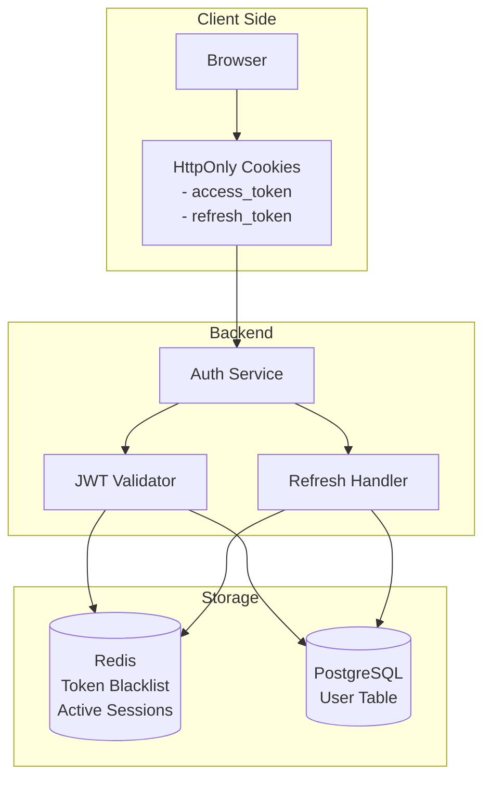

# Session Management & JWT Refresh Process

## Session Architecture



## Token Lifecycle Flow

```mermaid
sequenceDiagram
    actor User
    participant Frontend as Frontend<br/>(React)
    participant Backend as Backend<br/>(Django)
    participant Redis as Redis<br/>(Token Store)
    participant DB as Database<br/>(PostgreSQL)

    Note over User,DB: Initial Login - Issue Tokens
    
    User->>Frontend: Login with credentials
    Frontend->>Backend: POST /api/auth/login<br/>{email, password}
    
    Backend->>DB: Verify credentials
    DB-->>Backend: User record
    
    Backend->>Backend: Generate access token<br/>(expires: 15 min)
    Backend->>Backend: Generate refresh token<br/>(expires: 7 days)
    
    Backend->>Redis: Store session<br/>SETEX session:{user_id}:{session_id}<br/>{refresh_token_hash, device_info}<br/>TTL: 7 days
    Redis-->>Backend: Stored
    
    Backend->>DB: UPDATE User<br/>SET last_login = NOW()
    DB-->>Backend: Updated
    
    Backend-->>Frontend: Set-Cookie: access_token=...<br/>(HttpOnly, Secure, SameSite=Strict, Max-Age=900)<br/><br/>Set-Cookie: refresh_token=...<br/>(HttpOnly, Secure, SameSite=Strict, Max-Age=604800)
    
    Frontend-->>User: Redirect to dashboard

    Note over User,DB: Making Authenticated Request
    
    User->>Frontend: Navigate to profile
    Frontend->>Backend: GET /api/profile<br/>(access_token sent automatically via cookie)
    
    Backend->>Backend: Extract access_token from cookie
    Backend->>Backend: Verify JWT signature<br/>Check expiration
    
    alt Access token valid
        Backend->>Redis: Check if blacklisted<br/>GET blacklist:{token_hash}
        Redis-->>Backend: Not blacklisted
        
        Backend->>Backend: Extract user_id from token
        Backend->>DB: Fetch user data
        DB-->>Backend: User profile
        
        Backend-->>Frontend: 200 OK<br/>{user: {...}}
        Frontend-->>User: Display profile
    else Access token expired
        Backend-->>Frontend: 401 Unauthorized<br/>{error: "Token expired"}
        
        Note over Frontend: Automatic token refresh
        Frontend->>Frontend: Intercept 401 error
        Frontend->>Backend: POST /api/auth/refresh<br/>(refresh_token sent via cookie)
        
        Backend->>Backend: Extract refresh_token from cookie
        Backend->>Backend: Verify JWT signature<br/>Check expiration
        
        Backend->>Redis: Check session validity<br/>GET session:{user_id}:{session_id}
        Redis-->>Backend: Session data
        
        Backend->>Backend: Verify refresh_token hash matches
        
        Backend->>Backend: Generate new access token<br/>(expires: 15 min)
        Backend->>Backend: Optionally rotate refresh token<br/>(if > 24h old)
        
        Backend->>Redis: Update session if rotated<br/>SETEX session:{user_id}:{new_session_id}
        Redis-->>Backend: Updated
        
        Backend-->>Frontend: Set-Cookie: access_token=new_token<br/>(HttpOnly, Secure, SameSite=Strict)<br/><br/>Set-Cookie: refresh_token=new_token<br/>(if rotated)
        
        Frontend->>Frontend: Retry original request
        Frontend->>Backend: GET /api/profile<br/>(with new access_token)
        
        Backend->>DB: Fetch user data
        DB-->>Backend: User profile
        
        Backend-->>Frontend: 200 OK<br/>{user: {...}}
        Frontend-->>User: Display profile
    end

    Note over User,DB: Refresh Token Expires
    
    User->>Frontend: Browse after 7 days of inactivity
    Frontend->>Backend: GET /api/profile<br/>(access_token expired)
    
    Backend-->>Frontend: 401 Unauthorized
    
    Frontend->>Backend: POST /api/auth/refresh<br/>(refresh_token cookie)
    
    Backend->>Backend: Extract refresh_token
    Backend->>Backend: Verify JWT - EXPIRED
    
    Backend-->>Frontend: 401 Unauthorized<br/>{error: "Refresh token expired",<br/>redirect: "/login"}
    
    Frontend->>Frontend: Clear local state
    Frontend->>Frontend: Redirect to login page
    Frontend-->>User: Show "Session expired, please login"

    Note over User,DB: Logout - Invalidate Tokens
    
    User->>Frontend: Click "Logout"
    Frontend->>Backend: POST /api/auth/logout<br/>(access_token + refresh_token in cookies)
    
    Backend->>Backend: Extract tokens from cookies
    Backend->>Backend: Decode access_token<br/>Get user_id & session_id
    
    Backend->>Redis: Blacklist access token<br/>SETEX blacklist:{access_token_hash} 1<br/>TTL: 900 (15 min)
    Redis-->>Backend: Blacklisted
    
    Backend->>Redis: Delete session<br/>DEL session:{user_id}:{session_id}
    Redis-->>Backend: Deleted
    
    Backend-->>Frontend: Set-Cookie: access_token=<br/>(deleted, Max-Age=0)<br/><br/>Set-Cookie: refresh_token=<br/>(deleted, Max-Age=0)<br/><br/>200 OK {message: "Logged out"}
    
    Frontend->>Frontend: Clear local storage
    Frontend->>Frontend: Disconnect WebSocket
    Frontend->>Frontend: Redirect to login
    Frontend-->>User: Show login page

    Note over User,DB: Logout From All Devices
    
    User->>Frontend: Click "Logout All Devices"
    Frontend->>Backend: POST /api/auth/logout-all<br/>(JWT from cookie)
    
    Backend->>Backend: Extract user_id from JWT
    
    Backend->>Redis: Get all user sessions<br/>SCAN 0 MATCH session:{user_id}:*
    Redis-->>Backend: List of session keys
    
    Backend->>Redis: Delete all sessions<br/>DEL session:{user_id}:*
    Redis-->>Backend: Deleted
    
    Backend->>Redis: Blacklist current access token<br/>SETEX blacklist:{token_hash} 1
    Redis-->>Backend: Blacklisted
    
    Backend-->>Frontend: 200 OK<br/>{message: "Logged out from all devices"}
    
    Frontend-->>User: Redirect to login<br/>Show "Logged out from all devices"

    Note over User,DB: View Active Sessions
    
    User->>Frontend: Navigate to Security Settings
    Frontend->>Backend: GET /api/auth/sessions<br/>(JWT from cookie)
    
    Backend->>Backend: Extract user_id from JWT
    
    Backend->>Redis: Get all sessions<br/>SCAN 0 MATCH session:{user_id}:*
    Redis-->>Backend: Session keys list
    
    Backend->>Redis: Get session details<br/>MGET session:{user_id}:*
    Redis-->>Backend: Session data list
    
    Backend->>Backend: Parse session data<br/>Format response
    
    Backend-->>Frontend: 200 OK<br/>{sessions: [<br/>  {session_id, device, ip,<br/>   location, last_active,<br/>   is_current: true},<br/>  {...}<br/>]}
    
    Frontend->>Frontend: Display sessions list
    Frontend-->>User: Show active devices table

    Note over User,DB: Revoke Specific Session
    
    User->>Frontend: Click "Revoke" on old session
    Frontend->>Backend: DELETE /api/auth/sessions/{session_id}<br/>(JWT from cookie)
    
    Backend->>Backend: Extract user_id from JWT
    Backend->>Backend: Verify session ownership
    
    Backend->>Redis: Check if revoking current session
    Redis-->>Backend: Not current
    
    Backend->>Redis: Delete session<br/>DEL session:{user_id}:{session_id}
    Redis-->>Backend: Deleted
    
    Backend-->>Frontend: 200 OK<br/>{message: "Session revoked"}
    
    Frontend->>Frontend: Remove from list
    Frontend-->>User: Show "Session revoked"

    Note over User,DB: Token Rotation on Refresh
    
    Frontend->>Backend: POST /api/auth/refresh<br/>(refresh_token cookie)
    
    Backend->>Backend: Extract refresh_token
    Backend->>Backend: Decode JWT<br/>Check issued_at timestamp
    
    alt Token > 24 hours old
        Backend->>Backend: Generate new access token
        Backend->>Backend: Generate new refresh token
        Backend->>Backend: Generate new session_id
        
        Backend->>Redis: Delete old session<br/>DEL session:{user_id}:{old_session_id}
        Redis-->>Backend: Deleted
        
        Backend->>Redis: Create new session<br/>SETEX session:{user_id}:{new_session_id}<br/>{new_refresh_hash, ...}
        Redis-->>Backend: Created
        
        Backend-->>Frontend: Set both new tokens<br/>(access + refresh)
        Frontend-->>User: Continue seamlessly
    else Token < 24 hours old
        Backend->>Backend: Generate new access token only
        Backend->>Backend: Keep existing refresh token
        
        Backend-->>Frontend: Set new access token only
        Frontend-->>User: Continue seamlessly
    end
```



## Token Structure

### Access Token (JWT)

**Purpose**: Short-lived token for API authentication
**Storage**: HttpOnly cookie
**Expiration**: 15 minutes
**Payload**:
```json
{
  "user_id": "uuid",
  "username": "string",
  "session_id": "uuid",
  "type": "access",
  "iat": 1704470400,
  "exp": 1704471300
}
```

### Refresh Token (JWT)

**Purpose**: Long-lived token to obtain new access tokens
**Storage**: HttpOnly cookie
**Expiration**: 7 days
**Payload**:
```json
{
  "user_id": "uuid",
  "session_id": "uuid",
  "type": "refresh",
  "iat": 1704470400,
  "exp": 1705075200
}
```

## Redis Session Data Structure

```json
// Key: session:{user_id}:{session_id}
// TTL: 604800 seconds (7 days)
{
  "user_id": "uuid",
  "session_id": "uuid",
  "refresh_token_hash": "sha256_hash",
  "device_info": {
    "user_agent": "Mozilla/5.0...",
    "device_type": "desktop",
    "os": "Windows 10",
    "browser": "Chrome 120"
  },
  "ip_address": "192.168.1.100",
  "location": "Warsaw, Poland",
  "created_at": "2024-01-05T12:00:00Z",
  "last_active": "2024-01-05T14:30:00Z"
}
```

## Token Blacklist Structure

```
// Key: blacklist:{sha256(access_token)}
// TTL: Remaining time until token expiration (max 900s)
// Value: 1 (flag indicating blacklisted)

Example:
blacklist:8f7d6e5c... = 1
TTL: 450 seconds
```

## Security Considerations

### Token Security

1. **HttpOnly Cookies**: Prevent XSS attacks by making tokens inaccessible to JavaScript
2. **Secure Flag**: Ensure cookies only transmitted over HTTPS
3. **SameSite=Strict**: Prevent CSRF attacks by restricting cookie transmission
4. **Short Access Token Lifetime**: Limit damage from token theft (15 min)
5. **Token Rotation**: Rotate refresh tokens to detect theft

### Session Security

1. **Session Tracking**: Monitor active sessions per user
2. **Device Fingerprinting**: Detect suspicious session creation
3. **Concurrent Session Limits**: Max 5 active sessions per user
4. **Geolocation Checks**: Alert on login from unusual locations
5. **Session Revocation**: Allow users to revoke individual sessions

### Refresh Token Security

1. **Token Hashing**: Store hashed refresh tokens in Redis
2. **One-Time Use**: Consider implementing refresh token rotation
3. **Family Detection**: Detect refresh token reuse (indicates theft)
4. **Automatic Revocation**: Revoke all sessions if theft detected

## API Endpoints

### POST /api/auth/login
**Purpose**: Authenticate user and issue tokens
**Request Body**: `{email, password}`
**Response**: Sets HttpOnly cookies, returns user data
**Cookies**: `access_token`, `refresh_token`

### POST /api/auth/refresh
**Purpose**: Obtain new access token using refresh token
**Request**: Refresh token from cookie
**Response**: Sets new access_token cookie
**Token Rotation**: New refresh token if > 24h old

### POST /api/auth/logout
**Purpose**: Invalidate current session
**Request**: JWT from cookie
**Response**: Clears cookies, blacklists access token

### POST /api/auth/logout-all
**Purpose**: Invalidate all user sessions
**Request**: JWT from cookie
**Response**: Clears all user sessions from Redis

### GET /api/auth/sessions
**Purpose**: List active sessions for current user
**Request**: JWT from cookie
**Response**: Array of session objects

### DELETE /api/auth/sessions/{session_id}
**Purpose**: Revoke specific session
**Request**: JWT from cookie, session_id in URL
**Response**: 200 OK on success

## Automatic Token Refresh (Frontend)

### Axios Interceptor Pattern

The frontend should implement an HTTP interceptor that:

1. **Detects 401 Errors**: Intercepts 401 Unauthorized responses
2. **Calls Refresh Endpoint**: Automatically requests new access token
3. **Retries Original Request**: Replays failed request with new token
4. **Handles Refresh Failure**: Redirects to login if refresh fails
5. **Queues Requests**: Prevents multiple simultaneous refresh calls

### Key Behaviors

- **Silent Refresh**: No user interaction required
- **Request Queue**: Hold pending requests during refresh
- **Retry Logic**: Automatically retry after successful refresh
- **Fallback**: Clear session and redirect if refresh fails

## Session Expiration Scenarios

| Scenario | Access Token | Refresh Token | Behavior |
|----------|--------------|---------------|----------|
| Normal usage (< 15 min) | Valid | Valid | Request succeeds |
| Idle 20 minutes | Expired | Valid | Auto-refresh, request succeeds |
| Idle 8 days | Expired | Expired | Redirect to login |
| User logs out | Blacklisted | Deleted | Redirect to login |
| User changes password | Blacklisted | All deleted | Force re-login all devices |
| Suspicious activity | Blacklisted | All deleted | Alert user, force re-login |

## Performance Optimization

1. **Redis Caching**: Fast token validation without DB queries
2. **JWT Verification**: Stateless verification of access tokens
3. **Lazy Blacklist Check**: Only check blacklist for sensitive operations
4. **Session Pagination**: Limit session listing to 100 most recent
5. **Background Cleanup**: Periodic job to remove expired Redis keys

## Monitoring & Logging

### Events to Log

1. **Login Success/Failure**: Track authentication attempts
2. **Token Refresh**: Monitor refresh frequency
3. **Token Theft Detection**: Alert on suspicious refresh patterns
4. **Session Revocation**: Log manual and automatic revocations
5. **Unusual Locations**: Flag logins from new locations
6. **Concurrent Sessions**: Alert on excessive session creation

### Metrics to Track

- Average session duration
- Token refresh frequency
- Failed authentication rate
- Active sessions per user
- Geographic login distribution

## Error Handling

| Error Condition | HTTP Status | Frontend Action |
|----------------|-------------|-----------------|
| Access token expired | 401 Unauthorized | Auto-refresh and retry |
| Refresh token expired | 401 Unauthorized | Redirect to login |
| Invalid token signature | 401 Unauthorized | Clear session, redirect to login |
| Token blacklisted | 401 Unauthorized | Clear session, show "Logged out" |
| Session not found | 401 Unauthorized | Clear session, redirect to login |
| Too many sessions | 429 Too Many Requests | Show "Max sessions reached" |
| Server error | 500 Internal Server Error | Show error, allow retry |

## Best Practices

1. **Token Lifetime Balance**: Short enough for security, long enough for UX
2. **Refresh Token Rotation**: Enhanced security at cost of complexity
3. **Session Monitoring**: Empower users to manage their security
4. **Graceful Degradation**: Handle token refresh failures smoothly
5. **Clear Communication**: Inform users about session expiration
6. **Secure Defaults**: HttpOnly, Secure, SameSite=Strict on all cookies
