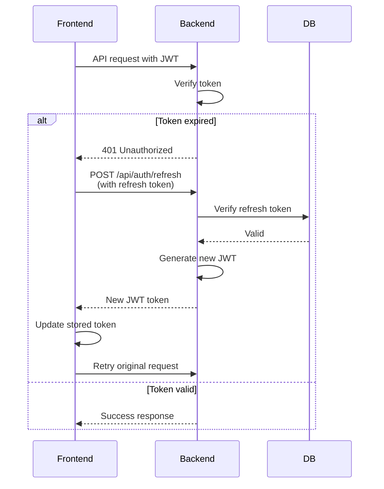

# User Login Process

## Login Flow Diagram

```mermaid
sequenceDiagram
    actor User
    participant Frontend as Frontend<br/>(React)
    participant Backend as Backend<br/>(Django)
    participant DB as Database<br/>(PostgreSQL)
    participant OAuth as OAuth Provider<br/>(42 Intra)

    Note over User,OAuth: Standard Login Flow
    
    User->>Frontend: Enter credentials<br/>(username/email, password)
    Frontend->>Frontend: Validate input fields<br/>- Check not empty<br/>- Basic format validation
    
    Frontend->>Backend: POST /api/auth/login<br/>{identifier, password}
    
    Backend->>Backend: Sanitize inputs
    
    Backend->>DB: SELECT User WHERE<br/>username = identifier OR email = identifier
    DB-->>Backend: User record or NULL
    
    alt User not found
        Backend->>Backend: Delay response (prevent timing attacks)
        Backend-->>Frontend: 401 Unauthorized
        Frontend-->>User: Show error: Invalid credentials
    else User found
        Backend->>Backend: Verify password hash<br/>(compare with stored hash)
        
        alt Password invalid
            Backend->>Backend: Delay response
            Backend-->>Frontend: 401 Unauthorized
            Frontend-->>User: Show error: Invalid credentials
        else Password valid
            Backend->>DB: Check is_active status
            DB-->>Backend: User status
            
            alt Account inactive
                Backend-->>Frontend: 403 Forbidden
                Frontend-->>User: Show error: Account disabled
            else Account active
                Backend->>DB: UPDATE User<br/>SET last_login = CURRENT_TIMESTAMP
                DB-->>Backend: Updated
                
                Backend->>Backend: Generate JWT token<br/>(include user_id, username, exp)
                
                Backend->>DB: SELECT PlayerStats<br/>WHERE user_id = user.id
                DB-->>Backend: Player statistics
                
                Backend-->>Frontend: Set-Cookie: jwt=token<br/>(HttpOnly, Secure, SameSite)<br/>200 OK {user_data, stats}
                Frontend->>Frontend: Update app state<br/>(user info, stats)
                Frontend-->>User: Redirect to dashboard
            end
        end
    end

    Note over User,OAuth: OAuth Login Flow (42 Intra)
    
    User->>Frontend: Click "Login with 42"
    Frontend->>OAuth: Redirect to 42 OAuth<br/>(with client_id, redirect_uri)
    OAuth->>User: Show 42 login page
    User->>OAuth: Enter 42 credentials
    OAuth->>OAuth: Validate credentials
    OAuth-->>Frontend: Redirect with authorization code
    
    Frontend->>Backend: POST /api/auth/oauth/callback<br/>{code, provider: '42'}
    Backend->>OAuth: POST /oauth/token<br/>(exchange code for access token)
    OAuth-->>Backend: Access token + refresh token
    
    Backend->>OAuth: GET /api/v2/me<br/>(fetch user profile)
    OAuth-->>Backend: User profile data
    
    Backend->>Backend: Extract oauth_id from profile
    
    Backend->>DB: SELECT User WHERE<br/>oauth_provider = '42'<br/>AND oauth_id = oauth_user_id
    DB-->>Backend: User record or NULL
    
    alt OAuth user not found
        Backend-->>Frontend: 404 Not Found<br/>{error: "Account not registered"}
        Frontend-->>User: Show: "Please register first"<br/>or auto-register
    else OAuth user found
        Backend->>DB: Check is_active status
        DB-->>Backend: User status
        
        alt Account inactive
            Backend-->>Frontend: 403 Forbidden
            Frontend-->>User: Show error: Account disabled
        else Account active
            Backend->>DB: UPDATE User<br/>SET last_login = CURRENT_TIMESTAMP<br/>SET avatar_url = latest_42_avatar
            DB-->>Backend: Updated
            
            Backend->>Backend: Generate JWT token
            
            Backend->>DB: SELECT PlayerStats<br/>WHERE user_id = user.id
            DB-->>Backend: Player statistics
            
            Backend-->>Frontend: Set-Cookie: jwt=token<br/>(HttpOnly, Secure, SameSite)<br/>200 OK {user_data, stats}
            Frontend->>Frontend: Update app state
            Frontend-->>User: Redirect to dashboard
        end
    end
```



## Process Breakdown

### Frontend Responsibilities

1. **Input Handling**
   - Accept username or email as identifier
   - Mask password input
   - Basic client-side validation (not empty)
   - Show loading state during authentication

2. **OAuth Flow**
   - Generate OAuth redirect URL with proper parameters
   - Handle OAuth callback and extract authorization code
   - Manage state parameter for CSRF protection

3. **Session Management**
   - Receive JWT token via HttpOnly cookie (automatic with credentials)
   - Configure axios/fetch with `credentials: 'include'` for cookie transmission
   - Handle token expiration and refresh logic
   - Logout by calling backend to clear cookie

4. **User Experience**
   - Display appropriate error messages
   - Provide "Forgot Password?" link
   - Offer both standard and OAuth login options
   - Show login success and redirect smoothly

### Backend Responsibilities

1. **Security**
   - Sanitize all inputs
   - Use constant-time comparison for passwords (prevent timing attacks)
   - Implement rate limiting (e.g., max 5 attempts per minute per IP)
   - Add deliberate delay on failed attempts
   - Generate secure JWT tokens with proper expiration
   - Set tokens in HttpOnly, Secure, SameSite=Strict cookies

2. **Authentication**
   - Verify password against stored hash
   - Handle both username and email as login identifiers
   - Check account status (active/inactive)
   - Validate OAuth tokens with provider

3. **OAuth Processing**
   - Exchange authorization code for access token
   - Fetch user profile from OAuth provider
   - Match OAuth user to database record
   - Update avatar and last login time

4. **Response Data**
   - Set JWT token in HttpOnly cookie
   - Include essential user data (id, username, email, avatar) in response body
   - Attach player statistics
   - Set appropriate HTTP status codes

### Database Operations

#### On Successful Login
```sql
-- Update last login timestamp
UPDATE User 
SET last_login = CURRENT_TIMESTAMP
WHERE id = user_id;

-- For OAuth: also update avatar
UPDATE User 
SET last_login = CURRENT_TIMESTAMP,
    avatar_url = new_avatar_url
WHERE id = user_id;

-- Fetch user data
SELECT id, username, email, display_name, avatar_url, language
FROM User
WHERE id = user_id;

-- Fetch player statistics
SELECT games_played, games_won, games_lost, 
       total_shots, total_hits, accuracy_percentage,
       longest_win_streak, current_win_streak
FROM PlayerStats
WHERE user_id = user_id;
```

## JWT Token Structure

```json
{
  "user_id": "uuid",
  "username": "player123",
  "email": "player@example.com",
  "iat": 1704484800,
  "exp": 1704571200
}
```

## Security Considerations

1. **Rate Limiting**: Maximum 5 login attempts per IP per minute
2. **Account Lockout**: Temporary lock after 10 failed attempts
3. **Password Verification**: Use constant-time comparison
4. **Generic Error Messages**: Don't reveal if username exists
5. **JWT Security**: 
   - Store in HttpOnly, Secure, SameSite=Strict cookies
   - Not accessible via JavaScript (protects against XSS attacks)
   - Short expiration time (24 hours)
   - Include user claims for authorization
6. **CSRF Protection**: Implement CSRF tokens for cookie-based authentication
7. **OAuth State Parameter**: Prevent CSRF attacks during OAuth flow
8. **HTTPS Only**: All authentication over encrypted connection

## Error Handling

| Error Condition | HTTP Status | Frontend Action |
|----------------|-------------|-----------------|
| Invalid credentials | 401 Unauthorized | Show "Invalid username or password" |
| Account disabled | 403 Forbidden | Show "Account has been disabled" |
| Too many attempts | 429 Too Many Requests | Show "Too many attempts, try again later" |
| OAuth not registered | 404 Not Found | Redirect to registration with OAuth |
| Server error | 500 Internal Server Error | Show "Login failed, try again" |
| OAuth provider error | 502 Bad Gateway | Show "42 login unavailable" |

## Session Management

### HttpOnly Cookie Configuration

**Backend Cookie Settings**:
- `key`: 'jwt'
- `httponly`: true (not accessible via JavaScript for XSS protection)
- `secure`: true (only sent over HTTPS)
- `samesite`: 'Strict' (CSRF protection)
- `max_age`: 86400 seconds (24 hours)

**Frontend Configuration**:
- Enable `withCredentials` for HTTP client (axios/fetch)
- Set `credentials: 'include'` to automatically send cookies
- No manual token management needed (handled by browser)

**Logout Process**:
- Backend sets cookie with empty value and max_age=0
- Browser automatically deletes expired cookie
- Frontend redirects to login page

### Token Refresh Strategy


