# User Profile Update Process

## Profile Update Flow Diagram

```mermaid
sequenceDiagram
    actor User
    participant Frontend as Frontend<br/>(React)
    participant Backend as Backend<br/>(Django)
    participant DB as Database<br/>(PostgreSQL)
    participant Storage as File Storage<br/>(Local/S3)

    Note over User,Storage: Profile Information Update
    
    User->>Frontend: Navigate to profile settings
    Frontend->>Backend: GET /api/user/profile<br/>(JWT from HttpOnly cookie)
    Backend->>Backend: Extract & verify JWT from cookie
    
    alt Token invalid/expired
        Backend-->>Frontend: 401 Unauthorized
        Frontend-->>User: Redirect to login
    else Token valid
        Backend->>DB: SELECT User<br/>WHERE id = token.user_id
        DB-->>Backend: User data
        
        Backend->>DB: SELECT PlayerStats<br/>WHERE user_id = token.user_id
        DB-->>Backend: Statistics
        
        Backend-->>Frontend: 200 OK<br/>{user_data, stats}
        Frontend->>Frontend: Populate form fields
        Frontend-->>User: Display profile page
    end
    
    User->>Frontend: Edit profile fields<br/>(display_name, language, email)
    Frontend->>Frontend: Validate changes<br/>- Check required fields<br/>- Validate email format<br/>- Check field lengths
    
    User->>Frontend: Click "Save Changes"
    Frontend->>Backend: PATCH /api/user/profile<br/>{display_name, language, email}<br/>(JWT from HttpOnly cookie)
    
    Backend->>Backend: Extract & verify JWT from cookie<br/>Get user_id
    Backend->>Backend: Sanitize inputs<br/>Validate data
    
    Backend->>DB: Check if new email exists<br/>(if email changed)
    DB-->>Backend: Query result
    
    alt Email taken by another user
        Backend-->>Frontend: 409 Conflict
        Frontend-->>User: Show error: Email already in use
    else Email available or unchanged
        Backend->>DB: UPDATE User SET<br/>display_name = new_value,<br/>email = new_value,<br/>language = new_value<br/>WHERE id = user_id
        DB-->>Backend: Updated successfully
        
        Backend->>DB: SELECT updated User data
        DB-->>Backend: User record
        
        Backend-->>Frontend: 200 OK<br/>{updated_user_data}
        Frontend->>Frontend: Update app state
        Frontend-->>User: Show success message
    end

    Note over User,Storage: Password Change
    
    User->>Frontend: Navigate to "Change Password"
    Frontend-->>User: Show password change form
    
    User->>Frontend: Enter old & new password
    Frontend->>Frontend: Validate passwords<br/>- Old password not empty<br/>- New password strength<br/>- Passwords don't match
    
    User->>Frontend: Click "Change Password"
    Frontend->>Backend: POST /api/user/password<br/>{old_password, new_password}<br/>(JWT from HttpOnly cookie)
    
    Backend->>Backend: Extract & verify JWT from cookie
    Backend->>Backend: Sanitize inputs
    
    Backend->>DB: SELECT password_hash<br/>WHERE id = user_id
    DB-->>Backend: Current password hash
    
    Backend->>Backend: Verify old_password<br/>against stored hash
    
    alt Old password incorrect
        Backend-->>Frontend: 401 Unauthorized
        Frontend-->>User: Show error: Current password incorrect
    else Old password correct
        alt OAuth user (password_hash is NULL)
            Backend-->>Frontend: 400 Bad Request
            Frontend-->>User: Show: OAuth accounts cannot set password
        else Regular user
            Backend->>Backend: Hash new password<br/>(PBKDF2/bcrypt)
            
            Backend->>DB: UPDATE User SET<br/>password_hash = new_hash<br/>WHERE id = user_id
            DB-->>Backend: Updated
            
            Backend-->>Frontend: 200 OK
            Frontend-->>User: Show success: Password changed
        end
    end

    Note over User,Storage: Avatar Upload
    
    User->>Frontend: Click "Upload Avatar"
    Frontend->>Frontend: Open file picker
    User->>Frontend: Select image file
    
    Frontend->>Frontend: Validate file<br/>- Check file type (jpg, png, gif)<br/>- Check file size (max 5MB)<br/>- Optional: Preview crop
    
    alt File invalid
        Frontend-->>User: Show error: Invalid file
    else File valid
        Frontend->>Frontend: Create FormData<br/>with file
        
        Frontend->>Backend: POST /api/user/avatar<br/>(multipart/form-data)<br/>(JWT from HttpOnly cookie)
        
        Backend->>Backend: Extract & verify JWT from cookie
        Backend->>Backend: Validate file<br/>- Check MIME type<br/>- Verify file size<br/>- Scan for malware (optional)
        
        alt File validation fails
            Backend-->>Frontend: 400 Bad Request
            Frontend-->>User: Show error message
        else File valid
            Backend->>Backend: Generate unique filename<br/>(user_id + timestamp + ext)
            
            Backend->>Storage: Save file<br/>(/media/avatars/ or S3)
            Storage-->>Backend: File URL
            
            Backend->>DB: SELECT avatar_url<br/>WHERE id = user_id
            DB-->>Backend: Old avatar URL
            
            Backend->>DB: UPDATE User SET<br/>avatar_url = new_url<br/>WHERE id = user_id
            DB-->>Backend: Updated
            
            alt Old avatar exists (not OAuth avatar)
                Backend->>Storage: Delete old avatar file
                Storage-->>Backend: Deleted
            end
            
            Backend-->>Frontend: 200 OK<br/>{avatar_url}
            Frontend->>Frontend: Update displayed avatar
            Frontend-->>User: Show success message
        end
    end

    Note over User,Storage: Delete Account
    
    User->>Frontend: Click "Delete Account"
    Frontend-->>User: Show confirmation dialog<br/>"This action cannot be undone"
    
    User->>Frontend: Confirm deletion<br/>Enter password for verification
    Frontend->>Backend: DELETE /api/user/account<br/>{password}<br/>(JWT from HttpOnly cookie)
    
    Backend->>Backend: Extract & verify JWT from cookie
    Backend->>Backend: Verify password
    
    alt Password incorrect
        Backend-->>Frontend: 401 Unauthorized
        Frontend-->>User: Show error: Password incorrect
    else Password correct
        Backend->>DB: UPDATE User SET<br/>is_active = FALSE,<br/>email = email + '_deleted_' + timestamp<br/>WHERE id = user_id
        DB-->>Backend: Soft deleted
        
        Note over Backend: Soft delete preserves<br/>game history integrity
        
        Backend->>Backend: Clear JWT cookie<br/>(Set-Cookie with Max-Age=0)
        Backend-->>Frontend: 200 OK
        Frontend->>Frontend: Clear app state
        Frontend-->>User: Redirect to homepage<br/>Show: Account deleted
    end
```



## Process Breakdown

### Frontend Responsibilities

1. **Profile Display**
   - Fetch and display current user data
   - Show read-only fields (username, created_at)
   - Show editable fields (display_name, email, language)
   - Display player statistics (read-only)

2. **Form Validation**
   - Validate email format
   - Check display name length (3-50 characters)
   - Enforce password strength requirements
   - Validate file types and sizes for avatar upload
   - Show real-time validation feedback

3. **File Upload**
   - Preview image before upload
   - Optional: Implement crop/resize functionality
   - Show upload progress
   - Update displayed avatar immediately

4. **User Experience**
   - Disable form during submission
   - Show loading states
   - Display success/error messages
   - Confirm destructive actions (password change, account deletion)

### Backend Responsibilities

1. **Authentication & Authorization**
   - Extract JWT token from HttpOnly cookie on every request
   - Verify JWT token signature and expiration
   - Ensure user can only modify their own profile
   - Check token expiration
   - Verify JWT token on every request
   - Ensure user can only modify their own profile
   - Check token expiration

2. **Data Validation**
   - Sanitize all text inputs
   - Validate email uniqueness
   - Verify password strength
   - Validate file types and sizes
   - Check MIME types (don't trust client)

3. **File Management**
   - Generate secure, unique filenames
   - Store files in appropriate location
   - Clean up old avatar files
   - Implement file size limits
   - Optional: Virus scanning

4. **Security**
   - Hash passwords securely
   - Verify old password before changing
   - Prevent email enumeration
   - Rate limit update requests
   - Log security-relevant changes

### Database Operations

#### Profile Information Update
```sql
-- Check email availability
SELECT id FROM User 
WHERE email = new_email 
  AND id != current_user_id;

-- Update profile
UPDATE User SET
    display_name = new_display_name,
    email = new_email,
    language = new_language
WHERE id = user_id;
```

#### Password Change
```sql
-- Fetch current password hash
SELECT password_hash 
FROM User 
WHERE id = user_id;

-- Update password
UPDATE User SET
    password_hash = new_hash
WHERE id = user_id;
```

#### Avatar Update
```sql
-- Get old avatar URL
SELECT avatar_url 
FROM User 
WHERE id = user_id;

-- Update avatar
UPDATE User SET
    avatar_url = new_url
WHERE id = user_id;
```

#### Soft Delete Account
```sql
-- Soft delete (preserves referential integrity)
UPDATE User SET
    is_active = FALSE,
    email = CONCAT(email, '_deleted_', EXTRACT(EPOCH FROM NOW()))
WHERE id = user_id;

-- Alternative: Hard delete (cascades to stats, but breaks game history)
-- DELETE FROM User WHERE id = user_id;
```

## Updateable vs Read-Only Fields

### Can Update
- `display_name` - User's display name
- `email` - Email address (must remain unique)
- `language` - UI language preference
- `avatar_url` - Profile picture
- `password_hash` - Password (requires old password verification)

### Read-Only
- `username` - Cannot be changed (permanent identifier)
- `oauth_provider` - Set during registration
- `oauth_id` - Set during registration
- `created_at` - Account creation timestamp
- `last_login` - Automatically updated
- All fields in `PlayerStats` - Updated by game logic only

## Security Considerations

1. **JWT Cookie Authentication**: 
   - JWT stored in HttpOnly, Secure, SameSite=Strict cookie
   - Not accessible via JavaScript (protects against XSS attacks)
   - Automatically included in requests with `credentials: 'include'`
2. **Authorization**: Users can only update their own profile (verified via JWT user_id)
3. **Password Verification**: Always require old password to change password
4. **Email Uniqueness**: Prevent duplicate emails across users
5. **CSRF Protection**: Implement CSRF tokens for state-changing operations
6. **File Upload Security**:
   - Validate file types server-side
   - Limit file sizes (5MB recommended)
   - Sanitize filenames
   - Store outside web root or use signed URLs
   - Optional: Virus scanning
7. **Rate Limiting**: Limit update frequency (e.g., max 10 per hour)
8. **Audit Trail**: Log sensitive changes (email, password)
9. **Soft Deletion**: Preserve data integrity for game history

## Error Handling

| Error Condition | HTTP Status | Frontend Action |
|----------------|-------------|-----------------|
| Token invalid/expired | 401 Unauthorized | Redirect to login |
| Email already taken | 409 Conflict | Show error on email field |
| Invalid file type | 400 Bad Request | Show "Only JPG, PNG, GIF allowed" |
| File too large | 413 Payload Too Large | Show "Max file size is 5MB" |
| Wrong old password | 401 Unauthorized | Show "Current password incorrect" |
| Weak new password | 400 Bad Request | Show password requirements |
| OAuth user setting password | 400 Bad Request | Show "OAuth accounts cannot set password" |
| Server error | 500 Internal Server Error | Show "Update failed, try again" |

## File Upload Best Practices

1. **Storage Options**:
   - **Development**: Local filesystem (`/media/avatars/`)
   - **Production**: Cloud storage (AWS S3, Google Cloud Storage)

2. **Filename Generation**:
   ```python
   filename = f"{user_id}_{timestamp()}.{extension}"
   # Example: a7b3c9d1-1704484800.jpg
   ```

3. **URL Structure**:
   - Local: `https://yourdomain.com/media/avatars/{filename}`
   - S3: `https://bucket.s3.amazonaws.com/avatars/{filename}`

4. **Image Processing** (Optional):
   - Resize to standard dimensions (e.g., 200x200)
   - Convert to optimized format (WebP)
   - Generate thumbnails
