# User Registration Process

## Registration Flow Diagram

```mermaid
sequenceDiagram
    actor User
    participant Frontend as Frontend<br/>(React)
    participant Backend as Backend<br/>(Django)
    participant DB as Database<br/>(PostgreSQL)
    participant OAuth as OAuth Provider<br/>(42 Intra)

    Note over User,OAuth: Standard Registration Flow
    
    User->>Frontend: Fill registration form<br/>(username, email, password, language)
    Frontend->>Frontend: Validate input fields<br/>- Email format<br/>- Password strength<br/>- Username availability
    
    Frontend->>Backend: POST /api/auth/register<br/>{username, email, password, language}
    
    Backend->>Backend: Validate data<br/>- Sanitize inputs<br/>- Check password requirements
    
    Backend->>DB: Check if username exists
    DB-->>Backend: Query result
    
    alt Username exists
        Backend-->>Frontend: Error: Username taken
        Frontend-->>User: Show error message
    else Username available
        Backend->>DB: Check if email exists
        DB-->>Backend: Query result
        
        alt Email exists
            Backend-->>Frontend: Error: Email already registered
            Frontend-->>User: Show error message
        else Email available
            Backend->>Backend: Hash password<br/>(PBKDF2/bcrypt)
            
            Backend->>DB: INSERT INTO User<br/>- id (UUID)<br/>- username<br/>- email<br/>- password_hash<br/>- language<br/>- created_at
            DB-->>Backend: User created
            
            Backend->>DB: INSERT INTO PlayerStats<br/>- id (UUID)<br/>- user_id<br/>- Initialize all stats to 0
            DB-->>Backend: Stats created
            
            Backend->>Backend: Generate JWT token
            Backend-->>Frontend: Set-Cookie: jwt=token<br/>(HttpOnly, Secure, SameSite)
            Frontend->>Frontend: Update app state<br/>(user info, stats)
            Frontend-->>User: Redirect to dashboard
        end
    end

    Note over User,OAuth: OAuth Registration Flow (42 Intra)
    
    User->>Frontend: Click "Login with 42"
    Frontend->>OAuth: Redirect to 42 OAuth
    OAuth->>User: Show 42 login page
    User->>OAuth: Enter 42 credentials
    OAuth->>OAuth: Validate credentials
    OAuth-->>Frontend: Redirect with authorization code
    
    Frontend->>Backend: POST /api/auth/oauth/callback<br/>{code, provider}
    Backend->>OAuth: Exchange code for access token
    OAuth-->>Backend: Access token + user info
    
    Backend->>Backend: Extract user data<br/>(email, username, avatar)
    
    Backend->>DB: Check if oauth_id exists
    DB-->>Backend: Query result
    
    alt OAuth user exists
        Backend->>DB: UPDATE last_login
        DB-->>Backend: Updated
        Backend->>Backend: Generate JWT token
        Backend-->>Frontend: Success + JWT token
        Frontend->>Frontend: Store JWT in localStorage
        Frontend-->>User: Redirect to dashboard
    else New OAuth user
        Backend->>DB: Check if email exists
        DB-->>Backend: Query result
        
        alt Email exists (link accounts)
            Backend->>DB: UPDATE User<br/>- oauth_provider = '42'<br/>- oauth_id = user_id<br/>- avatar_url = 42_avatar
            DB-->>Backend: Updated
        else Create new user
            Backend->>DB: INSERT INTO User<br/>- id (UUID)<br/>- username (from 42)<br/>- email (from 42)<br/>- oauth_provider = '42'<br/>- oauth_id = 42_user_id<br/>- avatar_url<br/>- password_hash = NULL<br/>- created_at
            DB-->>Backend: User created
            
            Backend->>DB: INSERT INTO PlayerStats<br/>- Initialize all stats to 0
            DB-->>Backend: Stats created
        end
        
        Backend->>Backend: Generate JWT token
        Backend-->>Frontend: Success + JWT token
        Frontend->>Frontend: Store JWT in localStorage
        Frontend-->>User: Redirect to dashboard
    end
```



## Process Breakdown

### Frontend Responsibilities

1. **Form Validation**
   - Check email format (RFC 5322 compliant)
   - Validate password strength (min 8 chars, uppercase, lowercase, number, special char)
   - Ensure username meets requirements (3-20 chars, alphanumeric + underscore)
   - Verify all required fields are filled

2. **User Experience**
   - Display real-time validation feedback
   - Show loading state during registration
   - Handle error messages gracefully
   - Receive authentication via HttpOnly cookie (set by backend)
   - Redirect to appropriate page after success

3. **OAuth Initiation**
   - Redirect user to OAuth provider
   - Handle OAuth callback with authorization code

### Backend Responsibilities

1. **Security & Validation**
   - Sanitize all inputs to prevent XSS and SQL injection
   - Verify password complexity requirements
   - Check for duplicate usernames and emails
   - Hash passwords using PBKDF2 or bcrypt with salt
   - Generate secure JWT tokens with expiration
   - Set JWT in HttpOnly, Secure, SameSite=Strict cookie

2. **OAuth Processing**
   - Exchange authorization code for access token
   - Fetch user information from OAuth provider
   - Handle account linking for existing emails
   - Map OAuth user data to database schema

3. **Business Logic**
   - Coordinate database operations
   - Initialize player statistics
   - Handle transaction rollback on errors
   - Send appropriate HTTP status codes

### Database Operations

#### User Table
```sql
INSERT INTO User (
    id,
    username,
    email,
    password_hash,      -- NULL for OAuth users
    display_name,       -- Same as username initially
    avatar_url,         -- NULL or OAuth avatar
    language,           -- User preference or 'en' default
    oauth_provider,     -- NULL or '42'
    oauth_id,           -- NULL or 42 user ID
    is_active,          -- TRUE
    created_at,         -- CURRENT_TIMESTAMP
    last_login          -- CURRENT_TIMESTAMP
)
```

#### PlayerStats Table
```sql
INSERT INTO PlayerStats (
    id,
    user_id,            -- Foreign key to User
    games_played,       -- 0
    games_won,          -- 0
    games_lost,         -- 0
    total_shots,        -- 0
    total_hits,         -- 0
    accuracy_percentage,-- 0.0
    longest_win_streak, -- 0
    current_win_streak, -- 0
    best_game_duration_seconds, -- NULL
    updated_at          -- CURRENT_TIMESTAMP
)
```

## Security Considerations

1. **Password Storage**: Never store plain text passwords; always use cryptographic hashing
2. **Input Sanitization**: All user inputs must be sanitized on both frontend and backend
3. **JWT Security**: 
   - Store tokens in HttpOnly, Secure, SameSite=Strict cookies
   - Not accessible via JavaScript (protects against XSS attacks)
   - Tokens should have reasonable expiration times (e.g., 24 hours)
4. **CSRF Protection**: Implement CSRF tokens for cookie-based authentication
5. **Rate Limiting**: Implement rate limiting on registration endpoint to prevent abuse
6. **HTTPS Only**: All authentication operations must use encrypted connections

## Error Handling

| Error Condition | HTTP Status | Frontend Action |
|----------------|-------------|-----------------|
| Username taken | 409 Conflict | Show inline error on username field |
| Email taken | 409 Conflict | Show inline error on email field |
| Invalid email format | 400 Bad Request | Show validation error |
| Weak password | 400 Bad Request | Show password requirements |
| Server error | 500 Internal Server Error | Show generic error message |
| OAuth failure | 401 Unauthorized | Show "Login failed" message |
