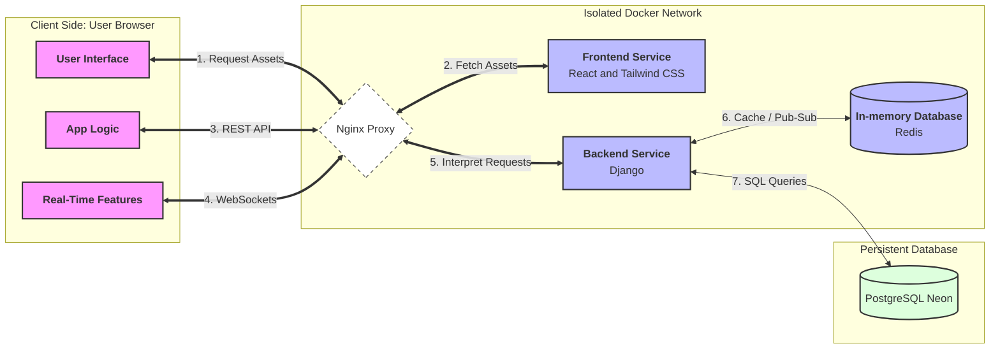

_This project has been created as part of the 42 curriculum by dmodrzej[, agorski[, mbany[, ltomasze[, and gbuczyns]]]]._

---

## Index

- [Description](#description)
- [Instructions](#instructions)
- [Resources](#resources)
- [Team Information](#team-information)
- [Project Management](#project-management)
- [Technical Stack](#technical-stack)
- [Database Schema](#database-schema)
- [Features List](#features-list)
- [Modules](#modules)
- [Individual Contributions](#individual-contributions)
- [GitHub Rules](GitRules.md)

---

# Description

**Online Tactical Battleship** is the final project of the 42 Common Core.
Our team has developed a high-end, web-based **Online Battleship** platform.
The project features a real-time multiplayer engine, an AI strategic opponent,
and a sleek UI.

---

# Instructions

### Prerequisites

- Docker & Docker Compose
- Git

### Setup

1. Clone the repository:
   ```bash
   git clone https://github.com/antekgorski/ft_transendence.git
   cd ft_transendence
   ```

2. Create environment file:
   ```bash
   cp .env.example .env
   # Edit .env with your credentials and variables
   ```

3. Compile the application:
   ```bash
   # Compile
   make

   # Restart containers
   make restart

   # Restart frontend
   make restart_frontend

   # Restart backend
   make restart_backend

   # Restart redis
   make restart_redis

   # Rebuild
   make re
   ```

4. Access your app via browser under URL and port defined in .env file

---

# Resources

### Infrastructure



> **Architecture Note:**
> 1. **Static Serving Phase:** The browser initially contacts Nginx to download the application (React + Tailwind CSS bundle) stored in the **Frontend** container.
> 2. **Runtime Phase:** Once the application is loaded in the browser, it executes locally. It communicates with the **Backend** via Nginx for dynamic data (REST API) and real-time multiplayer features (WebSockets).

### Documentation

- [Docker Documentation](https://docs.docker.com/)
- [Docker Compose](https://docs.docker.com/compose/)
- [Redis Documentation](https://redis.io/docs/)
- [Django Channels](https://channels.readthedocs.io/en/stable/)
- [Mermaid Diagrams](https://mermaid.js.org/intro/)

---

# Team Information

| Login        | Role                   | Responsibilities                              |
|:-------------|:-----------------------|:----------------------------------------------|
| **mbany**    | **Product Owner (PO)** | Feature prioritization, game rules, 14-pt goal|
| **dmodrzej** | **Technical Lead**     | Architecture (React+Django), DevOps, WS       |
| **agorski**  | **Project Manager**    | Sprint planning, deadlines, Agile process     |
| **ltomasze** | **Developer**          | Game logic, API development, UI integration   |
| **gbuczyns** | **Developer**          | Game logic, API development, UI integration   |

---

# Project Management

### Communication

- We communicate primarily via **Slack**, using a dedicated private
  group for the project.
- All day-to-day updates, quick questions, and decisions are shared
  there to keep everyone aligned.

### Meetings

- We meet **once a week**, every **Saturday at 12:00**, **in person
  on campus**.
- Each meeting follows a fixed agenda with pre-agreed discussion points
  (progress review, blockers, upcoming milestones, priority alignment).
- After the discussion, we **split tasks** and assign ownership for
  the next iteration.

### Tools

- We use **GitHub Issues** as our main project management tool.
- Each feature/bug is tracked as an issue with clear acceptance criteria,
  assignees, and status updates.

---

# Technical Stack

### Frontend
- **React**: Component-based SPA framework for dynamic UI
- **Nginx**: Web server for serving static assets and reverse proxy

### Backend
- **Django 4.2**: Python web framework with built-in admin, ORM, and security features
- **Django REST Framework**: RESTful API development
- **Channels & Daphne**: WebSocket support for real-time multiplayer gameplay
- **Django Sessions**: Secure session-based authentication with Redis backend

### Database & Cache
- **PostgreSQL 15**: Robust relational database (hosted via Neon) chosen for ACID compliance, complex queries, and excellent Django ORM integration.
- **Redis 7**: In-memory data store for WebSocket channel layers and session caching. Configured with custom memory limits (256MB) and LRU eviction policy in [redis/redis.conf](redis/redis.conf).

### Infrastructure
- **Docker & Docker Compose**: Containerization for consistent development and deployment environments
- **OAuth 2.0**: 42 Intra integration for remote authentication

### Key Technical Choices
- **Django + React architecture**: Separates concerns between API (Django) and presentation (React), enabling independent scaling and development
- **PostgreSQL over NoSQL**: Relational data model suits user management, game history, and friendship systems with enforced data integrity
- **WebSockets via Channels**: Real-time bidirectional communication essential for synchronous multiplayer gameplay
- **Docker-based deployment**: Ensures reproducibility across environments and simplifies microservices orchestration

---

# Database Schema

```mermaid
erDiagram
    User ||--|| PlayerStats : "has stats"
    User ||--o{ Game : "player_1"
    User ||--o{ Game : "player_2"
    User ||--o{ Game : "winner"
    User ||--o{ Friendship : "requests"
    User ||--o{ Friendship : "receives"
    User ||--o{ Notification : "receives"
    
    User {
        uuid id PK
        string username UK
        string email UK
        string password_hash
        string display_name "nullable"
        string avatar_url "nullable"
        string custom_avatar_url "nullable"
        string intra_avatar_url "nullable"
        string language
        string oauth_provider "nullable"
        string oauth_id "nullable"
        boolean is_active
        boolean is_staff
        boolean is_superuser
        json notification_preferences
        timestamp created_at
        timestamp last_login "nullable"
    }
    
    Notification {
        uuid id PK
        uuid user_id FK
        string type
        string title
        text message
        json data
        boolean is_read
        timestamp read_at "nullable"
        timestamp created_at
        timestamp expires_at "nullable"
        string action_url "nullable"
    }
    
    PlayerStats {
        uuid id PK
        uuid user_id FK UK
        int games_played
        int games_won
        int games_lost
        int total_shots
        int total_hits
        float accuracy_percentage
        int longest_win_streak
        int current_win_streak
        int best_game_duration_seconds
        timestamp updated_at
    }
    
    Game {
        uuid id PK
        uuid player_1_id FK
        uuid player_2_id FK "null for AI opponent"
        string game_type "pvp|ai"
        string status "pending|active|completed|forfeited"
        uuid winner_id FK "nullable"
        int duration_seconds
        int player_1_shots
        int player_1_hits
        int player_2_shots
        int player_2_hits
        timestamp started_at
        timestamp ended_at
    }
    
    Friendship {
        uuid id PK
        uuid requester_id FK
        uuid addressee_id FK
        string status "pending|accepted|blocked"
        timestamp created_at
        timestamp updated_at
    }
```

---

# Features List

### User Management
- **User Registration & Login**: Secure account creation with password hashing, email validation, and session-based authentication
- **OAuth 2.0 Authentication**: Single sign-on via 42 Intra for streamlined access
- **User Profiles**: Customizable display names and avatar uploads
- **Session Management**: Secure Redis-backed sessions with HttpOnly cookies

### Social Features
- **Friendship System**: Send, accept, or reject friend requests with online status checking
- **Notifications**: In-app alerts for friend requests, game invitations, and match results with customizable preferences

### Gameplay
- **Battleship Game**: Full-featured battleships game with options to play against AI or another player
- **Real-time Chat**: WebSocket-based option to chat during the game with AI or another player
- **AI Opponent**: Strategic bot using probability-grid algorithms for challenging single-player experience
- **Game History**: Persistent match records with detailed statistics (shots, hits, duration, winner)

### Statistics & Leaderboards
- **Player Statistics**: Track games played, wins and losses, accuracy percentage, and win streaks
- **Leaderboard System**: Global rankings based on wins, accuracy, and other performance metrics

---

# Modules

## Basic

### Web (7 Points)

- **Major: Use a framework for both the frontend and backend.** Django & React (2 pts)
- **Major: Implement real-time features using WebSockets or similar technology.** Real-time gaming experience and chat (2 pts)
- **Major: Allow users to interact with other users.** Basic chat, checking other users' profiles, adding and removing friends (2 pts)
- **Minor: Use an ORM for the database.** Django ORM for database management (1 pt)

### User Management (3 Points)

- **Major: Standard user management and authentication.** Secure registration, login, and profile management (2 pts)
- **Minor: Game statistics and match history.** Game stats and match history (1 pt)

### Gaming and User Experience (4 Points)

- **Major: Implement a complete web-based game where users can play against each other** Full Battleship implementation (2 pts)
- **Major: Remote players — Enable two players on separate computers to play the same game in real-time** Real-time multiplayer via WebSockets (2 pts)

**Total: 14 Points**

## Bonus

### User Management (1 Point)

- **Minor: Implement remote authentication with OAuth 2.0** OAuth integration with 42 Intra (1 pt)

### Artificial Intelligence (2 Points)

- **Major: Introduce an AI Opponent for games** A strategic bot utilizing a probability-grid algorithm for ship hunting (2 pts)

### Modules of Choice (2 Points)

- **Minor: Accessibility of the game via friendly URL** Game available on https://statki.bieda.it (1 pt)
- **Minor: Deployment pipeline to a remote VPS server** Deployment to a server on mikr.us via Docker Hub with a deployment script (1 pt)

**Total: 19 Points** (14 points for basic implementation + 5 points for bonus)

---

# Individual Contributions

| Member     | Focus Area                                      |
|------------|------------------------------------------------|
| **agorski**  | GitHub Issues, project setup, backend development |
| **dmodrzej** | Docker, infrastructure, backend support         |
| **ltomasze** | Backend development (Django)                    |
| **mbany**    | Frontend development (React)                    |
| **gbuczyns** | Frontend development (React)                    |
