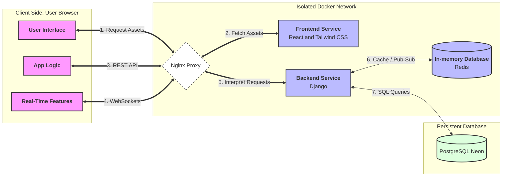
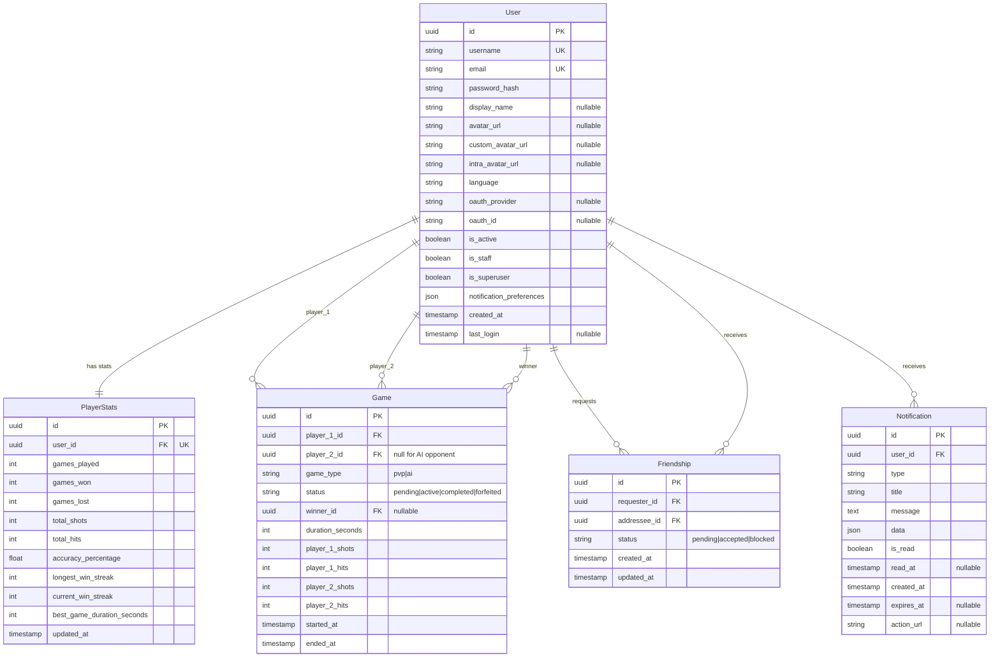

_This project has been created as part of the 42 curriculum by dmodrzej[, agorski[, mbany[, ltomasze[, and gbuczyns]]]]._

---

## Index

- [Description](#description)
- [Instructions](#instructions)
- [Resources](#resources)
- [Team Information](#team-information)
- [Project Management](#project-management)
- [Technical Stack](#technical-stack)
- [Database Schema](#database-schema)
- [Features List](#features-list)
- [Modules](#modules)
- [Individual Contributions](#individual-contributions)
- [GitHub Rules](GitRules.md)

---

# Description

**"Battleships - Tactical Online Game"** is the final project of the 42 Common Core.
Our team has developed a high-end, web-based **Online Battleship** platform.
The project features a real-time multiplayer engine, an AI strategic opponent,
and a sleek UI.

---

# Instructions

### Prerequisites

- Docker & Docker Compose
- Git

### Setup

1. Clone the repository:
   ```bash
   git clone https://github.com/antekgorski/ft_transendence.git
   cd ft_transendence
   ```

2. Create environment file:
   ```bash
   cp .env.example .env
   # Edit .env with your credentials and variables
   ```

3. Compile the application:
   ```bash
   # Compile
   make

   # Restart containers
   make restart

   # Restart frontend
   make restart_frontend

   # Restart backend
   make restart_backend

   # Restart redis
   make restart_redis

   # Rebuild
   make re
   ```

4. Access your app via browser under URL and port defined.

---

# Resources

## The following official documentation and technical resources were used during the development of this project:

### Frameworks and Technologies
- Django Documentation – https://www.djangoproject.com/
- React Documentation – https://react.dev/
- Docker Documentation – https://docs.docker.com/
- MDN Web Docs – https://developer.mozilla.org/

### Authentication and APIs
- OAuth 2.0 Specification (RFC 6749) – https://datatracker.ietf.org/doc/html/rfc6749#section-1.3.4
- 42 API Documentation – Web Application Flow – https://api.intra.42.fr/apidoc/guides/web_application_flow#redirect-urls


## AI Usage

During the development of this project we used AI tools as a **supporting resource** to improve productivity and assist with research and documentation, in accordance with the ft_transcendence project guidelines.

AI was mainly used to reduce repetitive work and help explore possible technical solutions. It was **not used to blindly generate large parts of the project code**. All important architectural and implementation decisions were made by the team and every piece of code included in the project was reviewed and understood by the developers.

### Tasks where AI was helpful

AI tools were used for several supporting tasks, including:

- **Explaining technical concepts** such as WebSockets, authentication flows, and containerization with Docker.
- **Debugging assistance**, suggesting possible causes for configuration or runtime errors.
- **Documentation support**, helping structure and improve the clarity of the README and technical descriptions.
- **Command and configuration reminders**, for example Docker commands, Git usage, and environment configuration.

### Validation process

Following the project guidelines, every AI suggestion was:

- carefully reviewed by the team,
- tested in the development environment,
- discussed before being integrated into the codebase.

Only solutions that were **fully understood by the team members** were implemented in the final project.

### Tools used

Examples of AI tools used during development include:

- ChatGPT  
- GitHub Copilot  
- AI-assisted code suggestions available in development environments

AI was used strictly as a **productivity aid**, while the design, architecture, and implementation of the project were done by the team.

## Infrastructure



> **Architecture Note:**
> 1. **Static Serving Phase:** The browser initially contacts Nginx to download the application (React + Tailwind CSS bundle) stored in the **Frontend** container.
> 2. **Runtime Phase:** Once the application is loaded in the browser, it executes locally. It communicates with the **Backend** via Nginx for dynamic data (REST API) and real-time multiplayer features (WebSockets).

### Documentation

- [Docker Documentation](https://docs.docker.com/)
- [Docker Compose](https://docs.docker.com/compose/)
- [Redis Documentation](https://redis.io/docs/)
- [Django Channels](https://channels.readthedocs.io/en/stable/)
- [Mermaid Diagrams](https://mermaid.js.org/intro/)

---

# Team Information

| Login        | Role                   | Responsibilities                              |
|:-------------|:-----------------------|:----------------------------------------------|
| **mbany**    | **Product Owner (PO)** | Feature prioritization, game rules, 14-pt goal|
| **dmodrzej** | **Technical Lead**     | Architecture (React+Django), DevOps, WS       |
| **agorski**  | **Project Manager**    | Sprint planning, deadlines, Agile process     |
| **ltomasze** | **Developer**          | Game logic, API development, UI integration   |
| **gbuczyns** | **Developer**          | Game logic, API development, UI integration   |

---

# Project Management

### Communication

- We communicate primarily via **Slack**, using a dedicated private
  group for the project.
- All day-to-day updates, quick questions, and decisions are shared
  there to keep everyone aligned.

### Meetings

- We meet **once a week**, every **Saturday at 12:00**, **in person
  on campus**.
- Each meeting follows a fixed agenda with pre-agreed discussion points
  (progress review, blockers, upcoming milestones, priority alignment).
- After the discussion, we **split tasks** and assign ownership for
  the next iteration.

### Tools

- We use **GitHub Issues** as our main project management tool.
- Each feature/bug is tracked as an issue with clear acceptance criteria,
  assignees, and status updates.

---

# Technical Stack

### Frontend
- **React**: Component-based SPA framework for dynamic UI
- **Nginx**: Web server for serving static assets and reverse proxy

### Backend
- **Django 4.2**: Python web framework with built-in admin, ORM, and security features
- **Django REST Framework**: RESTful API development
- **Channels & Daphne**: WebSocket support for real-time multiplayer gameplay
- **Django Sessions**: Secure session-based authentication with Redis backend

### Database & Cache
- **PostgreSQL 15**: Robust relational database (hosted via Neon) chosen for ACID compliance, complex queries, and excellent Django ORM integration.
- **Redis 7**: In-memory data store for WebSocket channel layers and session caching. Configured with custom memory limits (256MB) and LRU eviction policy in [redis/redis.conf](redis/redis.conf).

### Infrastructure
- **Docker & Docker Compose**: Containerization for consistent development and deployment environments
- **OAuth 2.0**: 42 Intra integration for remote authentication

### Key Technical Choices
- **Django + React architecture**: Separates concerns between API (Django) and presentation (React), enabling independent scaling and development
- **PostgreSQL over NoSQL**: Relational data model suits user management, game history, and friendship systems with enforced data integrity
- **WebSockets via Channels**: Real-time bidirectional communication essential for synchronous multiplayer gameplay
- **Docker-based deployment**: Ensures reproducibility across environments and simplifies microservices orchestration

---

# Database Schema



---

# Features List

### User Management
- **User Registration & Login**: Secure account creation with password hashing, email validation, and session-based authentication (ltomasze, mbany)
- **OAuth 2.0 Authentication**: Single sign-on via 42 Intra for streamlined access (agorski)
- **User Profiles**: Customizable display names and avatar uploads (gbuczyns, agorski, ltomasze)
- **Session Management**: Secure Redis-backed sessions with HttpOnly cookies (dmodrzej)

### Social Features
- **Friendship System**: Send, accept, or reject friend requests with online status checking (mbany)
- **Notifications**: In-app alerts for friend requests, game invitations, and match results with customizable preferences (mbany)

### Gameplay
- **Battleship Game**: Full-featured battleships game with options to play against AI or another player (dmodrzej, mbany)
- **Real-time Chat**: WebSocket-based option to chat during the game with AI or another player (dmodrzej)
- **AI Opponent**: Strategic bot using probability-grid algorithms for challenging single-player experience (dmodrzej)
- **Game History**: Persistent match records with detailed statistics (shots, hits, duration, winner) (gbuczyns, dmodrzej, mbany)

### Statistics & Leaderboards
- **Player Statistics**: Track games played, wins and losses, accuracy percentage, and win streaks (gbuczyns, dmodrzej, mbany)
- **Leaderboard System**: Global rankings based on wins, accuracy, and other performance metrics (dmodrzej)

---

# Modules

Scoring rule used in this section: **Major = 2 points**, **Minor = 1 point**.

## Mandatory Modules (14 points)

### Web (7 points)

1) **Major (2 pts) – Framework for frontend and backend**
- **Why we chose it:** We needed a robust full web stack with clear separation of concerns and strong community support.
- **How it was implemented:** React was used for SPA UI and routing; Django + DRF were used for APIs and backend business logic.
- **Team members:** ltomasze, gbuczyns, mbany, dmodrzej, agorski.

2) **Major (2 pts) – Real-time features via WebSockets**
- **Why we chose it:** Real-time Battleship gameplay and in-game events require low-latency bidirectional communication.
- **How it was implemented:** Django Channels + Daphne + Redis channel layers power real-time game state sync, invites, and notifications.
- **Team members:** dmodrzej.

3) **Major (2 pts) – User interaction features**
- **Why we chose it:** Social interaction is a core value of the product and required by the selected module set.
- **How it was implemented:** Friendship flows (add/accept/remove), profile lookup, and in-game chat were exposed via API and WebSocket events.
- **Team members:** ltomasze, gbuczyns.

4) **Minor (1 pt) – ORM usage**
- **Why we chose it:** ORM accelerates development while preserving schema integrity and maintainability.
- **How it was implemented:** Django ORM models/migrations define users, games, stats, friendships, and notifications.
- **Team members:** dmodrzej.

### User Management (3 points)

5) **Major (2 pts) – Standard authentication and profile management**
- **Why we chose it:** Secure account lifecycle is mandatory for multi-user gameplay.
- **How it was implemented:** Registration/login/logout, hashed passwords, session auth, profile edit, and avatar management.
- **Team members:** ltomasze, agorski.

6) **Minor (1 pt) – Game statistics and match history**
- **Why we chose it:** Players need measurable progress and transparent match results.
- **How it was implemented:** Persistent per-user stats and recent matches endpoints integrated into profile/leaderboard views.
- **Team members:** dmodrzej, gbuczyns.

### Gaming and User Experience (4 points)

7) **Major (2 pts) – Complete web-based game**
- **Why we chose it:** Battleship is the central product feature and foundation for gameplay-related modules.
- **How it was implemented:** Full game loop (setup, turns, hit/miss/sink logic, win/loss conditions, persistence).
- **Team members:** dmodrzej.

8) **Major (2 pts) – Remote players in real-time**
- **Why we chose it:** Multi-device multiplayer is required and essential to project scope.
- **How it was implemented:** Real-time synchronization across clients, disconnect handling, and reconnect grace logic.
- **Team members:** dmodrzej.

**Mandatory total: 14 points (Web 7 + User Management 3 + Gaming 4).**

## Bonus Modules (5 points)

9) **Minor (1 pt) – OAuth 2.0 authentication (User Management)**
- **Why we chose it:** Reduces login friction and demonstrates external identity provider integration.
- **How it was implemented:** 42 Intra OAuth flow with callback, account binding, and session initialization.
- **Team members:** dmodrzej, agorski.

10) **Major (2 pts) – AI Opponent (Artificial Intelligence)**
- **Why we chose it:** Enables meaningful single-player mode and increases gameplay depth.
- **How it was implemented:** Probability-grid targeting with state-aware shot selection and adaptive hunt/target phases.
- **Team members:** dmodrzej.

11) **Minor (1 pt) – Friendly URL deployment (Modules of choice)**
- **Why we chose it:** Makes the project publicly accessible for demos/evaluation and improves usability.
- **How it was implemented:** Domain routing to the production stack and Nginx reverse-proxy exposure.
- **Team members:** dmodrzej.

12) **Minor (1 pt) – VPS deployment pipeline (Modules of choice)**
- **Why we chose it:** Provides repeatable remote deployment and demonstrates practical DevOps ownership.
- **How it was implemented:** Docker Hub images + deployment script + production compose stack on mikr.us VPS.
- **Team members:** dmodrzej.

**Overall total: 19 points (14 mandatory + 5 bonus).**

### Justification for Modules of Choice

- **Business/project value:** Public URL and deployment pipeline make the application review-ready, easier to test by peers, and closer to real-world delivery standards.
- **Technical value:** These modules validated container image lifecycle, environment separation, service orchestration, and operational reliability beyond local development.

---

# Individual Contributions

## Dominik Modrzejewski (dmodrzej)

- **Scope:** Backend architecture, infrastructure, security, and core game mechanics.
- Implemented and stabilized Django backend logic (including race-condition fixes and error handling improvements).
- Implemented and improved WebSocket communication for real-time gameplay.
- Developed core game mechanics for PvP and AI modes (consumers, views, synchronization logic).
- Implemented session management rules, including single active login per user.
- Built and refined PvP invitation flow and in-game chat features.
- Integrated and extended Redis-based game/session state management.
- Contributed to frontend game integration (GameBoard and socket flow), including mobile/UI fixes.
- Configured infrastructure components (Nginx, Docker Compose, environment setup, deployment workflow).
- Improved security-related behavior (cookies, HTTPS-related configuration, CSRF handling, token/auth flows).
- Prepared infrastructure documentation and architecture diagrams (README + Mermaid).
- **Challenges faced and resolution:** Real-time synchronization and race conditions in multiplayer flow were resolved through stricter backend state transitions, Redis coordination, and iterative WebSocket event handling refinements.

## Łukasz Tomaszewski (ltomasze)

- **Scope:** Authentication backend, database integration, and matchmaking.
- Implemented backend endpoints for registration and login flows.
- Configured and integrated PostgreSQL (Neon) with the application backend.
- Implemented PvP matchmaking queue logic.
- Added UI switching support for PvP mode integration.
- Contributed Docker Compose configuration fixes for reliable local/dev startup.
- **Challenges faced and resolution:** Matching backend auth/matchmaking behavior with frontend expectations required endpoint and payload adjustments; this was solved through iterative API updates and integration testing.

## Grzegorz Buczyński (gbuczyns)

- **Scope:** Frontend UI structure, routing, and leaderboard experience.
- Implemented leaderboard functionality and related UI presentation.
- Built and refined RouterPage navigation and user flow structure.
- Added interface controls/buttons and improved overall component layout.
- Improved React logic in selected components (including useEffect behavior).
- Cleaned and standardized code comments/documentation style (PL → EN where needed).
- Contributed Docker/environment configuration fixes (.env handling and port consistency).
- **Challenges faced and resolution:** Maintaining stable UI behavior while logic evolved was addressed by simplifying component flow and applying incremental refactors to state/effect logic.

## Michał Bany (mbany)

- **Scope:** Friends system, frontend auth flow, and project structure contributions.
- Implemented friend-related features: user search and add-friend flow.
- Implemented functional frontend login and registration integration.
- Integrated GameBoard with the broader application flow.
- Contributed to project description and role-distribution documentation.
- **Challenges faced and resolution:** Integrating social/auth/game flows in a consistent UX required coordination across screens and endpoints; solved through staged integration and UI/flow corrections.

## Antoni Górski (agorski)

- **Scope:** User-facing features, admin-related work, and 42 authentication integration.
- Implemented user avatar functionality.
- Developed and improved admin-related page/features.
- Contributed fixes and improvements in login/authentication behavior.
- Integrated 42 OAuth authentication flow.
- Delivered feature-branch work for auth-related development (e.g., 42 authentication branch flow).
- Contributed to README evolution and documentation updates.
- **Challenges faced and resolution:** Third-party authentication integration and account-flow consistency were resolved through iterative callback/login fixes and branch-level testing.

## Team-level collaboration and delivery notes

- The team used feature branches and pull requests for integration into shared branches.
- Work was coordinated across backend, frontend, and infrastructure domains with role-aligned ownership.
- Cross-cutting blockers (real-time sync, auth-state consistency, deployment reliability) were resolved through iterative fixes, shared testing, and review-driven adjustments.
