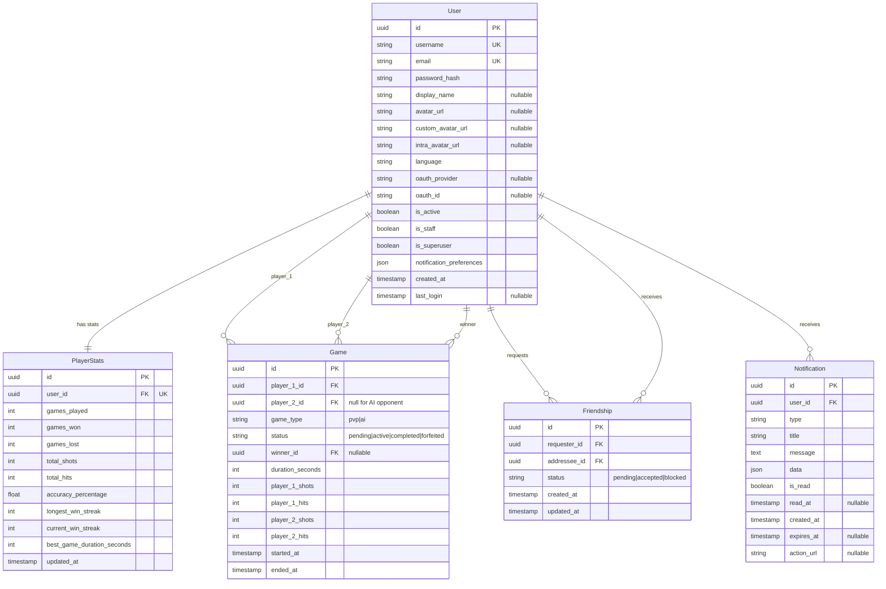

# Database Design - Battleships

## Entity Relationship Diagram

## Schema Description

### Persistent Entities

#### User
Stored in the `users` table. This is a custom Django authentication model that keeps local account data and 42 OAuth metadata.

Key fields:
- `username`, `email`: unique identifiers
- `password_hash`: hashed password stored in the `password_hash` database column
- `avatar_url`: currently selected avatar
- `custom_avatar_url`: locally uploaded custom avatar source
- `intra_avatar_url`: locally cached 42 Intra avatar source
- `oauth_provider`, `oauth_id`: optional OAuth linkage
- `notification_preferences`: JSON settings blob
- `is_active`, `is_staff`, `is_superuser`: account and admin flags

#### PlayerStats
Stored in the `player_stats` table. Each user has exactly one stats row through a one-to-one relationship. A `post_save` signal creates `PlayerStats` automatically for new users.

Tracks aggregated gameplay metrics such as win/loss totals, shooting accuracy, streaks, and quickest win time.

#### Game
Stored in the `games` table. This is a historical summary record for a match, not a full move log.

It stores players, winner, match type, lifecycle status, duration, and shot/hit totals for both sides.

Lifecycle statuses:
- `pending`: Game created, waiting for opponent acceptance
- `active`: Game in progress, players taking turns
- `completed`: Game finished normally with a winner
- `forfeited`: Game ended due to forfeit or player timeout during disconnection

Notes:
- `player_2` is nullable for AI matches
- `winner` is nullable until the game is resolved
- gameplay state itself is kept outside PostgreSQL
- the real-time layer currently uses a 60-second reconnect timeout before auto-forfeit

#### Friendship
Stored in the `friendships` table. Represents directed social relationships between `requester` and `addressee`.

Constraints and indexing:
- unique pair constraint on (`requester`, `addressee`)
- indexes on (`addressee`, `status`) and (`requester`, `status`)

Supported states:
- `pending`
- `accepted`
- `blocked`

#### Notification
Stored in the `notifications` table. Notifications are attached to a single user and contain a type, title, message, optional JSON payload, and read state.

Important implementation note:
- `expires_at` is optional and indexed
- unread counts already ignore expired notifications when `expires_at` is set
- there is no general automatic 30-day expiration rule implemented at the model level

### Real-Time Data (Not Stored in Database)

The following data is maintained outside PostgreSQL, primarily in Redis and WebSocket session state during active gameplay:

- **Game State**: Board configurations, ship placements, current turn
- **Moves**: Real-time shot coordinates and results
- **Ship Positions**: Live ship placement and hit tracking
- **Transient Match Presence**: Active connections, reconnect windows, invite state

When a game ends, only the summary statistics are persisted to the `Game` table and player stats are updated.

## Key Design Decisions

1. **Minimal Persistent Data**: PostgreSQL stores user profiles, relationships, notifications, player aggregates, and game summaries only
2. **Real-Time with Redis**: Active game state managed in-memory for performance
3. **UUID Primary Keys**: All persistent entities use UUID primary keys
4. **Summary Statistics**: `games` captures essential outcome metrics without storing every move
5. **One-to-One Stats Model**: `player_stats` keeps leaderboard and profile queries simple and fast
6. **OAuth Flexibility**: Optional OAuth fields support local auth and 42 OAuth in the same user table
