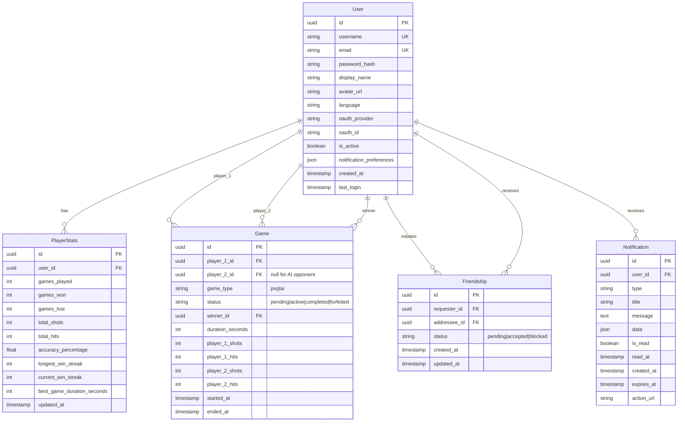

# Database Design - 3D Tactical Battleship

## Entity Relationship Diagram

## Schema Description

### Persistent Entities

#### User
Stores all user account information including OAuth integration (42 Intra), language preferences, and authentication details.

#### PlayerStats
Tracks comprehensive statistics for each player including win/loss ratios, accuracy, and streaks. Updated after each completed game.

#### Game
Historical record of completed games with summary statistics. Stores final results and performance metrics for both players. Includes status tracking for game lifecycle:
- `pending`: Game created, waiting for opponent acceptance
- `active`: Game in progress, players taking turns
- `completed`: Game finished normally with a winner
- `forfeited`: Game ended due to forfeit or player timeout during disconnection

Games are always real-time. If a player disconnects, they have 60 seconds to reconnect before automatically forfeiting.

#### Friendship
Manages friend connections with pending/accepted/blocked states.

#### Notification
Stores in-app notifications for users. Includes friend requests, game invitations, system announcements, etc. Old notifications automatically expire after 30 days.

### Real-Time Data (Not Stored in Database)

The following data exists only in **Redis** and **WebSocket sessions** during active gameplay:

- **Game State**: Board configurations, ship placements, current turn
- **Moves**: Real-time shot coordinates and results
- **Chat Messages**: In-game communication
- **Ship Positions**: Live ship placement and hit tracking

When a game ends, only the summary statistics are persisted to the `Game` table and player stats are updated.

## Key Design Decisions

1. **Minimal Persistent Data**: Only stores user profiles, stats, and game history
2. **Real-Time with Redis**: Active game state managed in-memory for performance
3. **UUID Primary Keys**: Better for distributed systems and microservices architecture
4. **Summary Statistics**: Games table captures essential metrics without move-by-move data
5. **Soft Deletes**: `is_active` flag for user account management
6. **OAuth Flexibility**: `oauth_provider` and `oauth_id` support multiple authentication providers
