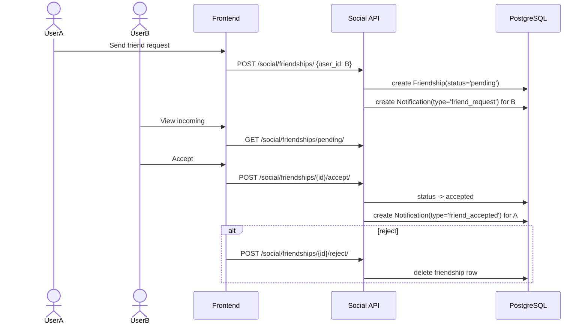

# Friendship Management Process

This document describes the **currently implemented** friendship flow.

## API Surface (Implemented)

All routes are under `/api/social/` via DRF router.

### Friendship endpoints

- `GET /api/social/friendships/` (list all relationships involving current user)
- `POST /api/social/friendships/` (send request, body `{ user_id }`)
- `DELETE /api/social/friendships/{id}/` (remove relationship)
- `GET /api/social/friendships/pending/` (incoming pending)
- `GET /api/social/friendships/sent/` (outgoing pending)
- `GET /api/social/friendships/accepted/` (accepted friendships)
- `POST /api/social/friendships/{id}/accept/`
- `POST /api/social/friendships/{id}/reject/`
- `POST /api/social/friendships/{id}/block/`

### Status values

`Friendship.status`:

- `pending`
- `accepted`
- `blocked`

## Implemented Runtime Flow

## Frontend Behavior (Implemented)

In `ProfilePage`:

- Uses `/social/friendships/accepted|pending|sent/`
- Sends/accepts/rejects/cancels/removes via API calls
- Refreshes friendship lists by polling every 5 seconds
- Search uses `GET /api/auth/users/search/?q=...`

## Validation & Authorization (Implemented)

- Cannot friend self (`400`)
- Target user must exist (`404`)
- Existing relationship returns `409` (including blocked case)
- Only addressee can accept/reject
- Only participants can delete/block relationship

## Notifications Integration (Implemented)

- Friend request creation inserts notification row for addressee
- Friend acceptance inserts notification row for requester
- No real-time friendship websocket event flow is wired in frontend currently

## Not Implemented / Different Than Earlier Drafts

1. No dedicated blocked-users list endpoint
2. No frontend block/unblock management UI flow
3. No websocket-driven friend list updates; polling is used
4. No explicit friendship rate-limiting in current code

## Error Handling (Current)

| Error Condition | Status |
|----------------|--------|
| unauthenticated request | 401 |
| friend self | 400 |
| target user not found | 404 |
| duplicate/existing relationship | 409 |
| non-recipient accepting/rejecting | 403 |
| non-participant deleting/blocking | 403 |
