# Game Process

## Game Flow Diagram

```mermaid
sequenceDiagram
    actor Player1 as Player 1
    participant Frontend1 as Frontend 1<br/>(React)
    participant Backend as Backend<br/>(Django)
    participant DB as Database<br/>(PostgreSQL)
    participant Redis as Redis<br/>(Game State)
    participant WS as WebSocket<br/>(Django Channels)
    participant Frontend2 as Frontend 2<br/>(React)
    actor Player2 as Player 2

    Note over Player1,Player2: Game Initiation (PvP)
    
    Player1->>Frontend1: Click "Challenge Friend" or "Play vs AI"
    Frontend1->>Backend: POST /api/games/create<br/>{game_type: 'pvp', opponent_id}<br/>(JWT from HttpOnly cookie)
    
    Backend->>Backend: Extract & verify JWT<br/>Get player1_id
    Backend->>Backend: Validate opponent_id
    
    Backend->>DB: Check if both users are friends<br/>AND neither is blocked
    DB-->>Backend: Friendship status
    
    alt Not friends or blocked
        Backend-->>Frontend1: 403 Forbidden<br/>{error: "Cannot challenge this user"}
        Frontend1-->>Player1: Show error message
    else Valid challenge
        Backend->>DB: Check if opponent in active game
        DB-->>Backend: Opponent game status
        
        alt Opponent busy
            Backend-->>Frontend1: 409 Conflict<br/>{error: "User is in another game"}
            Frontend1-->>Player1: Show "User is busy"
        else Opponent available
            Backend->>DB: INSERT INTO Game<br/>- id (UUID)<br/>- player_1_id<br/>- player_2_id<br/>- game_type = 'pvp'<br/>- started_at = CURRENT_TIMESTAMP<br/>- All stats = 0
            DB-->>Backend: Game created
            
            Backend->>Redis: Create game session<br/>- game_id<br/>- player_1_id<br/>- player_2_id<br/>- status = 'pending'<br/>- current_turn = NULL<br/>- board_states = {}
            Redis-->>Backend: Session created
            
            Backend->>WS: Send game invitation<br/>to Player 2
            WS->>Frontend2: Push notification<br/>{type: 'game_invitation', from: player1, game_id}
            Frontend2-->>Player2: Show "Game invitation from Player 1"
            
            Backend-->>Frontend1: 201 Created<br/>{game_id, status: 'pending'}
            Frontend1->>Frontend1: Show "Waiting for opponent..."
            Frontend1-->>Player1: Display waiting screen
        end
    end

    Note over Player1,Player2: Game Initiation (vs AI)
    
    Player1->>Frontend1: Click "Play vs AI"
    Frontend1->>Backend: POST /api/games/create<br/>{game_type: 'ai'}<br/>(JWT from HttpOnly cookie)
    
    Backend->>Backend: Extract & verify JWT<br/>Get player1_id
    
    Backend->>DB: INSERT INTO Game<br/>- player_1_id<br/>- player_2_id = NULL<br/>- game_type = 'ai'<br/>- started_at
    DB-->>Backend: Game created
    
    Backend->>Redis: Create AI game session<br/>- Initialize AI state<br/>- status = 'active'<br/>- current_turn = player_1_id
    Redis-->>Backend: Session created
    
    Backend-->>Frontend1: 201 Created<br/>{game_id, status: 'active'}
    Frontend1->>Frontend1: Load game board<br/>Enable ship placement
    Frontend1-->>Player1: Show "Place your ships"

    Note over Player1,Player2: Accept/Decline Invitation
    
    Player2->>Frontend2: Click "Accept" on invitation
    Frontend2->>Backend: POST /api/games/{game_id}/accept<br/>(JWT from HttpOnly cookie)
    
    Backend->>Backend: Extract & verify JWT<br/>Get player2_id
    
    Backend->>Redis: Get game session
    Redis-->>Backend: Game data
    
    alt Wrong player or game not pending
        Backend-->>Frontend2: 403 Forbidden
        Frontend2-->>Player2: Show error
    else Valid acceptance
        Backend->>Redis: UPDATE game session<br/>- status = 'active'<br/>- current_turn = player_1_id
        Redis-->>Backend: Updated
        
        Backend->>WS: Notify Player 1<br/>(game_accepted event)
        WS->>Frontend1: Game accepted
        Frontend1->>Frontend1: Load game board
        Frontend1-->>Player1: Show "Place your ships"
        
        Backend-->>Frontend2: 200 OK<br/>{game}
        Frontend2->>Frontend2: Load game board
        Frontend2-->>Player2: Show "Place your ships"
    end
    
    alt Player 2 declines
        Player2->>Frontend2: Click "Decline"
        Frontend2->>Backend: DELETE /api/games/{game_id}<br/>(JWT from HttpOnly cookie)
        
        Backend->>Redis: Delete game session
        Redis-->>Backend: Deleted
        
        Backend->>DB: DELETE FROM Game<br/>WHERE id = game_id
        DB-->>Backend: Deleted
        
        Backend->>WS: Notify Player 1<br/>(game_declined event)
        WS->>Frontend1: Game declined
        Frontend1-->>Player1: Show "Invitation declined"
        
        Backend-->>Frontend2: 204 No Content
    end

    Note over Player1,Player2: Ship Placement Phase
    
    Player1->>Frontend1: Place ships on board
    Frontend1->>Frontend1: Validate ship positions<br/>- No overlaps<br/>- Within bounds<br/>- All ships placed
    
    Player1->>Frontend1: Click "Ready"
    Frontend1->>Backend: WS: ship_placement<br/>{game_id, ships: [{type, x, y, orientation}]}
    
    Backend->>Backend: Verify JWT from WS connection
    Backend->>Backend: Validate ship placement
    
    Backend->>Redis: Save Player 1 board state<br/>- ships positions<br/>- player_1_ready = true
    Redis-->>Backend: Saved
    
    Backend->>Backend: Check if both players ready
    
    alt Only Player 1 ready
        Backend->>WS: Confirm to Player 1
        WS->>Frontend1: Waiting for opponent
        Frontend1-->>Player1: Show "Waiting for opponent..."
    end
    
    Player2->>Frontend2: Place ships & click "Ready"
    Frontend2->>Backend: WS: ship_placement<br/>{game_id, ships: [...]}
    
    Backend->>Redis: Save Player 2 board state<br/>- player_2_ready = true
    Redis-->>Backend: Saved
    
    Backend->>Backend: Both players ready!<br/>Randomly select first turn
    
    Backend->>Redis: UPDATE game session<br/>- current_turn = player_1_id
    Redis-->>Backend: Updated
    
    Backend->>WS: Broadcast game_start<br/>{current_turn: player_1_id}
    WS->>Frontend1: Game started, your turn
    WS->>Frontend2: Game started, opponent's turn
    Frontend1->>Frontend1: Enable board interaction
    Frontend1-->>Player1: Show "Your turn!"
    Frontend2->>Frontend2: Disable board interaction
    Frontend2-->>Player2: Show "Opponent's turn"

    Note over Player1,Player2: Gameplay Loop
    
    Player1->>Frontend1: Click coordinate to attack
    Frontend1->>Backend: WS: make_move<br/>{game_id, x, y}
    
    Backend->>Backend: Verify JWT<br/>Verify it's player's turn
    
    Backend->>Redis: Get game session
    Redis-->>Backend: Game state
    
    Backend->>Backend: Check coordinate<br/>against Player 2's ships
    
    alt Miss
        Backend->>Redis: Update game state<br/>- Record miss at (x,y)<br/>- Increment player_1_shots<br/>- Switch turn to player_2_id
        Redis-->>Backend: Updated
        
        Backend->>WS: Broadcast move_result<br/>{result: 'miss', x, y, next_turn: player_2_id}
        WS->>Frontend1: Miss! Opponent's turn
        WS->>Frontend2: Opponent missed! Your turn
        Frontend1->>Frontend1: Show miss marker<br/>Disable board
        Frontend2->>Frontend2: Show hit on own board<br/>Enable board
    else Hit (but not sunk)
        Backend->>Redis: Update game state<br/>- Record hit at (x,y)<br/>- Mark ship segment as hit<br/>- Increment shots & hits<br/>- KEEP SAME TURN
        Redis-->>Backend: Updated
        
        Backend->>WS: Broadcast move_result<br/>{result: 'hit', x, y, next_turn: player_1_id}
        WS->>Frontend1: Hit! Your turn again
        WS->>Frontend2: Your ship was hit!
        Frontend1->>Frontend1: Show hit marker<br/>Keep board enabled
        Frontend2->>Frontend2: Show hit on own board
    else Hit and Ship Sunk
        Backend->>Backend: Check if ship fully destroyed
        Backend->>Redis: Update game state<br/>- Mark ship as sunk<br/>- Increment shots & hits<br/>- Check win condition
        Redis-->>Backend: Updated
        
        alt All ships sunk (Game Over)
            Backend->>Redis: Get final game stats
            Redis-->>Backend: Statistics
            
            Backend->>DB: UPDATE Game SET<br/>- winner_id = player_1_id<br/>- ended_at = CURRENT_TIMESTAMP<br/>- duration_seconds<br/>- player_1_shots, player_1_hits<br/>- player_2_shots, player_2_hits
            DB-->>Backend: Updated
            
            Backend->>DB: UPDATE PlayerStats<br/>for both players<br/>- Increment games_played<br/>- Update wins/losses<br/>- Update accuracy, streaks
            DB-->>Backend: Updated
            
            Backend->>Redis: Delete game session
            Redis-->>Backend: Deleted
            
            Backend->>WS: Broadcast game_over<br/>{winner: player_1_id, stats}
            WS->>Frontend1: You won!
            WS->>Frontend2: You lost!
            Frontend1-->>Player1: Show victory screen<br/>Display statistics
            Frontend2-->>Player2: Show defeat screen<br/>Display statistics
        else Ship sunk but game continues
            Backend->>WS: Broadcast move_result<br/>{result: 'sunk', ship_type, next_turn: player_1_id}
            WS->>Frontend1: Ship sunk! Your turn again
            WS->>Frontend2: Your ship was destroyed!
        end
    end
    
    Note over Player1,Player2: Game Loop continues...
    
    Player2->>Frontend2: Make move...
    Note over Player2,Frontend2: Same process as above

    Note over Player1,Player2: Player Forfeit
    
    Player1->>Frontend1: Click "Forfeit"
    Frontend1->>Frontend1: Show confirmation dialog
    Player1->>Frontend1: Confirm forfeit
    
    Frontend1->>Backend: POST /api/games/{game_id}/forfeit<br/>(JWT from HttpOnly cookie)
    
    Backend->>Backend: Extract & verify JWT
    Backend->>Redis: Get game session
    Redis-->>Backend: Game state
    
    Backend->>DB: UPDATE Game SET<br/>- winner_id = player_2_id<br/>- ended_at = CURRENT_TIMESTAMP<br/>- duration_seconds
    DB-->>Backend: Updated
    
    Backend->>DB: UPDATE PlayerStats<br/>for both players
    DB-->>Backend: Updated
    
    Backend->>Redis: Delete game session
    Redis-->>Backend: Deleted
    
    Backend->>WS: Broadcast game_over<br/>{winner: player_2_id, reason: 'forfeit'}
    WS->>Frontend1: You forfeited
    WS->>Frontend2: Opponent forfeited, you win!
    Frontend1-->>Player1: Return to lobby
    Frontend2-->>Player2: Show victory screen

    Note over Player1,Player2: Player Disconnect
    
    Player1->>Frontend1: Close browser/disconnect
    Frontend1-xWS: WebSocket closed
    
    WS->>Backend: Connection lost for Player 1
    Backend->>Backend: Start 60-second timer
    
    Backend->>WS: Notify Player 2
    WS->>Frontend2: Opponent disconnected,<br/>waiting for reconnection (60s)
    Frontend2-->>Player2: Show "Waiting for opponent..."
    
    alt Player reconnects within 60s
        Frontend1->>Backend: WebSocket reconnect<br/>(JWT from cookie)
        Backend->>Backend: Verify JWT<br/>Find active game
        
        Backend->>Redis: Get game session
        Redis-->>Backend: Current game state
        
        Backend->>WS: Restore connection
        WS->>Frontend1: Game state sync
        Frontend1->>Frontend1: Restore board state
        Frontend1-->>Player1: Resume game
        
        Backend->>WS: Notify Player 2
        WS->>Frontend2: Opponent reconnected
        Frontend2-->>Player2: Resume game
    else Timeout (60 seconds)
        Backend->>Backend: Mark disconnected player as loser
        
        Backend->>DB: UPDATE Game SET<br/>status = 'forfeited',<br/>winner_id = player_2_id,<br/>ended_at = CURRENT_TIMESTAMP,<br/>duration_seconds = EXTRACT(EPOCH FROM (CURRENT_TIMESTAMP - started_at))
        DB-->>Backend: Updated
        
        Backend->>DB: UPDATE PlayerStats<br/>for both players
        DB-->>Backend: Updated
        
        Backend->>Redis: Delete game session
        Redis-->>Backend: Deleted
        
        Backend->>WS: Broadcast game_over<br/>{winner: player_2_id, reason: 'disconnect_timeout'}
        WS->>Frontend2: Opponent disconnected, you win!
        Frontend2-->>Player2: Show victory screen
    end
```



## Process Breakdown

### Frontend Responsibilities

1. **Game UI Rendering**
   - Render 3D game board using Three.js
   - Show ship placement interface
   - Display hit/miss markers in real-time
   - Show turn indicators and timers

2. **Game State Management**
   - Maintain local game state synchronized with server
   - Handle ship placement validation (client-side preview)
   - Track which coordinates have been attacked
   - Show remaining ships for both players

3. **WebSocket Communication**
   - Establish WebSocket connection on game start
   - Listen for game events (moves, hits, game_over)
   - Send move commands through WebSocket
   - Handle reconnection logic

4. **User Experience**
   - Disable board during opponent's turn
   - Show loading states and animations
   - Display game statistics in real-time
   - Provide forfeit option with confirmation
   - Show victory/defeat screens with stats

### Backend Responsibilities

1. **Game Creation & Matchmaking**
   - Create game records in database
   - Initialize game sessions in Redis
   - Send invitations via WebSocket
   - Validate friend relationships for PvP

2. **Game State Management**
   - Store active game state in Redis (temporary)
   - Validate all moves server-side
   - Implement game logic (hit detection, ship sinking, win conditions)
   - Handle turn management

3. **AI Opponent**
   - Implement AI strategy (probability grid algorithm)
   - Generate AI moves automatically
   - Simulate realistic delay for AI turns
   - Track AI decision-making state in Redis

4. **WebSocket Event Handling**
   - Authenticate WebSocket connections via JWT
   - Broadcast game events to both players
   - Handle player disconnections and reconnections
   - Implement 60-second grace period for reconnection (auto-loss if exceeded)
   - Update game status in database on timeout (active → forfeited)

5. **Game Completion**
   - Calculate final statistics
   - Update database with game results (status = 'completed')
   - Update player statistics (wins, losses, accuracy, streaks)
   - Clean up Redis game sessions

### Database Operations

#### Create Game
```sql
-- Create new game record
INSERT INTO Game (
    id,
    player_1_id,
    player_2_id,
    game_type,
    status,
    started_at,
    player_1_shots,
    player_1_hits,
    player_2_shots,
    player_2_hits
) VALUES (
    gen_uuid(),
    player1_id,
    player2_id,  -- NULL for AI games
    'pvp',       -- or 'ai'
    'pending',   -- initial status
    CURRENT_TIMESTAMP,
    0, 0, 0, 0
);
```

#### Complete Game
```sql
-- Update game with results
UPDATE Game 
SET winner_id = winner_player_id,
    status = 'completed',
    ended_at = CURRENT_TIMESTAMP,
    duration_seconds = EXTRACT(EPOCH FROM (CURRENT_TIMESTAMP - started_at)),
    player_1_shots = final_p1_shots,
    player_1_hits = final_p1_hits,
    player_2_shots = final_p2_shots,
    player_2_hits = final_p2_hits
WHERE id = game_id;

-- Update winner stats
UPDATE PlayerStats
SET games_played = games_played + 1,
    games_won = games_won + 1,
    total_shots = total_shots + shots_fired,
    total_hits = total_hits + hits_landed,
    accuracy_percentage = (total_hits + hits_landed) * 100.0 / (total_shots + shots_fired),
    current_win_streak = current_win_streak + 1,
    longest_win_streak = GREATEST(longest_win_streak, current_win_streak + 1),
    best_game_duration_seconds = LEAST(
        COALESCE(best_game_duration_seconds, 999999), 
        duration_seconds
    ),
    updated_at = CURRENT_TIMESTAMP
WHERE user_id = winner_id;

-- Update loser stats
UPDATE PlayerStats
SET games_played = games_played + 1,
    games_lost = games_lost + 1,
    total_shots = total_shots + shots_fired,
    total_hits = total_hits + hits_landed,
    accuracy_percentage = (total_hits + hits_landed) * 100.0 / (total_shots + shots_fired),
    current_win_streak = 0,
    updated_at = CURRENT_TIMESTAMP
WHERE user_id = loser_id;
```

#### Handle Player Reconnection
```sql
-- Reconnection succeeds - game continues unchanged
-- No database update needed, game remains in 'active' status
-- Redis session is retrieved and sent to reconnected client
```

#### Handle Disconnection Timeout
```sql
-- End game due to timeout (60 seconds) - disconnected player loses
UPDATE Game
SET status = 'forfeited',
    winner_id = remaining_player_id,
    ended_at = CURRENT_TIMESTAMP,
    duration_seconds = EXTRACT(EPOCH FROM (CURRENT_TIMESTAMP - started_at))
WHERE id = game_id
  AND status = 'active';

-- Update player stats (same as forfeit)
-- [Winner and loser stats updates as shown above]
```

#### Get Player Game History
```sql
SELECT 
    g.id,
    g.game_type,
    g.winner_id,
    g.started_at,
    g.ended_at,
    g.duration_seconds,
    CASE 
        WHEN g.player_1_id = user_id THEN g.player_1_shots 
        ELSE g.player_2_shots 
    END as my_shots,
    CASE 
        WHEN g.player_1_id = user_id THEN g.player_1_hits 
        ELSE g.player_2_hits 
    END as my_hits,
    u.username as opponent_name,
    u.avatar_url as opponent_avatar
FROM Game g
LEFT JOIN User u ON (
    CASE 
        WHEN g.player_1_id = user_id THEN u.id = g.player_2_id
        WHEN g.player_2_id = user_id THEN u.id = g.player_1_id
    END
)
WHERE (g.player_1_id = user_id OR g.player_2_id = user_id)
  AND g.ended_at IS NOT NULL
ORDER BY g.ended_at DESC
LIMIT 20;
```

### Redis Game Session Structure

```json
{
  "game_id": "uuid",
  "player_1_id": "uuid",
  "player_2_id": "uuid or null for AI",
  "status": "pending|active|completed",
  "current_turn": "uuid",
  "started_at": "timestamp",
  "player_1_board": {
    "ships": [
      {"type": "carrier", "positions": [[0,0], [0,1], [0,2], [0,3], [0,4]], "hits": [false, true, false, false, false], "sunk": false},
      // ... more ships
    ],
    "shots_received": [[3,4], [5,6]],
    "ready": true
  },
  "player_2_board": {
    // Same structure
  },
  "move_history": [
    {"player_id": "uuid", "x": 3, "y": 4, "result": "hit", "timestamp": "ISO 8601"}
  ],
  "stats": {
    "player_1_shots": 15,
    "player_1_hits": 8,
    "player_2_shots": 12,
    "player_2_hits": 6
  },
  "ai_state": {
    "mode": "hunt|target",
    "probability_grid": [[0.1, 0.2, ...], ...],
    "target_queue": [[x, y], ...]
  }
}
```

## WebSocket Events

```javascript
// Client sends move
{
  type: 'make_move',
  game_id: 'uuid',
  x: 3,
  y: 4
}

// Server broadcasts move result
{
  type: 'move_result',
  game_id: 'uuid',
  player_id: 'uuid',
  x: 3,
  y: 4,
  result: 'miss|hit|sunk',
  ship_type: 'carrier',  // if sunk
  next_turn: 'uuid'
}

// Server broadcasts game over
{
  type: 'game_over',
  game_id: 'uuid',
  winner_id: 'uuid',
  reason: 'victory|forfeit|timeout',
  stats: {
    duration_seconds: 450,
    player_1: {shots: 45, hits: 17, accuracy: 37.8},
    player_2: {shots: 42, hits: 15, accuracy: 35.7}
  }
}

// Client sends forfeit
{
  type: 'forfeit',
  game_id: 'uuid'
}

// Server notifies reconnection
{
  type: 'player_reconnected',
  game_id: 'uuid',
  player_id: 'uuid'
}
```

## Security Considerations

1. **JWT Cookie Authentication**: All HTTP and WebSocket connections authenticated via HttpOnly cookies
2. **Move Validation**: 
   - Verify it's player's turn
   - Validate coordinates are within bounds
   - Prevent attacking same coordinate twice
   - Server-side hit detection (never trust client)
3. **Game State Protection**: 
   - Store complete game state only in Redis (server-side)
   - Never send opponent's ship positions to client
   - Validate all ship placements server-side
4. **Anti-Cheat**:
   - All game logic executed server-side
   - Rate limit move frequency
   - Detect and punish cheating attempts
5. **CSRF Protection**: Use CSRF tokens for HTTP endpoints
6. **Resource Management**: 
   - Limit concurrent games per user (max 1)
   - Clean up abandoned game sessions after timeout
   - Set Redis TTL for game sessions (4 hours max)

## Error Handling

| Error Condition | HTTP Status | Frontend Action |
|----------------|-------------|-----------------|
| Token invalid/expired | 401 Unauthorized | Redirect to login |
| Not player's turn | 403 Forbidden | Show "Wait for your turn" |
| Invalid move | 400 Bad Request | Show error, don't update board |
| Game not found | 404 Not Found | Return to lobby |
| Already in game | 409 Conflict | Show "Finish current game first" |
| Opponent not available | 409 Conflict | Show "User is busy" |
| Coordinate already attacked | 400 Bad Request | Show "Already attacked this position" |
| Server error | 500 Internal Server Error | Show "Game error, returning to lobby" |

## Game Configuration

```javascript
// Ship types and sizes
const SHIPS = {
  carrier: 5,
  battleship: 4,
  cruiser: 3,
  submarine: 3,
  destroyer: 2
};

// Board configuration
const BOARD_SIZE = 10;  // 10x10 grid

// Timing
const MOVE_TIMEOUT = 60;  // seconds per turn
const DISCONNECT_GRACE_PERIOD = 60;  // seconds before forfeit
const AI_MOVE_DELAY = 2;  // seconds for AI to "think"
```
