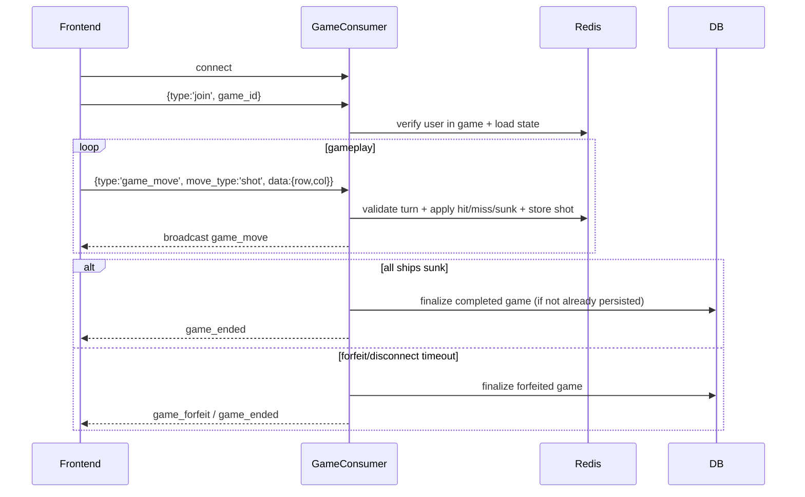

# Game Process

This document reflects the **currently implemented** game flow across REST + WebSocket.

## Implemented Entry Flows

### 1) AI game creation

- Frontend (menu/game page) calls `POST /api/games/` with `{ game_type: 'ai' }`
- Backend creates Redis game state (`status='pending'`) and auto-prepares AI board/ships
- User places ships via `POST /api/games/{id}/ships/`
- When player ships are placed in AI mode, backend sets game to `active`, current turn = player_1

### 2) PvP direct invite flow

- `POST /api/games/invite/` sends 30-second invite (Redis-backed)
- `POST /api/games/invite/{invite_id}/accept/` creates PvP game and activates active-game mapping
- `POST /api/games/invite/{invite_id}/reject/` rejects invite
- `POST /api/games/invite/cancel/` cancels outgoing invite
- Invite events are pushed over `user_{id}` WS group: `invite_received`, `invite_cancelled`, `invite_accepted`, `invite_rejected`

### 3) PvP matchmaking queue flow

- `POST /api/games/matchmake/`
  - returns `waiting` with TTL or `matched` with `game_id`
- `POST /api/games/matchmake/cancel/` cancels queue wait

## Core REST Endpoints in Use

- `GET /api/games/active/`
- `POST /api/games/`
- `POST /api/games/{id}/ships/`
- `GET /api/games/{id}/ships_status/`
- `GET /api/games/{id}/shots/`
- `POST /api/games/{id}/forfeit/`
- `POST /api/games/{id}/end_game/`
- `POST /api/games/{id}/cancel/` (pending games)
- `GET /api/games/game_history/`

## WebSocket Runtime Flow (`/ws/games/`)

## Ship Placement Rules (Implemented)

- Board: 10x10
- Fleet expected as 20 cells total: sizes `4,3,3,2,2,2,1,1,1,1`
- Validation includes:
  - in-bounds coordinates
  - contiguous horizontal/vertical placement
  - no overlap
  - no adjacency (including diagonal) between ships

## Disconnect Behavior (Implemented)

- On active-game disconnect:
  - mark player disconnected in Redis
  - notify opponent with `opponent_disconnected` + 60s timeout
  - if reconnect not completed in grace period, disconnected player forfeits
- If both players disconnect in short initial window, game can be cancelled with no winner (`both_disconnected` path)

## Persistence Model

### Redis (active games)

- metadata, ship placement, board state, shots, inactive cells, chat, timers
- active-game mapping per user

### PostgreSQL (historical record)

- `Game` row is created on completion/forfeit
- `PlayerStats` updated after game result persistence

## Implemented vs Not Implemented

### Implemented

1. AI and PvP game creation
2. Invite + matchmaking systems
3. Real-time move processing via WebSocket
4. Forfeit/disconnect timeout handling
5. History/stat updates after game end

### Not Implemented / Different Than Earlier Drafts

1. No standalone `/api/games/create` endpoint (uses DRF create on `/api/games/`)
2. No separate `/api/games/{id}/details` API
3. No dedicated websocket endpoint per-game URL (single `/ws/games/` + `join` message)
4. Friendship restriction for PvP challenge is currently not enforced in `_create_pvp_game` (check is commented out)
