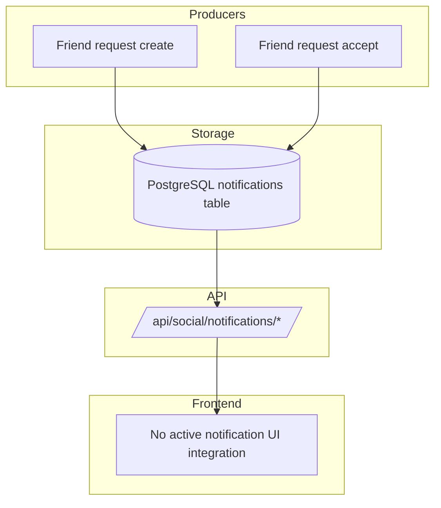

# Notification System Architecture

This document describes the **currently implemented** notification system.

## Current Architecture

## What Is Implemented

### Data model

`social.models.Notification` fields:

- `id`, `user`, `type`, `title`, `message`, `data`
- `is_read`, `read_at`, `created_at`, `expires_at`, `action_url`

### Notification creation points

- On friend request creation (`POST /api/social/friendships/`):
  - creates `type='friend_request'` notification for recipient
- On friend request acceptance (`POST /api/social/friendships/{id}/accept/`):
  - creates `type='friend_accepted'` notification for requester

### Notification API endpoints

Under `NotificationViewSet`:

- `GET /api/social/notifications/`
- `GET /api/social/notifications/{id}/`
- `PATCH /api/social/notifications/{id}/` (mark read)
- `DELETE /api/social/notifications/{id}/`
- `GET /api/social/notifications/unread/`
- `POST /api/social/notifications/mark-all-read/`

## Real-Time Delivery Status

### Implemented partially

- WebSocket route exists: `ws/notifications/`
- `NotificationConsumer` includes handlers (`notification`, `friend_request`, `game_invitation`)

### Not currently usable

- `NotificationConsumer` auth method `_get_user_from_token_notification()` returns `None`
- connection is closed with `4401`
- frontend currently does not subscribe/use notification websocket channel

## Practical Frontend Behavior Today

- Friendship UI updates via HTTP calls + polling (friends section refresh every 5s)
- Notifications are persisted server-side and can be fetched via API
- No active in-app notification center/toast pipeline wired to `NotificationViewSet`

## Error Handling (Implemented)

| Endpoint | Error | Status |
|----------|-------|--------|
| notifications detail/update/delete | missing or foreign notification | 404 |
| mark-all-read | none (bulk update) | 200 |
| unread count | none | 200 |

## Not Implemented Yet (Compared to Earlier Design)

1. Redis-backed notification queue/badge counter pipeline
2. Email notification channel
3. Real-time delivery to frontend notification center
4. Notification preference management endpoints
5. Auto-expiration cleanup jobs (beyond `expires_at` field availability)
