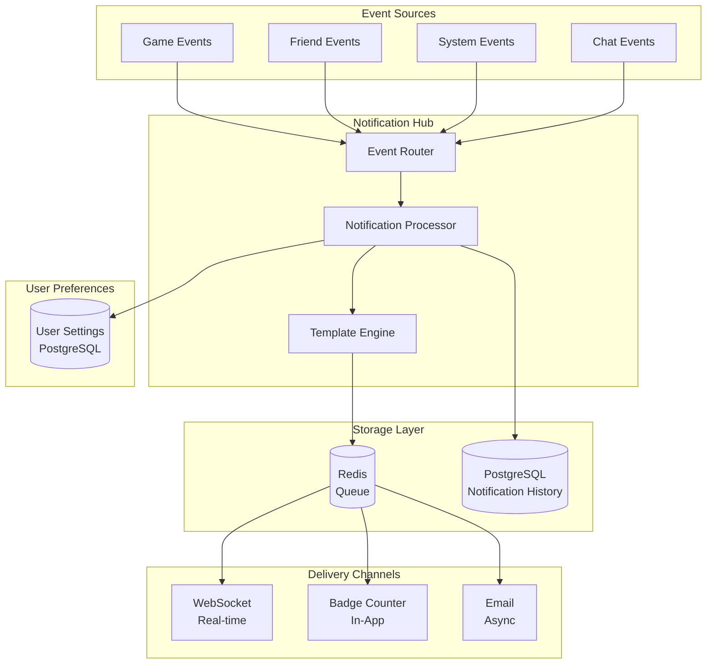

# Notification System Architecture

## Notification System Overview



## Notification Flow Diagram

```mermaid
sequenceDiagram
    actor User1 as User 1
    participant App1 as Frontend 1<br/>(React)
    participant Backend as Backend<br/>(Django)
    participant NotifHub as Notification Hub
    participant Redis as Redis<br/>(Queue)
    participant DB as Database<br/>(PostgreSQL)
    participant WS as WebSocket
    participant App2 as Frontend 2<br/>(React)
    actor User2 as User 2

    Note over User1,User2: Event Occurs (Friend Request Example)
    
    User1->>App1: Click "Add Friend"
    App1->>Backend: POST /api/friends/request<br/>{addressee_id}
    
    Backend->>DB: Create Friendship record
    DB-->>Backend: Created
    
    Backend->>NotifHub: Trigger notification event<br/>{type: 'friend_request',<br/>from: user1, to: user2}
    
    NotifHub->>NotifHub: Route event to processor
    
    NotifHub->>DB: Check notification preferences<br/>for User 2
    DB-->>NotifHub: Preferences<br/>{friend_requests: {<br/>  in_app: true,<br/>  email: false<br/>}}
    
    NotifHub->>NotifHub: Apply template<br/>Generate notification content
    
    NotifHub->>DB: INSERT INTO Notifications<br/>- id, user_id, type<br/>- title, message<br/>- is_read = false<br/>- created_at
    DB-->>NotifHub: Notification saved
    
    NotifHub->>Redis: Increment unread badge<br/>INCR notif:user2:unread
    Redis-->>NotifHub: New count: 3
    
    alt User 2 is online
        NotifHub->>WS: Push notification to User 2
        WS->>App2: Real-time notification<br/>{type: 'friend_request',<br/>data: {...}, unread_count: 3}
        
        App2->>App2: Show toast notification<br/>Update badge count
        App2-->>User2: Display "New friend request<br/>from User 1"
    else User 2 is offline
        NotifHub->>Redis: Add to pending queue<br/>LPUSH notif:user2:pending
        Redis-->>NotifHub: Queued
        
        Note over App2: User 2 will receive<br/>on next login
    end
    
    Backend-->>App1: 201 Created
    App1-->>User1: Show "Request sent"

    Note over User1,User2: User 2 Comes Online
    
    User2->>App2: Login to app
    App2->>Backend: WebSocket connect
    Backend->>Backend: Authenticate user
    
    Backend->>Redis: Get unread count<br/>GET notif:user2:unread
    Redis-->>Backend: Count: 3
    
    Backend->>Redis: Get pending notifications<br/>LRANGE notif:user2:pending 0 -1
    Redis-->>Backend: Pending notifications list
    
    Backend->>WS: Send initial state
    WS->>App2: Connection established<br/>{unread_count: 3,<br/>pending: [...]}
    
    App2->>App2: Update badge count<br/>Display pending notifications
    App2-->>User2: Show badge "3"

    Note over User1,User2: User Views Notifications
    
    User2->>App2: Click notification bell
    App2->>Backend: GET /api/notifications<br/>?limit=20&offset=0<br/>(Session cookie)
    
    Backend->>Backend: Verify session
    Backend->>DB: SELECT * FROM Notifications<br/>WHERE user_id = user2<br/>ORDER BY created_at DESC<br/>LIMIT 20
    DB-->>Backend: Notifications list
    
    Backend-->>App2: 200 OK<br/>{notifications: [...],<br/>total: 15, unread: 3}
    App2->>App2: Display notifications panel
    App2-->>User2: Show notifications list

    Note over User1,User2: User Reads Notification
    
    User2->>App2: Click on notification
    App2->>Backend: PATCH /api/notifications/{id}/read<br/>(Session cookie)
    
    Backend->>Backend: Verify session
    Backend->>DB: UPDATE Notifications<br/>SET is_read = true,<br/>read_at = CURRENT_TIMESTAMP<br/>WHERE id = notif_id<br/>AND user_id = user2
    DB-->>Backend: Updated
    
    Backend->>Redis: Decrement unread count<br/>DECR notif:user2:unread
    Redis-->>Backend: New count: 2
    
    Backend-->>App2: 200 OK<br/>{unread_count: 2}
    App2->>App2: Update badge count<br/>Mark notification as read
    App2-->>User2: Update UI

    Note over User1,User2: Mark All As Read
    
    User2->>App2: Click "Mark all as read"
    App2->>Backend: POST /api/notifications/read-all<br/>(Session cookie)
    
    Backend->>Backend: Verify session
    Backend->>DB: UPDATE Notifications<br/>SET is_read = true,<br/>read_at = CURRENT_TIMESTAMP<br/>WHERE user_id = user2<br/>AND is_read = false
    DB-->>Backend: Updated 8 rows
    
    Backend->>Redis: SET notif:user2:unread = 0
    Redis-->>Backend: Updated
    
    Backend-->>App2: 200 OK<br/>{unread_count: 0}
    App2->>App2: Clear badge<br/>Mark all as read in UI
    App2-->>User2: Update display

    Note over User1,User2: Delete Notification
    
    User2->>App2: Click delete on notification
    App2->>Backend: DELETE /api/notifications/{id}<br/>(Session cookie)
    
    Backend->>Backend: Verify session
    Backend->>DB: DELETE FROM Notifications<br/>WHERE id = notif_id<br/>AND user_id = user2
    DB-->>Backend: Deleted
    
    Backend-->>App2: 204 No Content
    App2->>App2: Remove from list
    App2-->>User2: Notification removed

    Note over User1,User2: Update Notification Preferences
    
    User2->>App2: Navigate to Settings
    App2->>Backend: GET /api/notifications/preferences<br/>(Session cookie)
    
    Backend->>DB: SELECT notification_preferences<br/>FROM User<br/>WHERE id = user2
    DB-->>Backend: Current preferences
    
    Backend-->>App2: 200 OK<br/>{preferences: {...}}
    App2-->>User2: Display settings form
    
    User2->>App2: Toggle email notifications
    App2->>Backend: PATCH /api/notifications/preferences<br/>{friend_requests: {email: true}}
    
    Backend->>DB: UPDATE User<br/>SET notification_preferences = new_prefs<br/>WHERE id = user2
    DB-->>Backend: Updated
    
    Backend-->>App2: 200 OK
    App2-->>User2: Show "Preferences saved"
```



## Notification Types

### Database Schema

```sql
CREATE TABLE Notifications (
    id UUID PRIMARY KEY,
    user_id UUID NOT NULL REFERENCES User(id),
    type VARCHAR(50) NOT NULL,  -- 'friend_request', 'game_invitation', etc.
    title VARCHAR(255) NOT NULL,
    message TEXT NOT NULL,
    data JSONB,  -- Additional context data
    is_read BOOLEAN DEFAULT FALSE,
    read_at TIMESTAMP,
    created_at TIMESTAMP DEFAULT CURRENT_TIMESTAMP,
    expires_at TIMESTAMP,  -- Optional expiration
    action_url VARCHAR(500),  -- Deep link for action
    
    INDEX idx_user_created (user_id, created_at DESC),
    INDEX idx_user_unread (user_id, is_read) WHERE is_read = FALSE
);

CREATE TABLE NotificationPreferences (
    user_id UUID PRIMARY KEY REFERENCES User(id),
    friend_requests_in_app BOOLEAN DEFAULT TRUE,
    friend_requests_email BOOLEAN DEFAULT FALSE,
    game_invitations_in_app BOOLEAN DEFAULT TRUE,
    game_invitations_email BOOLEAN DEFAULT FALSE,
    game_updates_in_app BOOLEAN DEFAULT TRUE,
    game_updates_email BOOLEAN DEFAULT FALSE,
    system_announcements_in_app BOOLEAN DEFAULT TRUE,
    system_announcements_email BOOLEAN DEFAULT TRUE,
    updated_at TIMESTAMP DEFAULT CURRENT_TIMESTAMP
);
```

### Notification Type Definitions

| Type | Title Template | Message Template | Channels | Behavior |
|------|----------------|------------------|----------|----------|
| `friend_request` | "New Friend Request" | "{{username}} sent you a friend request" | In-app, Email | Persistent, action_url: /friends/requests |
| `friend_accepted` | "Friend Request Accepted" | "{{username}} accepted your friend request" | In-app | Persistent, action_url: /friends |
| `friend_online` | "Friend Online" | "{{username}} is now online" | In-app | Real-time only, not persistent |
| `game_invitation` | "Game Invitation" | "{{username}} challenged you to a game!" | In-app, Email | Expires in 5 minutes, action_url: /games/{{game_id}} |
| `game_started` | "Game Started" | "Your game with {{username}} has started" | In-app | Persistent, action_url: /games/{{game_id}} |
| `game_your_turn` | "Your Turn" | "It's your turn in the game with {{username}}" | In-app | Persistent, action_url: /games/{{game_id}} |
| `game_ended` | "Game Ended" | "{{result}} against {{username}}!" | In-app | Persistent, action_url: /games/history/{{game_id}} |
| `system_announcement` | "{{title}}" | "{{message}}" | In-app, Email | Persistent, action_url: {{url}} |
| `maintenance_scheduled` | "Scheduled Maintenance" | "Service maintenance on {{date}}" | In-app, Email | Persistent, action_url: /status |

### Template Variable Replacement

Notification templates support variable interpolation using `{{variable_name}}` syntax. Backend processes these templates with actual data before sending to users.

## Security Considerations

1. **Authorization**: Users can only access their own notifications
2. **Rate Limiting**: Limit notification creation to prevent spam
3. **XSS Prevention**: Sanitize all notification content before display
4. **Privacy**: Don't expose sensitive data in notifications
5. **Expiration**: Auto-delete old notifications (30 days)

## Performance Optimization

1. **Caching**: Cache unread counts in Redis
2. **Pagination**: Limit notifications per request
3. **Indexing**: Database indexes on user_id and created_at
4. **Lazy Loading**: Load older notifications on demand
5. **Real-time**: Use WebSocket for instant delivery

## Error Handling

| Error Condition | HTTP Status | Frontend Action |
|----------------|-------------|-----------------|
| Unauthorized | 401 | Redirect to login |
| Not found | 404 | Remove from local list |
| Rate limit | 429 | Show warning |
| Server error | 500 | Retry with backoff |
