# Password Reset Process

## Password Reset Flow Diagram

```mermaid
sequenceDiagram
    actor User
    participant Frontend as Frontend<br/>(React)
    participant Backend as Backend<br/>(Django)
    participant DB as Database<br/>(PostgreSQL)
    participant Redis as Redis<br/>(Token Store)
    participant Email as Email Service<br/>(SMTP)

    Note over User,Email: Request Password Reset
    
    User->>Frontend: Click "Forgot Password?"
    Frontend-->>User: Show password reset form
    
    User->>Frontend: Enter email address
    Frontend->>Frontend: Validate email format
    
    User->>Frontend: Click "Send Reset Link"
    Frontend->>Backend: POST /api/auth/password-reset/request<br/>{email}
    
    Backend->>Backend: Sanitize email input
    Backend->>Backend: Rate limit check<br/>(max 3 requests per hour per IP)
    
    alt Rate limit exceeded
        Backend-->>Frontend: 429 Too Many Requests
        Frontend-->>User: Show "Too many attempts, try later"
    else Within rate limit
        Backend->>DB: SELECT User WHERE email = email
        DB-->>Backend: User record or NULL
        
        Note over Backend: Always return success<br/>to prevent email enumeration
        
        alt User not found
            Backend->>Backend: Delay response (prevent timing attack)
            Backend-->>Frontend: 200 OK<br/>{message: "If email exists, reset link sent"}
            Frontend-->>User: Show success message
        else User found
            Backend->>Backend: Generate secure reset token<br/>(32-byte random + user_id)
            Backend->>Backend: Hash token for storage
            
            Backend->>Redis: SET reset:{token_hash}<br/>= {user_id, email, created_at}<br/>EXPIRE 900 (15 minutes)
            Redis-->>Backend: Stored
            
            Backend->>Backend: Create reset URL<br/>https://domain/reset-password?token=token
            
            Backend->>Email: Send password reset email<br/>To: user@email.com<br/>Subject: Password Reset Request<br/>Body: Reset link with token
            
            alt Email sent successfully
                Email-->>Backend: Email sent
                Backend-->>Frontend: 200 OK<br/>{message: "If email exists, reset link sent"}
                Frontend-->>User: Show "Check your email for reset link"
            else Email service error
                Backend->>Backend: Log error
                Backend->>Redis: DEL reset:{token_hash}
                Redis-->>Backend: Deleted
                Backend-->>Frontend: 200 OK<br/>(Still return success to user)
                Frontend-->>User: Show success message
            end
        end
    end

    Note over User,Email: User Checks Email
    
    Email->>User: Deliver password reset email
    User->>User: Open email & click reset link
    
    User->>Frontend: Navigate to reset page<br/>with token in URL
    Frontend->>Frontend: Extract token from URL
    Frontend->>Backend: GET /api/auth/password-reset/validate<br/>?token=token
    
    Backend->>Backend: Hash received token
    Backend->>Redis: GET reset:{token_hash}
    Redis-->>Backend: Token data or NULL
    
    alt Token not found or expired
        Backend-->>Frontend: 404 Not Found<br/>{error: "Invalid or expired token"}
        Frontend-->>User: Show "Reset link expired or invalid"<br/>Offer to request new link
    else Token valid
        Backend->>Backend: Extract user_id from token data
        Backend->>DB: SELECT User WHERE id = user_id
        DB-->>Backend: User record
        
        alt User not found or inactive
            Backend-->>Frontend: 404 Not Found
            Frontend-->>User: Show error
        else User valid
            Backend-->>Frontend: 200 OK<br/>{email: "u***@example.com"}
            Frontend->>Frontend: Show password reset form<br/>with masked email
            Frontend-->>User: Display "Reset password for u***@example.com"
        end
    end

    Note over User,Email: Set New Password
    
    User->>Frontend: Enter new password (twice)
    Frontend->>Frontend: Validate password<br/>- Min 8 characters<br/>- Uppercase, lowercase, number, special char<br/>- Passwords match
    
    alt Password validation fails
        Frontend-->>User: Show validation errors
    else Password valid
        User->>Frontend: Click "Reset Password"
        Frontend->>Backend: POST /api/auth/password-reset/confirm<br/>{token, new_password}
        
        Backend->>Backend: Hash received token
        Backend->>Redis: GET reset:{token_hash}
        Redis-->>Backend: Token data or NULL
        
        alt Token invalid or expired
            Backend-->>Frontend: 404 Not Found<br/>{error: "Invalid or expired token"}
            Frontend-->>User: Show "Reset link expired"
        else Token valid
            Backend->>Backend: Validate password strength<br/>(server-side)
            
            alt Password too weak
                Backend-->>Frontend: 400 Bad Request<br/>{error: "Password too weak"}
                Frontend-->>User: Show password requirements
            else Password acceptable
                Backend->>Backend: Hash new password<br/>(PBKDF2/bcrypt)
                
                Backend->>DB: UPDATE User SET<br/>password_hash = new_hash<br/>WHERE id = user_id
                DB-->>Backend: Updated
                
                Backend->>Redis: DEL reset:{token_hash}
                Redis-->>Backend: Token deleted
                
                Backend->>Redis: Invalidate all user sessions<br/>DEL session:{user_id}:*<br/>(force re-login on all devices)
                Redis-->>Backend: Sessions cleared
                
                Backend->>DB: Log security event<br/>(password reset completed)
                DB-->>Backend: Logged
                
                Backend->>Email: Send confirmation email<br/>Subject: Password Changed<br/>Body: Password was reset on {date}
                Email-->>Backend: Sent
                
                Backend-->>Frontend: 200 OK<br/>{message: "Password reset successful"}
                Frontend->>Frontend: Clear form<br/>Redirect to login page
                Frontend-->>User: Show "Password reset successful, please login"
            end
        end
    end

    Note over User,Email: Login with New Password
    
    User->>Frontend: Login with new password
    Frontend->>Backend: POST /api/auth/login<br/>{email, new_password}
    Backend-->>Frontend: Login successful
    Frontend-->>User: Redirect to dashboard

    Note over User,Email: Suspicious Reset Attempt
    
    User->>User: Receives unexpected<br/>password reset email
    User->>User: Did NOT request reset
    User->>User: Click "I didn't request this" link<br/>in email
    
    User->>Frontend: Navigate to security page
    Frontend->>Backend: POST /api/auth/password-reset/report<br/>{token}<br/>(Session cookie)
    
    Backend->>Backend: Verify user session
    Backend->>Backend: Hash reported token
    Backend->>Redis: DEL reset:{token_hash}
    Redis-->>Backend: Token invalidated
    
    Backend->>DB: Log security event<br/>(unauthorized reset attempt)
    DB-->>Backend: Logged
    
    Backend->>Email: Send alert email<br/>Subject: Security Alert<br/>Body: Reset attempt blocked
    Email-->>Backend: Sent
    
    Backend-->>Frontend: 200 OK
    Frontend-->>User: Show "Reset link disabled.<br/>Your account is secure."
```



## Password Reset Email Templates

### Reset Request Email

```html
<!DOCTYPE html>
<html>
<head>
    <style>
        body { font-family: Arial, sans-serif; line-height: 1.6; }
        .container { max-width: 600px; margin: 0 auto; padding: 20px; }
        .button { 
            display: inline-block; 
            padding: 12px 24px; 
            background-color: #007bff; 
            color: white; 
            text-decoration: none; 
            border-radius: 4px; 
        }
        .warning { 
            padding: 10px; 
            background-color: #fff3cd; 
            border-left: 4px solid #ffc107; 
            margin: 20px 0; 
        }
    </style>
</head>
<body>
    <div class="container">
        <h2>Password Reset Request</h2>
        
        <p>Hi {{ username }},</p>
        
        <p>We received a request to reset your password for your 3D Battleship account.</p>
        
        <p>Click the button below to reset your password:</p>
        
        <p>
            <a href="{{ reset_url }}" class="button">Reset Password</a>
        </p>
        
        <p>Or copy and paste this link into your browser:</p>
        <p><a href="{{ reset_url }}">{{ reset_url }}</a></p>
        
        <div class="warning">
            <strong>Important:</strong>
            <ul>
                <li>This link expires in <strong>15 minutes</strong></li>
                <li>If you didn't request this, you can safely ignore this email</li>
                <li>Your password won't change until you create a new one</li>
            </ul>
        </div>
        
        <p>If you didn't request a password reset, please report this:</p>
        <p><a href="{{ report_url }}">I didn't request this</a></p>
        
        <hr>
        
        <p style="color: #666; font-size: 12px;">
            This email was sent to {{ email }}. If you received this by mistake, 
            please ignore it.
        </p>
    </div>
</body>
</html>
```

### Password Changed Confirmation Email

```html
<!DOCTYPE html>
<html>
<head>
    <style>
        body { font-family: Arial, sans-serif; line-height: 1.6; }
        .container { max-width: 600px; margin: 0 auto; padding: 20px; }
        .success { 
            padding: 10px; 
            background-color: #d4edda; 
            border-left: 4px solid #28a745; 
            margin: 20px 0; 
        }
    </style>
</head>
<body>
    <div class="container">
        <h2>Password Successfully Changed</h2>
        
        <p>Hi {{ username }},</p>
        
        <div class="success">
            <p>Your password was successfully changed on {{ date_time }}.</p>
        </div>
        
        <p><strong>Security Details:</strong></p>
        <ul>
            <li>IP Address: {{ ip_address }}</li>
            <li>Location: {{ location }}</li>
            <li>Browser: {{ browser }}</li>
        </ul>
        
        <p>If you made this change, no further action is required.</p>
        
        <p><strong>If you didn't make this change:</strong></p>
        <ol>
            <li>Someone else may have access to your account</li>
            <li>Contact support immediately: support@battleship.com</li>
            <li>We've logged you out of all devices for security</li>
        </ol>
        
        <p>Best regards,<br>3D Battleship Team</p>
    </div>
</body>
</html>
```

## Redis Data Structure

```
# Password reset token (TTL: 900 seconds / 15 minutes)
reset:{token_hash} = {
    "user_id": "uuid",
    "email": "user@example.com",
    "created_at": "2026-01-05T12:34:56Z"
}

# Rate limiting (TTL: 3600 seconds / 1 hour)
reset_rate:{ip_address} = 3
```

## Backend Processing Flow

### Password Reset Request Process

**Steps**:
1. Rate limiting check: max 3 requests per hour per IP (Redis counter)
2. User lookup: Query database by email (constant-time processing)
3. Token generation: 64-character cryptographically secure random string
4. Token storage: Hash token with SHA-256, store in Redis with 15-min TTL
5. Email delivery: Render HTML template, send reset link
6. Response: Always return success message (prevent email enumeration)

**Token Data Structure**:
```json
{
  "user_id": "uuid",
  "email": "user@example.com",
  "created_at": "2026-01-05T12:34:56Z"
}
```

**Anti-Enumeration**:
- Same response for existing and non-existing emails
- Add artificial delay for non-existent users (0.1s)
- Constant-time comparison

### Token Validation Process

**Steps**:
1. Hash received token with SHA-256
2. Look up token data in Redis
3. Check token expiration (TTL handled by Redis)
4. Verify user still exists and is active
5. Return masked email for user verification (e.g., "u***@example.com")

### Password Reset Confirmation Process

**Steps**:
1. Hash and validate token (one-time use)
2. Validate password strength (server-side)
3. Update user password (hash with secure algorithm)
4. Delete token from Redis (prevent reuse)
5. Invalidate all user sessions (force re-login on all devices)
6. Log security event (audit trail)
7. Send confirmation email
8. Return success response

**Session Invalidation**:
- Delete pattern: `session:{user_id}:*` from Redis
- Forces user to log in again on all devices
- Prevents use of stolen session tokens

## Security Considerations

1. **Token Security**:
   - Use cryptographically secure random tokens (64 characters)
   - Hash tokens before storing in Redis
   - Short expiration time (15 minutes)
   - One-time use only (delete after use)

2. **Email Enumeration Prevention**:
   - Always return success message regardless of email existence
   - Use constant-time comparison
   - Add artificial delay for non-existent users

3. **Rate Limiting**:
   - Maximum 3 reset requests per hour per IP
   - Track attempts in Redis
   - Return 429 Too Many Requests when exceeded

4. **Password Validation**:
   - Enforce strong password requirements (client and server)
   - Minimum 8 characters
   - Must contain uppercase, lowercase, number, special character
   - Check against common password lists

5. **Session Invalidation**:
   - Clear all user sessions after password reset
   - Force re-login on all devices
   - Prevent use of old passwords

6. **Audit Trail**:
   - Log all password reset attempts
   - Track IP addresses and user agents
   - Send confirmation emails for successful resets
   - Alert on suspicious activity

7. **HTTPS Only**:
   - All password reset operations over encrypted connection
   - Secure token transmission
   - HttpOnly cookies for authentication

## Error Handling

| Error Condition | HTTP Status | Frontend Action |
|----------------|-------------|-----------------|
| Rate limit exceeded | 429 Too Many Requests | Show "Too many attempts, try in 1 hour" |
| Invalid token | 404 Not Found | Show "Invalid or expired link" + request new |
| Token expired | 404 Not Found | Show "Link expired" + request new |
| Weak password | 400 Bad Request | Show password requirements |
| User not found | 404 Not Found | Show error message |
| Email service down | 200 OK | Return success (fail silently) |
| Server error | 500 Internal Server Error | Show "Try again later" |

## Redis Data Structure

```python
# Password reset token
reset:{token_hash} = {
    "user_id": "uuid",
    "email": "user@example.com",
    "created_at": "2026-01-05T12:34:56Z"
}
# TTL: 900 seconds (15 minutes)

# Rate limiting
reset_rate:{ip_address} = 3
# TTL: 3600 seconds (1 hour)
```

## Best Practices

1. **User Experience**:
   - Clear instructions in reset email
   - Display masked email during reset for verification
   - Show password strength indicator
   - Redirect to login after successful reset

2. **Communication**:
   - Professional, branded email templates
   - Include security tips
   - Provide support contact information
   - Set proper email headers (SPF, DKIM, DMARC)

3. **Monitoring**:
   - Track reset request frequency
   - Alert on unusual patterns
   - Monitor email delivery rates
   - Log all security events

4. **Recovery Options**:
   - Offer alternative recovery methods (security questions, 2FA backup codes)
   - Provide customer support fallback
   - Allow users to report suspicious attempts
