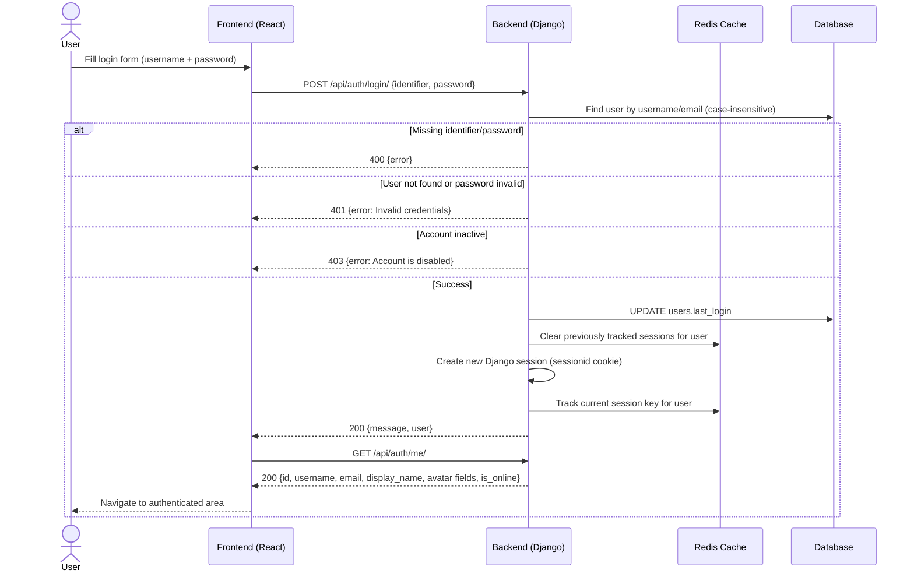
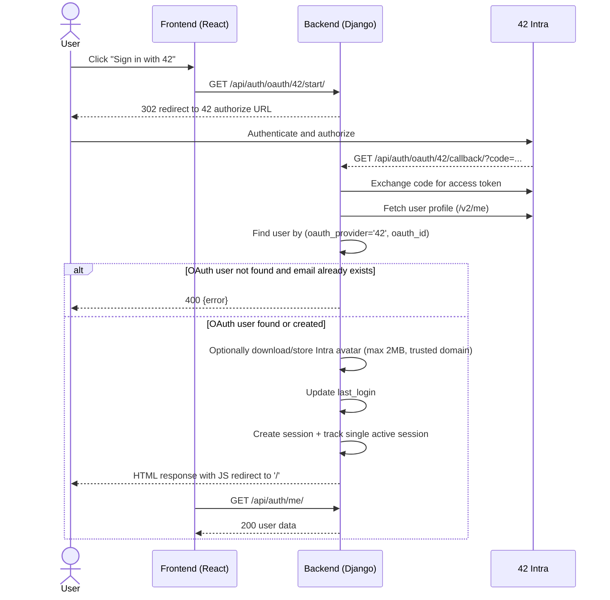

# User Login Process

This document describes the **currently implemented** login/session behavior.

## Login Flow Diagram (Implemented)

## OAuth 42 Login Flow (Implemented)

## Implemented Endpoints

- `POST /api/auth/login/`
  - Body: `{ identifier, password }` (`identifier` can be username or email)
  - Success: `200` with `{ message, user }`
  - Errors: `400`, `401`, `403`
- `GET /api/auth/me/`
  - If not logged in: `200 { "user": null }`
  - If logged in: `200` with flat user object:
    - `id`, `username`, `email`, `display_name`
    - `avatar_url`, `custom_avatar_url`, `intra_avatar_url`
    - `is_online`
- `POST /api/auth/logout/`
  - Flushes session, returns `200 { message }`
- `GET /api/auth/oauth/42/start/`
  - Redirects browser to 42 OAuth authorize URL
- `GET /api/auth/oauth/42/callback/?code=...`
  - Handles token exchange, login/registration, session creation, then redirects to `/`

## Frontend Behavior (Implemented)

- Login form sends `POST /auth/login/` with `identifier` from username input.
- On login success:
  - calls `checkAuth()` (`GET /auth/me/`)
  - navigates to `/`
- OAuth login uses browser redirect to `/api/auth/oauth/42/start/`.
- API client uses `withCredentials: true` so browser sends session cookies.
- CSRF token is fetched on app startup (`GET /api/auth/csrf/`) and attached to state-changing requests.

## Session & Cookie Behavior (Implemented)

- Session is Django cookie-based (`sessionid`), server-side data stored in cache backend.
- `SESSION_COOKIE_AGE = 86400` (24h).
- `SESSION_COOKIE_HTTPONLY = true`.
- `SESSION_COOKIE_SAMESITE = 'Lax'`.
- `SESSION_COOKIE_SECURE` is environment-driven (not always `true` in local/dev).
- CSRF cookie name: `csrftoken`, read by frontend and sent as `X-CSRFToken` header.

## Single-Session Enforcement (Implemented)

- Before login/register/OAuth-login, backend clears previously tracked sessions for that user.
- Active session keys are tracked in cache under `active_sessions_<user_id>`.
- A `force_logout` websocket event is broadcast to the user group when older sessions are cleared.

## Security Notes: Implemented vs Not Implemented

### Implemented

1. Password hashing via Django hashers (`set_password` / `check_password`)
2. Generic invalid-credentials message for missing user/wrong password (`401`)
3. Cookie + CSRF protection for session-based auth
4. OAuth avatar download guards (HTTPS + allowed domain + size limit)

### Not Implemented Yet

1. Login rate limiting (e.g., `429`)
2. Failed-attempt lockout policy
3. Deliberate timing delay on failed auth paths
4. Refresh-token flow (system uses session cookies, not access/refresh JWT tokens)

## Error Handling (Implemented)

| Error Condition | HTTP Status | Notes |
|----------------|-------------|-------|
| Missing identifier or password | 400 | `identifier and password are required.` |
| Invalid credentials | 401 | Same message for unknown user and wrong password |
| Account disabled (`is_active = false`) | 403 | Login blocked |
| OAuth callback missing code | 400 | `No authorization code provided` |
| OAuth token/profile fetch failure | 400 | OAuth provider communication failure |
| OAuth email conflict on first link | 400 | Existing email without OAuth link |
