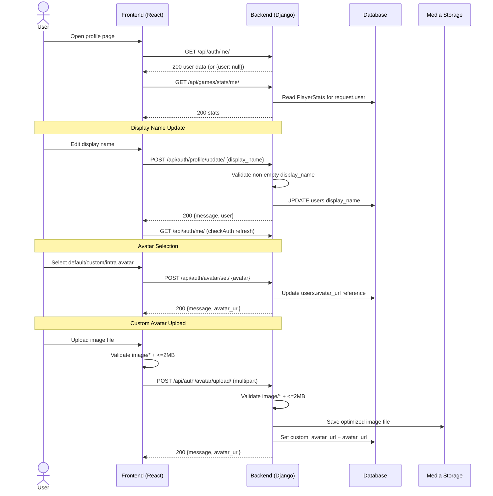

# User Profile Update Process

This document describes the **currently implemented** profile-management behavior.

## Profile + Stats + Avatar Flow Diagram (Implemented)

## Implemented Endpoints

- `GET /api/auth/me/`
  - Authenticated response: flat user object (`id`, `username`, `email`, `display_name`, avatar fields, `is_online`)
  - Unauthenticated response: `{ "user": null }`
- `POST /api/auth/profile/update/`
  - Body: `{ display_name }`
  - Success: `200` with updated `user`
  - Errors: `400`, `500`
- `POST /api/auth/avatar/set/`
  - Body: `{ avatar }`
  - `avatar` allowed values:
    - integer `1..4` (default avatars)
    - `'custom'` (requires existing custom upload)
    - `'intra'` (only for 42 OAuth users with stored intra avatar)
  - Success: `200` with selected `avatar_url`
  - Errors: `400`, `404`
- `POST /api/auth/avatar/upload/`
  - Multipart field: `avatar`
  - Validations: image MIME type, max `2MB`
  - Success: `200` with new `avatar_url`
  - Errors: `400`, `500`
- `GET /api/games/stats/me/`
  - Returns profile statistics used by profile page

## Frontend Responsibilities (Implemented)

1. Load authenticated user via `checkAuth()` (`/auth/me/`)
2. Fetch stats via `/games/stats/me/`
3. Edit display name only (no email/language/password form in current UI)
4. Avatar management:
   - choose preset avatar
   - choose custom/intra avatar if available
   - upload custom image (client-side `image/*`, `<=2MB` checks)

## Backend Responsibilities (Implemented)

1. Authenticate through custom session authentication (`request.session['user_id']`)
2. Validate and persist `display_name`
3. Validate avatar upload type/size and store media file
4. Maintain three avatar fields:
   - `avatar_url` (active avatar)
   - `custom_avatar_url` (uploaded avatar)
   - `intra_avatar_url` (downloaded 42 avatar)
5. Return safe avatar URLs only when files exist (`get_safe_avatar_url`)

## Updatable vs Read-Only Fields (Current Implementation)

### Updatable Through API/UI

- `display_name`
- Active avatar (`avatar_url`) via set/upload flows
- `custom_avatar_url` via upload

### Not Currently Updatable in Profile Flow

- `email`
- `language`
- `username`
- `password` (no change-password endpoint)
- account deletion / soft delete (no endpoint)

## Security Considerations (Current State)

### Implemented

1. Session cookie auth + CSRF middleware
2. HttpOnly session cookie
3. Server-side file validation for uploads (`image/*`, max 2MB)
4. Users update only their own data (auth based on session user)

### Not Implemented Yet

1. Password change flow (`old_password`/`new_password` endpoint)
2. Account deletion endpoint
3. Profile-update rate limiting
4. Virus scanning for uploaded files

## Error Handling (Implemented)

| Error Condition | HTTP Status | Notes |
|----------------|-------------|-------|
| Unauthenticated access to protected profile endpoints | 401 | DRF `IsAuthenticated` |
| Missing/empty `display_name` | 400 | Profile update validation |
| Invalid avatar option | 400 | Must be `1..4`, `custom`, or `intra` (with constraints) |
| Missing upload file | 400 | `No file provided.` |
| Upload too large (>2MB) | 400 | `File too large. Max size is 2MB.` |
| Upload invalid MIME type | 400 | Must start with `image/` |
| User not found in avatar set flow | 404 | Defensive path |
| Unexpected server failure | 500 | Generic failure response |
