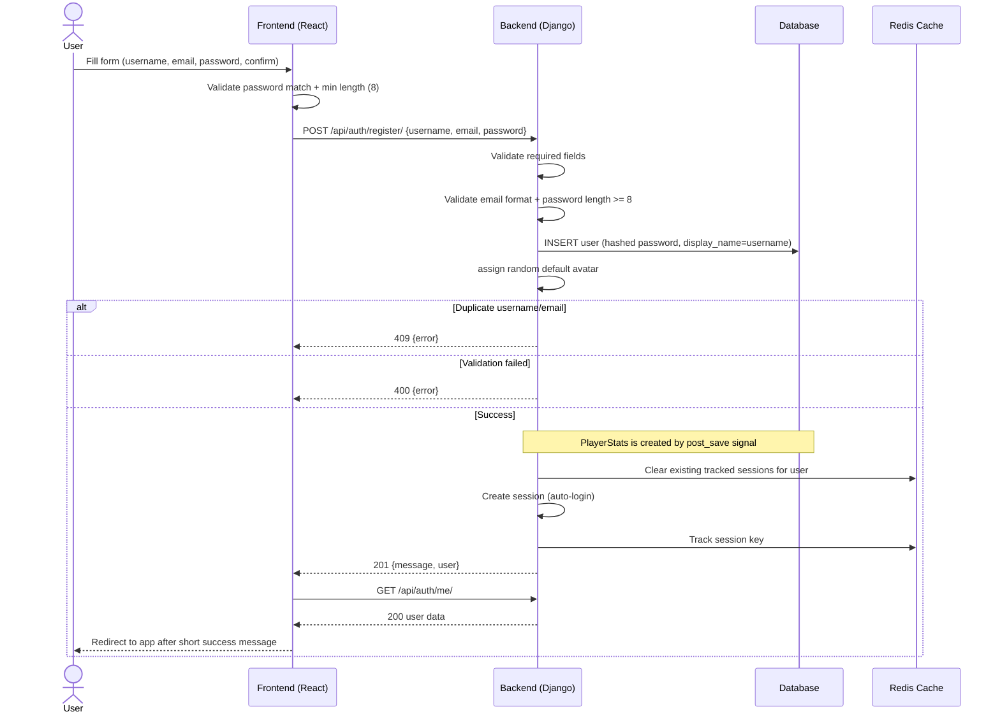
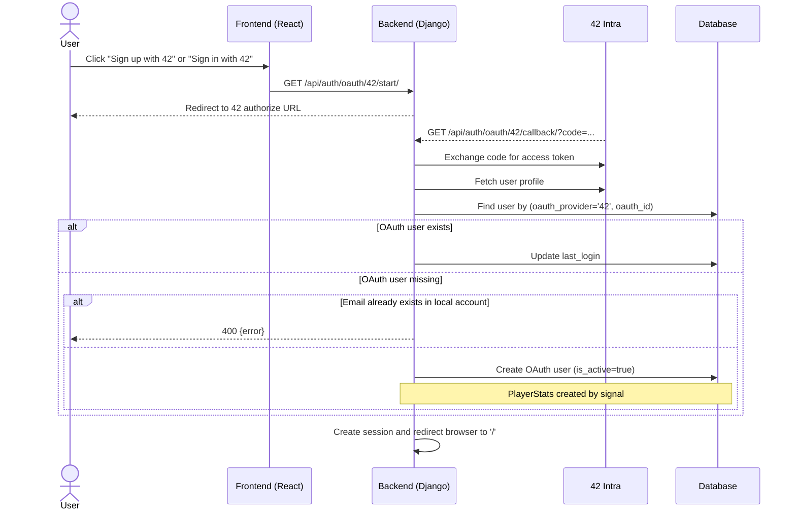

# User Registration Process

This document describes the **currently implemented** registration behavior.

## Registration Flow Diagram (Implemented)

## OAuth Registration/Login Flow (Implemented)

OAuth registration and OAuth login share the same callback endpoint.

## Implemented Endpoints

- `POST /api/auth/register/`
  - Body: `{ username, email, password }`
  - Success: `201` with `{ message, user }`
  - Errors: `400`, `409`, `500`
- `GET /api/auth/oauth/42/start/`
  - Redirect entry point for OAuth
- `GET /api/auth/oauth/42/callback/?code=...`
  - Completes OAuth flow, creates/logs in user, establishes session, returns HTML redirect

## Frontend Responsibilities (Implemented)

1. Form fields: `username`, `email`, `password`, `passwordConfirm`
2. Client validation:
   - Passwords must match
   - Password min length 8
3. Call `POST /auth/register/`
4. On success:
   - show success message
   - call `checkAuth()`
   - redirect to `/` after ~1s
5. OAuth button starts flow via full-page redirect to `/api/auth/oauth/42/start/`

## Backend Responsibilities (Implemented)

1. Validate required fields and email format
2. Hash password with Django hashing utilities
3. Set `display_name = username` on creation
4. Assign random default avatar (`avatar_1..4`)
5. Auto-login newly created users by creating session
6. Enforce one active tracked session per user (clear + track)
7. Handle OAuth code exchange, user lookup/creation, avatar import (guarded)

## Database Operations (Implemented)

### User Creation

- Creates `users` row with:
  - UUID id
  - unique username/email
  - hashed password
  - display_name initialized from username
  - language default from model (`en`)
  - random default avatar path

### PlayerStats Creation

- `PlayerStats` is created automatically by Django `post_save` signal when a new `User` is created.

## Security Notes: Implemented vs Not Implemented

### Implemented

1. Password hashing (no plaintext storage)
2. Email format validation
3. CSRF + cookie-based session authentication
4. HttpOnly session cookie

### Not Implemented Yet

1. Registration rate limiting/throttling
2. Password complexity rules beyond minimum length
3. OAuth state parameter validation in application code
4. Automatic account linking by email for OAuth (currently returns error instead)

## Error Handling (Implemented)

| Error Condition | HTTP Status | Notes |
|----------------|-------------|-------|
| Missing username/email/password | 400 | Required field validation |
| Invalid email format | 400 | Backend validator |
| Password too short (<8) | 400 | Backend validator |
| Username already exists | 409 | Integrity conflict |
| Email already exists | 409 | Integrity conflict |
| OAuth callback missing code | 400 | OAuth callback validation |
| OAuth token/user fetch failure | 400 | Provider communication failure |
| OAuth new user with existing local email | 400 | Returns "User with this email already exists" |
| Unexpected server error | 500 | Generic registration failure |
