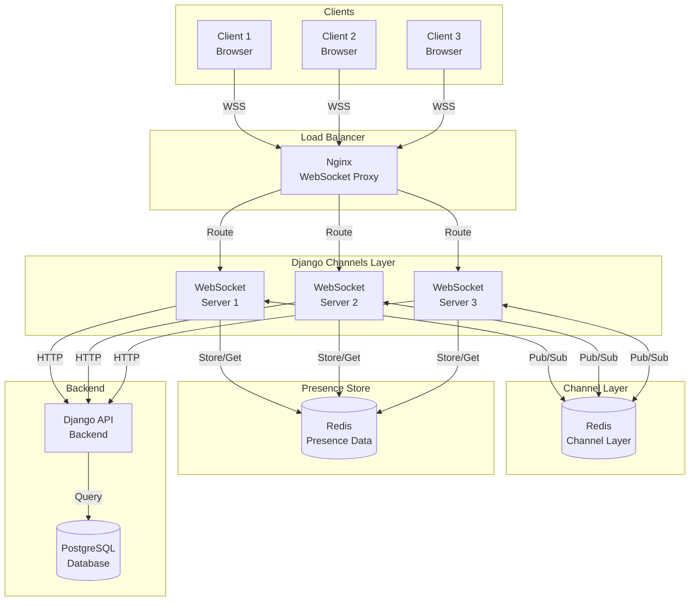
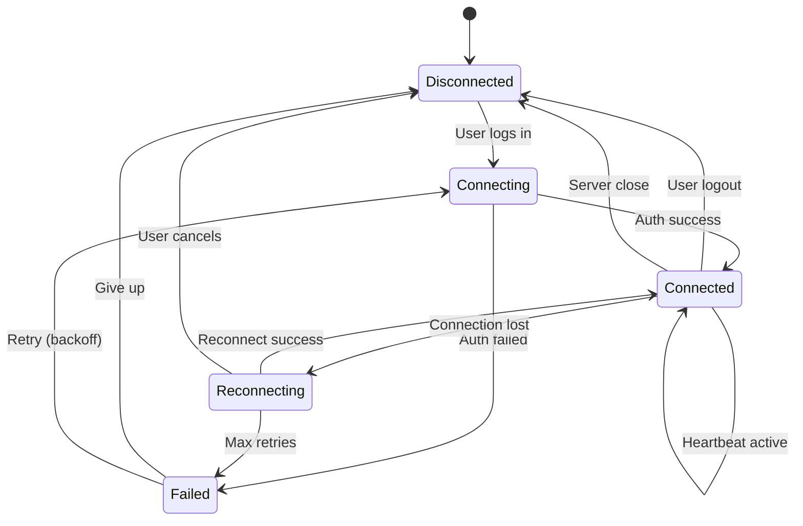

# WebSocket Connection Management

## WebSocket Connection Lifecycle

```mermaid
sequenceDiagram
    actor User
    participant Frontend as Frontend<br/>(React)
    participant WS as WebSocket Server<br/>(Django Channels)
    participant Backend as Backend<br/>(Django)
    participant Redis as Redis<br/>(Presence Store)
    participant DB as Database<br/>(PostgreSQL)

    Note over User,DB: Initial Connection & Authentication
    
    User->>Frontend: Login successful
    Frontend->>Frontend: Session cookie received
    Frontend->>Frontend: Initialize WebSocket client
    
    Frontend->>WS: Connect to wss://domain/ws/<br/>(Send session cookie)
    WS->>WS: Extract session from cookie
    WS->>WS: Verify session validity
    
    alt Session invalid or expired
        WS-->>Frontend: Close connection<br/>(4401: Unauthorized)
        Frontend->>Frontend: Redirect to login
        Frontend-->>User: Show "Session expired"
    else Session valid
        WS->>Backend: Validate user_id from token
        Backend->>DB: SELECT User WHERE id = user_id<br/>AND is_active = TRUE
        DB-->>Backend: User record
        
        alt User not found or inactive
            WS-->>Frontend: Close connection<br/>(4403: Forbidden)
            Frontend-->>User: Show "Account issue"
        else User valid
            WS->>WS: Store connection<br/>(user_id → connection)
            
            WS->>Redis: SET user:{user_id}:online = true<br/>SET user:{user_id}:last_seen = timestamp<br/>EXPIRE 300 (5 min TTL)
            Redis-->>WS: Stored
            
            WS->>DB: SELECT Friendship WHERE<br/>(requester_id = user_id OR addressee_id = user_id)<br/>AND status = 'accepted'
            DB-->>WS: Friends list
            
            WS->>Redis: Check which friends are online<br/>MGET user:{friend_id}:online
            Redis-->>WS: Online status for friends
            
            WS-->>Frontend: Connection established<br/>{type: 'connected', friends_online: [...]}
            Frontend->>Frontend: Store connection state<br/>Update friends online status
            Frontend-->>User: Show online indicator
            
            loop Notify all online friends
                WS->>WS: Get friend connections
                WS->>Frontend: Broadcast to friends<br/>{type: 'friend_online', user_id}
            end
        end
    end

    Note over User,DB: Heartbeat Mechanism
    
    loop Every 30 seconds
        Frontend->>WS: Send ping<br/>{type: 'ping', timestamp}
        WS->>WS: Verify connection alive
        
        alt Connection alive
            WS->>Redis: UPDATE user:{user_id}:last_seen<br/>EXPIRE 300
            Redis-->>WS: Updated
            
            WS-->>Frontend: Send pong<br/>{type: 'pong', timestamp}
            Frontend->>Frontend: Reset timeout counter
        else No response for 90 seconds
            Frontend->>Frontend: Connection considered dead
            Frontend->>Frontend: Attempt reconnection
        end
    end

    Note over User,DB: Receiving Real-Time Events
    
    WS->>Frontend: Push event<br/>{type: 'friend_request', data: {...}}
    Frontend->>Frontend: Route to appropriate handler
    Frontend->>Frontend: Update UI state
    Frontend-->>User: Show notification
    
    WS->>Frontend: Push event<br/>{type: 'game_invitation', data: {...}}
    Frontend->>Frontend: Show invitation popup
    Frontend-->>User: Display game invite

    Note over User,DB: Graceful Disconnection
    
    User->>Frontend: Click logout or close tab
    Frontend->>WS: Send close frame<br/>{type: 'disconnect', reason: 'logout'}
    
    WS->>Redis: DEL user:{user_id}:online<br/>SET user:{user_id}:last_seen = timestamp
    Redis-->>WS: Updated
    
    WS->>WS: Remove connection from pool
    
    loop Notify all online friends
        WS->>Frontend: Broadcast to friends<br/>{type: 'friend_offline', user_id}
    end
    
    WS-->>Frontend: Connection closed gracefully<br/>(1000: Normal closure)
    Frontend->>Frontend: Clear connection state
    Frontend-->>User: Logged out

    Note over User,DB: Connection Lost (Network Issue)
    
    Frontend-xWS: Network interruption
    Frontend->>Frontend: Detect connection lost<br/>(No pong received)
    Frontend-->>User: Show "Reconnecting..." indicator
    
    Frontend->>Frontend: Wait 2 seconds<br/>(Attempt 1)
    Frontend->>WS: Reconnect attempt
    
    alt Reconnection successful
        WS->>WS: Authenticate session
        WS->>Redis: SET user:{user_id}:online = true
        Redis-->>WS: Updated
        
        WS-->>Frontend: Reconnected<br/>{type: 'reconnected'}
        Frontend->>Frontend: Restore state
        Frontend-->>User: Show "Connected"
    else Reconnection failed
        Frontend->>Frontend: Wait 4 seconds<br/>(Attempt 2 - exponential backoff)
        Frontend->>WS: Reconnect attempt
        
        alt Still failing
            Frontend->>Frontend: Wait 8 seconds<br/>(Attempt 3)
            Frontend->>WS: Reconnect attempt
            
            alt Max retries reached (10 attempts)
                Frontend->>Frontend: Stop reconnection
                Frontend-->>User: Show "Connection lost"<br/>Offer manual reconnect button
            else Eventually succeeds
                WS-->>Frontend: Reconnected
                Frontend-->>User: Show "Connected"
            end
        end
    end

    Note over User,DB: Session Expiry During Connection
    
    WS->>WS: Session expiration detected<br/>(during heartbeat or event)
    WS-->>Frontend: Close connection<br/>(4401: Session expired)
    
    Frontend->>Frontend: Clear WebSocket state
    Frontend->>Backend: Check session validity<br/>GET /api/auth/me
    
    alt Session still valid
        Backend-->>Frontend: Session refreshed
        Frontend->>WS: Reconnect with session cookie
        WS-->>Frontend: Connection established
        Frontend-->>User: Seamless continuation
    else Session expired
        Frontend->>Frontend: Redirect to login page
        Frontend-->>User: Show "Session expired, please login"
    end

    Note over User,DB: Server Shutdown/Restart
    
    WS->>Frontend: Send warning<br/>{type: 'server_shutdown', seconds: 30}
    Frontend-->>User: Show "Server maintenance in 30s"
    
    Note over WS: Wait 30 seconds for graceful shutdown
    
    WS->>Frontend: Close all connections<br/>(1001: Going away)
    
    Frontend->>Frontend: Auto-reconnect after 5 seconds
    Frontend->>WS: Reconnect attempts with backoff
    
    WS-->>Frontend: Server back online
    Frontend-->>User: Show "Reconnected"
```



## WebSocket Architecture



## Connection States



## Redis Presence Data Structure

```
# User online status (TTL: 300 seconds)
user:{user_id}:online = "true"

# Last seen timestamp
user:{user_id}:last_seen = "2026-01-05T12:34:56Z"

# Active WebSocket connections (for multi-device support)
user:{user_id}:connections = ["channel_name_1", "channel_name_2"]
```

## Frontend Client Design Considerations

### WebSocket Client Features

**Connection Management**:
- Establish secure WSS connection to backend
- Extract and send session cookie automatically
- Handle connection lifecycle events (open, close, error)
- Implement event handler registration system

**Reconnection Strategy**:
- Exponential backoff algorithm: delay = min(2^attempt * 1000ms, 30s)
- Maximum 10 reconnection attempts before giving up
- Clear reconnection timeout on successful connection
- Emit events to notify UI of reconnection state

**Heartbeat Mechanism**:
- Send ping message every 30 seconds
- Detect connection staleness
- Stop heartbeat on disconnection

**Message Handling**:
- Parse incoming JSON messages
- Route messages by type to registered handlers
- Support multiple handlers per event type
- Emit global 'message' event for all messages

**Event System**:
- Event types: connected, disconnected, error, token_expired, reconnecting, reconnect_failed, message, and custom types (friend_request, game_invitation, etc.)
- Allow registration of multiple handlers per event
- Emit events with relevant data payload

**Graceful Disconnection**:
- Send proper WebSocket close frame (code 1000)
- Clean up timers and intervals
- Clear connection reference

## Security Considerations

1. **Session Authentication**: All WebSocket connections authenticated via HttpOnly session cookie
2. **Connection Validation**: Verify user exists and is active before accepting connection
3. **Rate Limiting**: Limit message frequency per connection (prevent spam)
4. **Input Validation**: Validate all incoming WebSocket messages
5. **CORS Configuration**: Proper WebSocket origin validation
6. **Heartbeat Timeout**: Detect and close dead connections
7. **Graceful Shutdown**: Notify clients before server maintenance
8. **Session Management**: Handle Session expiration during active connection

## Performance Considerations

1. **Redis Channel Layer**: Use Redis for pub/sub between multiple WebSocket servers
2. **Connection Pooling**: Efficient management of concurrent connections
3. **Message Batching**: Group multiple events when possible
4. **Compression**: Enable WebSocket compression for large messages
5. **Load Balancing**: Distribute connections across multiple servers
6. **Resource Limits**: Set max connections per server
7. **Memory Management**: Clean up inactive connections

## Error Codes

| Code | Reason | Client Action |
|------|--------|---------------|
| 1000 | Normal closure | No action needed |
| 1001 | Server going away | Auto-reconnect after delay |
| 4401 | Unauthorized (invalid/expired session) | Redirect to login |
| 4403 | Forbidden (inactive account) | Show error message, redirect to support |
| 4429 | Too many requests (rate limit) | Back off, show warning |

## Security Considerations

1. **Session Authentication**: All WebSocket connections authenticated via HttpOnly session cookie
2. **Connection Validation**: Verify user exists and is active before accepting connection
3. **Rate Limiting**: Limit message frequency per connection (prevent spam)
4. **Input Validation**: Validate all incoming WebSocket messages
5. **CORS Configuration**: Proper WebSocket origin validation
6. **Heartbeat Timeout**: Detect and close dead connections
7. **Graceful Shutdown**: Notify clients before server maintenance
8. **Session Management**: Handle Session expiration during active connection

## Performance Considerations

1. **Redis Channel Layer**: Use Redis for pub/sub between multiple WebSocket servers
2. **Connection Pooling**: Efficient management of concurrent connections
3. **Message Batching**: Group multiple events when possible
4. **Compression**: Enable WebSocket compression for large messages
5. **Load Balancing**: Distribute connections across multiple servers
6. **Resource Limits**: Set max connections per server
7. **Memory Management**: Clean up inactive connections

## Error Codes

| Code | Reason | Client Action |
|------|--------|---------------|
| 1000 | Normal closure | No action needed |
| 1001 | Server going away | Auto-reconnect after delay |
| 4401 | Unauthorized (invalid/expired session) | Redirect to login |
| 4403 | Forbidden (inactive account) | Show error message, redirect to support |
| 4429 | Too many requests (rate limit) | Back off, show warning |
