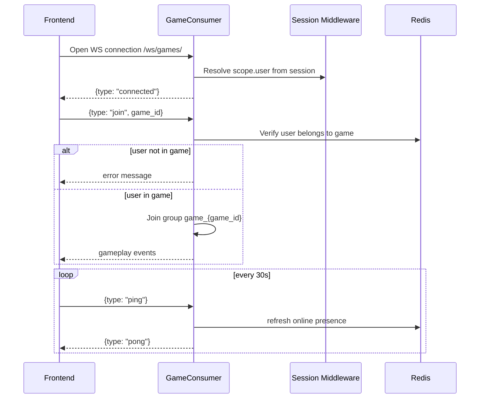

# WebSocket Connection Management

This document describes the **currently implemented** WebSocket behavior.

## WebSocket Endpoints

- `ws/games/` → handled by `GameConsumer`
- `ws/notifications/` → routed to `NotificationConsumer` but currently not usable in practice (auth helper returns `None`, connection closes with `4401`)

## Implemented Connection Lifecycle (`ws/games/`)

## Authentication Model (Implemented)

- WebSocket auth uses `SessionUserAuthMiddlewareStack` (`backend/game/middleware.py`).
- User identity is read from Django session key `user_id`.
- No JWT auth in the active flow.

## Frontend Client Behavior (Implemented)

`frontend/src/utils/socket.js`:

- Sends `join` after socket opens.
- Sends heartbeat ping every 30 seconds.
- Auto-reconnects with fixed delay (3s), max 5 attempts.
- Handles `force_logout` event by dispatching global `auth_error`.
- Supports handler registration via `on(type, handler)`.

## Main Message Types in Use

### Client -> Server

- `join` `{ game_id }`
- `ping`
- `game_move` `{ move_type: 'shot', data: { row, col } }`
- `game_forfeit`
- `chat_message` `{ message }`
- `leave_game`

### Server -> Client

- `connected`
- `pong`
- `player_joined`
- `game_move`
- `game_start`
- `placement_timer_start`
- `game_cancelled`
- `opponent_disconnected`
- `game_ended`
- `game_forfeit`
- `chat_message`
- `error`
- `force_logout` (personal user group message)

## Disconnect & Reconnect Rules (Implemented)

1. If socket closes during active game:
   - player marked disconnected in Redis
   - opponent gets `opponent_disconnected` with 60s timeout
   - server schedules forfeit after 60s (with an initial 3s simultaneous-disconnect check)
2. If both players disconnect in the initial 3s window:
   - game is erased, no winner (`game_ended` reason `both_disconnected`)
3. If disconnected player reconnects in time:
   - disconnect marker is cleared on `join`
   - game continues
4. If not reconnected by timeout:
   - game finalized as forfeited, winner is opponent

## Presence Data (Implemented)

Redis keys used by `GameStateManager`:

- `user:{user_id}:online` (TTL 300s)
- `user:{user_id}:last_seen`
- `user:{user_id}:active_game`

## Important Differences vs Earlier Design Docs

### Implemented

- Session-based WS auth through Channels middleware
- Ping/pong heartbeat
- Fixed reconnect strategy (3s, 5 attempts)
- Game disconnect grace period and timeout-forfeit handling

### Not Implemented / Not Active

- Notification WS channel for frontend (auth placeholder blocks it)
- Exponential backoff reconnect with 10 attempts
- Explicit WS close-code contract like `4429` rate-limit path
- Dedicated WS message rate-limiter
